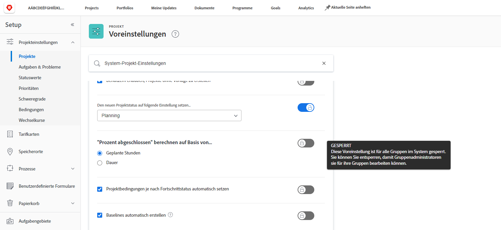
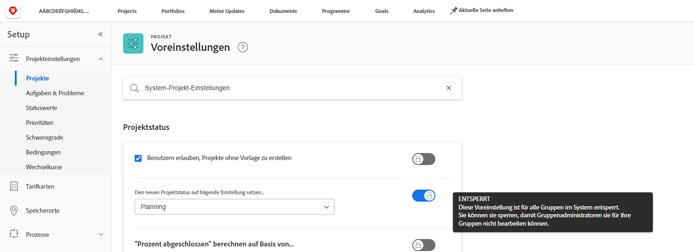
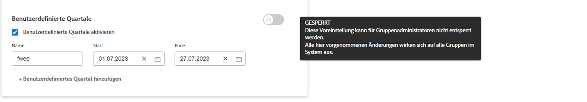

# Konfigurieren von globalen Standardprojekteinstellungen

<!--
21.4 updates have been made
-->

In diesem Video lernen Sie Folgendes:

* Ändern eines benutzerdefinierten Status
* Festlegen von globalen Projektvoreinstellungen
* Erstellen und Verwenden von Zeitplänen

>[!VIDEO](https://video.tv.adobe.com/v/3423348/?quality=12&learn=on&enablevpops&captions=ger)

## Globale und Gruppeneinstellungen für Projekte, Aufgaben und Probleme

Wenn Sie die Einstellungen von [!UICONTROL Projekten] in [!DNL Workfront] öffnen, werden Sie feststellen, dass in der Suchleiste am oberen Rand des Fensters „[!UICONTROL Systemprojektvoreinstellungen]“ steht. Damit wissen Sie, dass diese Einstellungen für alle Benutzenden Ihres [!DNL Workfront]-Systems gelten – es handelt sich um eine globale Konfiguration.

Die Seite ![[!UICONTROL Projektvoreinstellungen] in [!UICONTROL Setup]](assets/admin-fund-system-project-preferences-1.png)

Etwas Ähnliches sehen Sie, wenn Sie die Einstellungen von [!UICONTROL Aufgaben und Probleme] öffnen.

![[!UICONTROL Voreinstellungen für Aufgaben und Probleme] in [!UICONTROL Setup]](assets/admin-fund-task-issue-preferences-2.png)

Es ist jedoch möglich, dass nicht jede Gruppe in [!DNL Workfront] die gleichen Voreinstellungen für Projekte, Aufgaben und Probleme benötigt. Zum Beispiel: Die Marketing-Gruppe möchte vielleicht, dass ein neues Projekt den Status „Planung“ erhält, während die Projekt-Manager-Gruppe den Status „Anfrage“ bevorzugt.

[!DNL Workfront] ermöglicht es Gruppenadmins, bestimmte Voreinstellungen für Projekte, Aufgaben und Probleme für ihre Gruppen anzupassen. Welche Einstellungen angepasst werden können, bestimmen die [!DNL Workfront]-Systemadmins mithilfe des Umschalters „Sperren/Entsperren“.

Navigieren Sie zunächst zum Bereich [!UICONTROL Setup]:

1. Wählen Sie **[!UICONTROL Setup]** im **[!UICONTROL Hauptmenü]** aus.
1. Erweitern Sie die **[!UICONTROL Projektvoreinstellungen]** im linken Menü.
1. Wählen Sie **[!UICONTROL Projekte]** oder **[!UICONTROL Aufgaben und Probleme]** aus, je nachdem, welche Einstellungen Sie ändern möchten.

Sperren Sie eine Einstellung, um Gruppenadmins daran zu hindern, diese Einstellung für ihre Gruppe zu ändern.

Entsperren Sie die Voreinstellung, damit sie von Gruppenadmins angepasst werden kann.

Einige Einstellungen können nicht entsperrt werden und bleiben globale Systemeinstellungen.

### Festlegen von Gruppen- und Untergruppeneinstellungen

Für alle von Systemadmins freigeschalteten Einstellungen können die Gruppenadmins Anpassungen für die von ihnen verwalteten Gruppen und alle unter diesen Gruppen verschachtelten Untergruppen vornehmen. Darüber hinaus können Gruppenadmins steuern, welche Einstellungen ihre Untergruppenadmins ändern können.

1. Wählen Sie **[!UICONTROL Setup]** im Hauptmenü **** aus.
1. Klicken Sie im linken Menü auf **[!DNL Groups]**.
1. Klicken Sie auf den Namen der Gruppe oder Untergruppe, um sie zu öffnen.
1. Wählen Sie im linken Menü **[!UICONTROL Projektvoreinstellungen]** oder **[!UICONTROL Voreinstellungen für Aufgaben und Probleme]**.
1. Nehmen Sie die erforderlichen Änderungen für jede der entsperrten Voreinstellungen vor.
1. Wählen Sie **[!UICONTROL Speichern]** aus.

Der Abschnitt ![[!UICONTROL Projektstatus] auf der Seite [!UICONTROL Gruppe]](assets/admin-fund-group-preferences.png)

Wenn Ihr Unternehmen keine Gruppenadmins einsetzt, können die Systemadmins die Einstellungen für die verschiedenen Gruppen verwalten.

<!--
learn more URLs and guides
Create or edit a group status 
Group administrators 
Configure system-wide project preferences 
Configure project preferences for a group 
Configure task and issue preferences for a group 
Create and modify a group’s schedule 
-->
