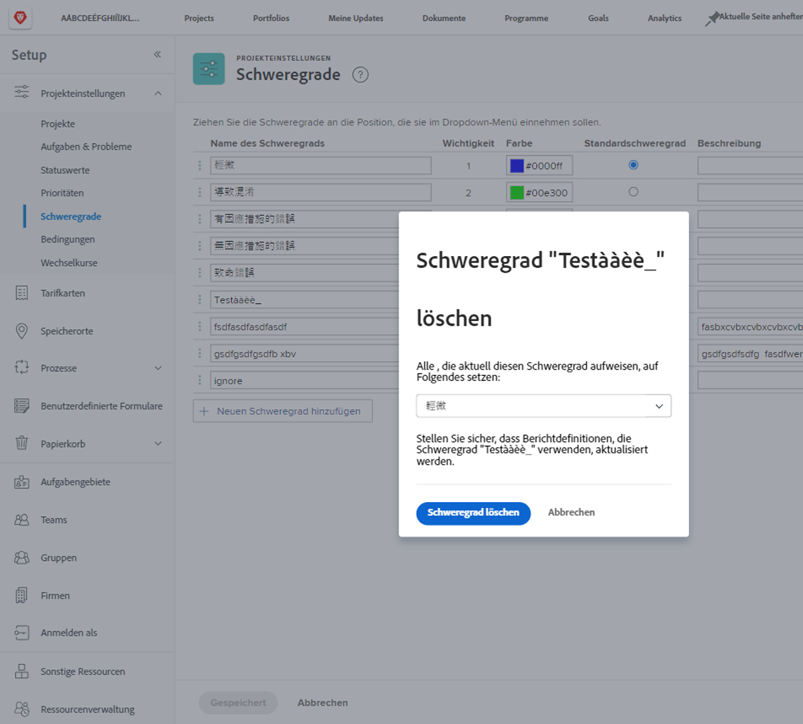

# Erstellen und Verwalten von Problemschweregraden

## Einführung zu Problemschweregraden

Ein Schweregrad kann verwendet werden, um anzugeben, wie schwerwiegend ein Problem ist oder wie es sich auf die durchgeführte Arbeit auswirken könnte.

Das Menü ![[!UICONTROL Schweregrad] im Fenster [!UICONTROL Problemdetails]](assets/admin-fund-severity-issue-details.png)

Das Feld [!UICONTROL Schweregrad] ist über die [!UICONTROL Problemdetails] zugänglich. Es kann auch in Spaltenansichten auf Listen und in benutzerdefinierten Berichten enthalten sein.

[!DNL Workfront] hat fünf Standardschweregrade:

* [!UICONTROL Kosmetisch]
* [!UICONTROL Verwirrend]
* [!UICONTROL Programmfehler mit Umgehungslösung]
* [!UICONTROL Programmfehler ohne Umgehungslösung]
* [!UICONTROL Schwerer Fehler]

Systemadmins können diese Standardschweregrade umbenennen oder bei Bedarf neue erstellen.

Schweregrade sind nur für Probleme in [!DNL Workfront] verfügbar.

## Erstellen und Verwalten von Problemschweregraden

Als Systemadmin können Sie bei Bedarf neue Abläufe erstellen, um den Workflow des Problems abzuschließen.

Die Seite ![[!UICONTROL Schweregrad] in [!UICONTROL Setup]](assets/admin-fund-severity-section.png)

1. Klicken Sie auf **[!UICONTROL Setup]** im **[!UICONTROL Hauptmenü]**.
1. Erweitern Sie die **[!UICONTROL Projektvoreinstellungen]** in der linken Menüleiste.
1. Wählen Sie **[!UICONTROL Schweregrade]** aus.
1. Klicken Sie auf **[!UICONTROL Neuen Schweregrad hinzufügen]**.
1. Geben Sie dem Schweregrad einen Namen, der dem vorgesehenen Verwendungszweck entspricht.
1. Die **[!UICONTROL Wichtigkeitszahl]** entspricht der Schwere des Problems. Die höchste Zahl entspricht dem höchsten Schweregrad. Die [!UICONTROL Wichtigkeitszahl] muss eindeutig sein.
1. Wählen Sie eine Farbe für Ihre Priorität aus. Diese wird in Diagrammberichten und an anderen Stellen in [!DNL Workfront] verwendet.
1. Legen Sie eine der Schweregradoptionen als **[!UICONTROL Standardschweregrad]** fest. Dieser wird automatisch auf alle neuen Probleme in Workfront angewendet.
1. Geben Sie eine Beschreibung des Schweregrads an, z. B. wie dieser verwendet werden soll.
1. Klicken Sie auf eine Stelle außerhalb der zu speichernden Felder.

Liste der ![[!UICONTROL Schweregrade]](assets/admin-fund-severity-new.png)

### Ändern von Schweregraden

Wenn ein Schweregrad für Ihre Problem-Workflows nicht mehr relevant ist, kann er umbenannt, ausgeblendet oder gelöscht werden.

Wenn ein Schweregrad nicht mehr benötigt wird, empfiehlt [!DNL Workfront], den Schweregrad auszublenden (klicken Sie auf die Schaltfläche [!UICONTROL Ausblenden] neben dem Feld im Setup-Bereich). Dadurch wird die Schweregradoption aus dem Dropdown-Menü entfernt, aber der Schweregrad von historischen Daten bleibt erhalten, sodass er weiterhin zu Berichtszwecken verfügbar ist.

Die hervorgehobene Spalte ![[!UICONTROL Ausblenden] auf der Seite [!UICONTROL Schweregrad] in [!UICONTROL Setup]](assets/admin-fund-severity-hide.png)

[!DNL Workfront] empfiehlt, dass Sie einen Schweregrad **nicht** löschen, der bereits bei zurückliegenden Problemen verwendet wurde. Wenn Sie einen Schweregrad löschen, werden Sie aufgefordert, ihn durch einen anderen Schweregrad zu ersetzen. Dadurch können sich historische Daten ändern und die Berichterstellung beeinflusst werden.

<!--
learn more URLs
Create and customize issue severities
Update issue severity
-->
