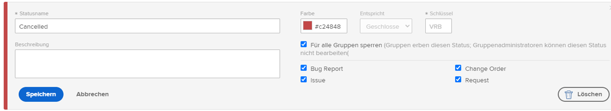
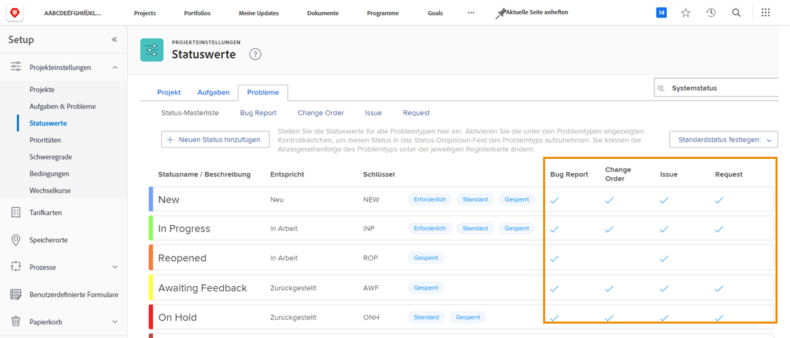

# Anpassen von systemweiten Status

[!DNL Workfront] bietet eine Vielzahl von Standard-Status, die sich an die Problem-Management-Workflows in Ihrem Unternehmen anpassen. Diese Status können umbenannt werden, um der Terminologie Ihres Unternehmens zu entsprechen. Status können außerdem bestimmten Problemtypen zugewiesen werden.

Bei Bedarf können weitere Status erstellt werden. Nur System-Admins können systemweite Status erstellen. Darüber hinaus steuern System-Admins, welche Status von Gruppen-Admins bearbeitet werden können.

Registerkarte ![[!UICONTROL Probleme] auf der Seite [!UICONTROL Status] unter [!UICONTROL Setup]](assets/admin-fund-all-issue-statuses.png)

## Ändern bestehender Status

[!DNL Workfront] empfiehlt eine Mindestanzahl von Status. Dies erleichtert den Benutzenden die Wahl des richtigen Status und führt zu einer kürzeren Liste von Status, die gepflegt werden müssen.

Sie können einen vorhandenen Status bearbeiten, um den Namen, die zugewiesenen Problemtypen, die zugehörige Farbe usw. zu ändern.

![Problemstatusliste mit hervorgehobener Option [!UICONTROL Bearbeiten]](assets/admin-fund-edit-issue-status.png)

1. Klicken Sie auf **[!UICONTROL Setup]** im **[!UICONTROL Hauptmenü]**.
1. Erweitern Sie den Abschnitt **[!UICONTROL Projektvoreinstellungen]** im linken Menübereich.
1. Wählen Sie **[!UICONTROL Status]**.
1. Wählen Sie die Registerkarte **[!UICONTROL Probleme]** und vergewissern Sie sich, dass [!UICONTROL Systemstatus] in der oberen rechten Ecke angezeigt wird.
1. Wählen Sie **[!UICONTROL Primäre Liste]**, um die Status für alle Problemtypen zu sehen. Hier können Sie einen Problemstatus erstellen oder ändern.
1. Bewegen Sie den Mauszeiger über die rechte Seite des Status, den Sie umbenennen möchten, und klicken Sie auf **[!UICONTROL Bearbeiten]**.
1. Benennen Sie den Status neu oder ändern Sie ggf. andere Informationen.
1. Sperren Sie den Status, wenn diese Einstellungen für alle Benutzenden in Ihrer [!DNL Workfront]-Instanz gelten sollen.
1. Entsperren Sie den Status, damit Gruppen-Admins den Status nur für ihre Gruppen bearbeiten können.
1. Markieren Sie die Kontrollkästchen für den Problemtyp, auf den der Status angewendet werden soll.
1. Klicken Sie auf **[!UICONTROL Speichern]**.

### Statuszuweisungen

Nicht alle Status können allen Problemtypen zugewiesen werden. Die Seite [!UICONTROL Status] enthält Spalten, die zeigen, für welche Problemtypen jeder Status verwendet werden kann.

Um nur die einem bestimmten Problemtyp zugewiesenen Status anzuzeigen, klicken Sie einfach oben im Fenster auf den Namen des Problemtyps.

Registerkarte ![[!UICONTROL Probleme] der Seite [!UICONTROL Status] mit hervorgehobenen Spalten](assets/admin-fund-statuses-issue-type.png)

Von hier aus können Sie die Probleme per Drag-and-Drop in die Reihenfolge bringen, in der sie im Dropdown-Menü [!UICONTROL Status] erscheinen sollen.

Um die Status zu bearbeiten, müssen Sie zurück zur [!UICONTROL primären Liste] gehen.
