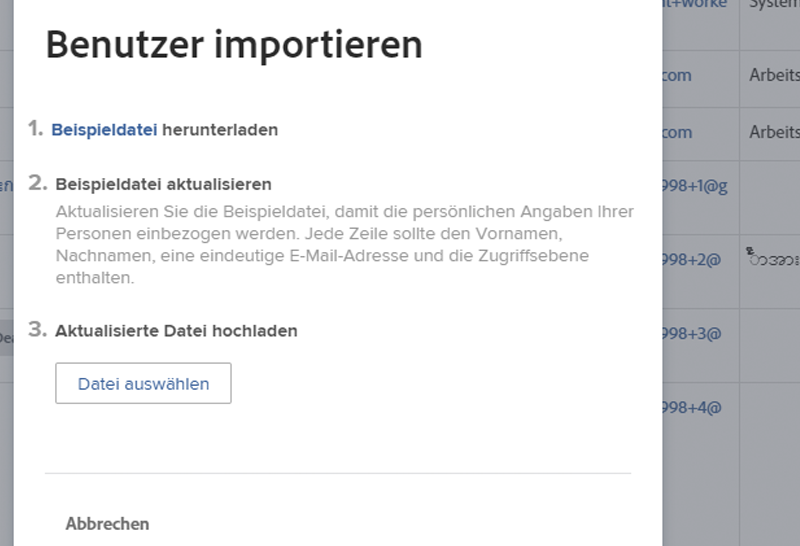
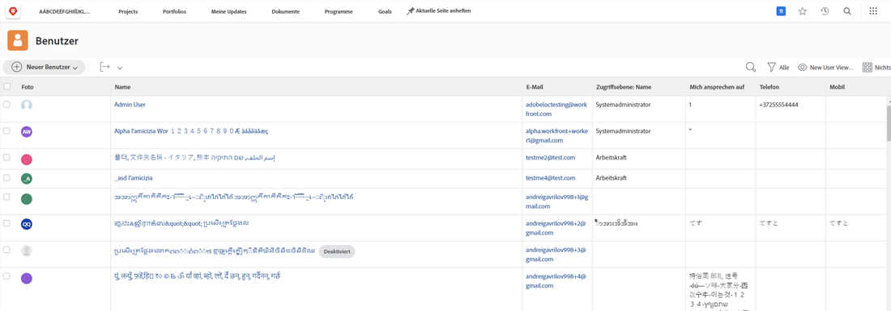

# Hinzufügen von Benutzenden in Stapeln

Das schrittweise Hinzufügen einzelner Benutzender kann zeitaufwendig und überwältigend sein. [!DNL Workfront] ermöglicht es Systemadmins, über die Importfunktion mehrere Benutzende gleichzeitig hinzuzufügen.

![[!UICONTROL Menüoption „Personen importieren“]](assets/admin-fund-adding-users-5.png)

1. Wählen Sie **[!UICONTROL Benutzer]** im [!UICONTROL Hauptmenü].
1. Wählen Sie den Pfeil auf der Schaltfläche **[!UICONTROL Neue Person]** und wählen Sie **[!UICONTROL Personen importieren]**.
1. Das sich öffnende Fenster führt Sie durch die Erstellung einer Tabelle mit den zu importierenden Benutzenden.
1. Laden Sie die Beispieldatei herunter, bei der es sich um eine [!DNL Excel]-Tabelle handelt.
1. Aktualisieren Sie die Tabelle mit den Benutzerinformationen – Vorname, Nachname, E-Mail-Adresse, Zugriffsebene – gemäß den Anweisungen in der Datei selbst.
1. Wählen Sie die Schaltfläche **[!UICONTROL Datei wählen]**, sobald die Benutzerliste gespeichert ist.
1. Navigieren Sie zur Benutzertabellendatei und wählen Sie sie aus.

Die importierten Benutzenden werden in der [!UICONTROL Benutzerliste] angezeigt. Bearbeiten Sie die Informationen zu einzelnen oder mehreren Benutzenden, falls erforderlich.

## Benutzende importieren: Verwenden von Kickstarts

[!DNL Workfront] bietet eine Kickstart-Vorlage für den Import von Daten in das System. Sie kann auch für den Import von Benutzenden verwendet werden. Bevor Sie den Kickstart nutzen, empfiehlt [!DNL Workfront] Ihnen, mit Ihrer [!DNL Workfront]-Beraterin bzw. Ihrem -Berater zusammenzuarbeiten, da es einige Punkte gibt, die Sie beachten sollten.

<!---
paragraph below needs URL to article
--->

Ausführliche Informationen finden Sie unter „Importieren von Daten in Workfront über Kickstarts“.

![[!UICONTROL Fenster „Daten importieren“] ([!UICONTROL Kickstarts]) im [!UICONTROL Einrichtungsbereich]](assets/admin-fund-adding-users-8.png)

<!--
Learn more URLs
Import users
Import data into Workfront via Kick-Starts
-->
