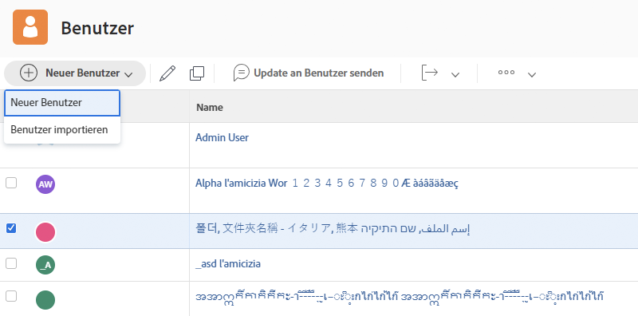

# Erstellen eines individuellen Benutzerprofils

Wenn eine neue Person eingestellt wird oder jemand in eine Abteilung wechselt, die [!DNL Workfront] verwendet, müssen die Systemadmins nur eine Benutzerin bzw. einen Benutzer anlegen. Dies kann schnell und einfach über den Bereich [!UICONTROL Benutzer] in [!DNL Workfront] erfolgen.

1. Wählen Sie **[!UICONTROL Benutzer]** im **[!UICONTROL Hauptmenü]**.
1. Klicken Sie auf die Schaltfläche **[!UICONTROL Neue Person]**.
1. Geben Sie den Vor- und Nachnamen der Person in das Fenster [!UICONTROL Neue Person] ein.
1. Geben Sie die E-Mail-Adresse der Person ein. Dies sind ihre [!DNL Workfront]-Anmeldedaten, die innerhalb Ihrer [!DNL Workfront]-Instanz eindeutig sein müssen.
1. Wenn Sie möchten, dass der Person eine E-Mail über ihre neue Anmeldung erhält, markieren Sie das Kontrollkästchen „Einladung senden“.
1. Weisen Sie der Person eine Zugriffsebene zu. Dadurch erhält sie ihre Hauptberechtigungen für [!DNL Workfront].
1. Weisen Sie die Person einer Stammgruppe zu, um sicherzustellen, dass sie Zugang zur richtigen Arbeit hat.
1. Wählen Sie **[!DNL Add this Person]**, um die Erstellung der Benutzerin bzw. des Benutzers abzuschließen.

Fenster ![[!UICONTROL Neue Person]](assets/admin-fund-adding-users-1.png)

Der Link [!UICONTROL Erweiterte Optionen anzeigen] öffnet das vollständige Fenster mit den Benutzerdetails. Hier können Systemadmins zusätzliche Organisations- und Ressourcenplanungsinformationen wie Teams und Aufgabengebiete festlegen und persönliche Informationen über die Person (Telefonnummer, Berufsbezeichnung usw.) eingeben.

Fenster ![[!UICONTROL Neue Person] nach Klick auf [!UICONTROL Erweiterte Optionen anzeigen]](assets/admin-fund-adding-users-2.png)

Einige dieser Informationen können von der Person selbst geändert werden, andere nicht (abhängig von ihren Zugriffsrechten).

## Erstellen von neuen Benutzenden durch Kopieren von bestehenden Benutzenden

Sie können eine bereits im System bestehende Person als Basis für die Erstellung neuer Anmeldedaten verwenden. Einige der vorhandenen Benutzerinformationen werden kopiert, aber andere müssen von Grund auf neu eingegeben werden.

1. Wählen Sie **[!UICONTROL Benutzer]** im **[!UICONTROL Hauptmenü]**.
1. Wählen Sie die Person, die Sie kopieren möchten, indem Sie das Kontrollkästchen neben ihrem Namen markieren.
1. Klicken Sie auf den Pfeil auf der Schaltfläche **[!UICONTROL Neue Person]** und wählen Sie **[!UICONTROL Neu aus ausgewählter Person]**.
1. Geben Sie die Daten der neuen Benutzerin bzw. des neuen Benutzers in den Abschnitt **[!UICONTROL Persönliche Daten]** ein.
1. Einige Felder werden von der ursprünglichen Person übernommen. Ändern Sie die Informationen nach Bedarf.
1. Wählen Sie **[!UICONTROL Diese Person hinzufügen]**.

Fenster ![[!UICONTROL Neue Person]](assets/admin-fund-adding-users-4.png)

<!--
Learn more URLs
Add users
-->
