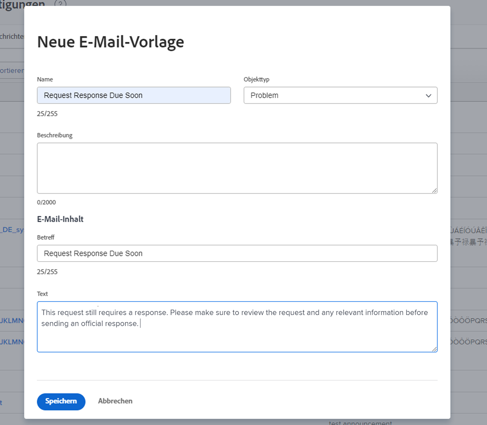

<!--
this has the same content as the system administrator notification setup and mangement section of the email and inapp notificiations learning path
-->

# Einrichten von Erinnerungsbenachrichtigungen

Erinnerungsbenachrichtigungen werden von Systemadmins im Bereich [!UICONTROL Setup] erstellt. Anschließend können sie von Projekt-, Aufgaben- und Problemeigentümern verwendet werden, um sie daran zu erinnern, dass eine Arbeit bald fällig oder überfällig ist.

Erinnerungen sind objektspezifisch und müssen manuell an das entsprechende Arbeitselement angehängt werden, damit die Benachrichtigung gesendet werden kann.

**Erstellen einer Erinnerungsbenachrichtigung**

1. Klicken Sie auf **[!UICONTROL Setup]** im **[!UICONTROL Hauptmenü]**.
1. Klicken Sie auf den Abschnitt **[!UICONTROL Email]**.
1. Klicken Sie auf **[!UICONTROL Benachrichtigungen]**.
1. Klicken Sie auf die Registerkarte **[!UICONTROL Neue Erinnerung]**.
1. Klicken Sie auf **[!UICONTROL +Neue Erinnerungsbenachrichtigung]**.
1. Wählen Sie das gewünschte Objekt für das Dropdown-Menü aus.
1. Geben Sie die erforderlichen Informationen ein.
1. Klicken Sie auf **[!UICONTROL Speichern]**.

Fenster ![[!UICONTROL Neue Erinnerungsbenachrichtigung]](assets/admin-fund-reminder-notification-1.png)

Beim Einrichten der Erinnerung sind einige Aspekte zu beachten:

* **[!UICONTROL Name der Erinnerungsbenachrichtigung] –** Der Name, der den Projekt-Managerinnen und -Managern angezeigt wird, wenn sie eine Erinnerung an ein Objekt anhängen. Stellen Sie sicher, dass der Name kurz, aber aussagekräftig ist.
* **[!UICONTROL Qualifikationszeitraum] –** Anzahl der Stunden, Tage, Wochen oder Monate vor/nach dem im Abschnitt „Zeitplan“ ausgewählten Datum.
* **[!UICONTROL Timing] –** Wählen Sie aus, ob die Erinnerung vor oder nach dem geplanten, projizierten oder tatsächlichen Start-/Fertigstellungsdatum des Objekts gesendet werden soll. Die Optionen für Zeitpläne beziehen sich auf das Startdatum, Enddatum oder das Datum der letzten Aktualisierung.
* **[!UICONTROL Kriterien] –** Geben Sie die Kriterien für den Versand der Erinnerung an. Die Optionen variieren je nach objektspezifischer Erinnerung.
* **[!UICONTROL Empfänger] –** Wählen Sie aus, an wen die Erinnerung gesendet werden soll. Die Optionen für Interessengruppen variieren je nach dem für die Erinnerung ausgewählten Objekttyp.

Nachdem die Erinnerungseinstellungen eingerichtet und gespeichert wurden, steht die Erinnerungsbenachrichtigung den Objekteigentümern in [!DNL Workfront] zur Verfügung.

## E-Mail-Anpassung

Erinnerungsbenachrichtigungen verwenden ein Standard-E-Mail-Format und eine Standard-Nachricht. Wenn Sie die E-Mail anpassen möchten, können Sie eine Vorlage erstellen.

<!--
paragraph above needs a hyperlink to an article
-->

<!--
learn more URLs
-->
