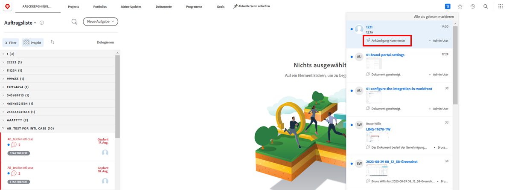
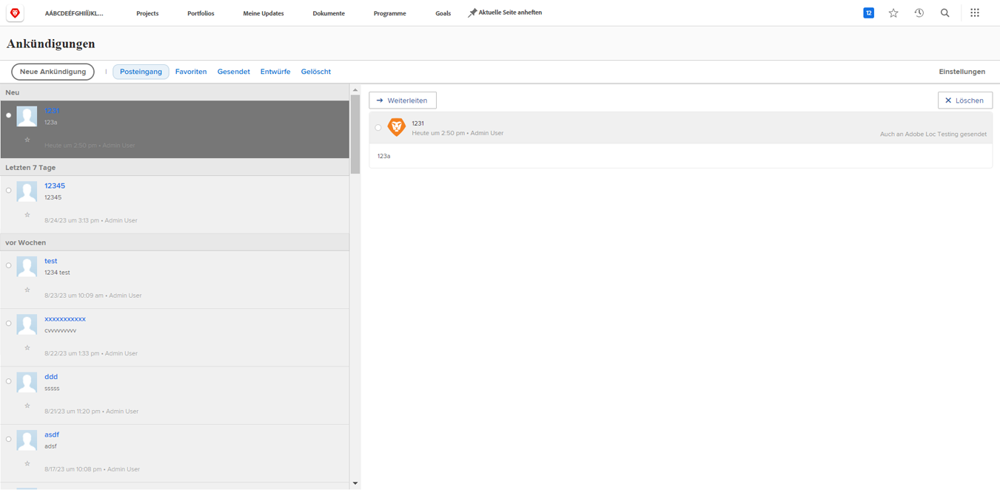

<!---
this has the same content as the system administrator notification setup and mangement section of the email and inapp notificiations learning path
--->

# Senden [!UICONTROL Ankündigungszentrum] messages

Die [!UICONTROL Ankündigungszentrum] ist ein zentralisierter Ort für Systemadministratoren, von denen aus sie Nachrichten empfangen können. [!DNL Workfront] oder Mitteilungen an die [!DNL Workfront] Benutzer.

[!DNL Workfront] sendet an Systemadministratoren Ankündigungen zu Softwareversionen, kommenden Webinaren, Systemwartung und mehr. Die [!UICONTROL Ankündigungszentrum] fügt alle wichtigen Informationen an einer Stelle ein, sodass Sie sie nicht unter den anderen Nachrichten in Ihrem E-Mail-Posteingang verlieren.

Das Benachrichtigungssymbol zeigt alle nicht gelesenen Benachrichtigungen und Mitteilungen an, die über [!DNL Workfront]. Mitteilungen in der Liste sind beschriftet und können angeklickt werden, wenn Sie sie öffnen möchten.

Systemadministratoren können auch die [!UICONTROL Ankündigungszentrum] zum Senden [!DNL Workfront]-weite Nachrichten an Benutzer. Sie können Erinnerungen darüber senden, wer Support erhalten soll, eine &quot;Tagesinfo&quot;anbieten und vieles mehr.

![[!UICONTROL Alle Mitteilungen] link](assets/admin-fund-announcements-2.png)

**So senden Sie eine Mitteilung**

1. Klicken Sie auf **Benachrichtigungssymbol**.
1. Klicken **[!UICONTROL Alle Mitteilungen]**.
1. Klicken Sie auf **[!UICONTROL Neue Mitteilung]** Schaltfläche. Standardmäßig wird die [!UICONTROL Senden an] Zeileneinträge mit [!UICONTROL Alle] , um eine Nachricht an alle zu senden [!DNL Workfront] Benutzer. Sie können diesen Eintrag löschen und die Namen von Benutzern, Jobrollen, Teams, Gruppen oder Unternehmen eingeben.
1. Geben Sie eine Betreffzeile ein.
1. Geben Sie dann den Text der Mitteilung ein und verwenden Sie dabei die Bearbeitungswerkzeuge nach Bedarf.
1. Fügen Sie die freizugebenden Dateien an, indem Sie auf die **[!UICONTROL Anhang hinzufügen]** Schaltfläche, falls zutreffend.
1. Klicken **[!UICONTROL Senden]**.

![Schreiben einer Ankündigung zur [!UICONTROL Mitteilungen] page](assets/admin-fund-announcements-3.png)

Der Bereich für Ankündigungen sieht wie ein Posteingang mit empfangenen Nachrichten im linken Bereich aus. Klicken Sie auf eine Nachricht, um sie zu lesen.

