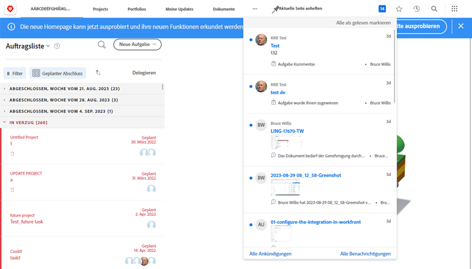

# In-App- und E-Mail-Ereignisbenachrichtigungen verwalten

E-Mails sind Teil des täglichen Arbeitslebens, und manchmal ist die Menge an E-Mails, die Sie erhalten, überwältigend. Allerdings gilt Folgendes: [!DNL Workfront], können Systemadministratoren sicherstellen, dass alle relevanten und hilfreichen E-Mails zu ihrer Arbeit erhalten.

Es gibt verschiedene Arten von Benachrichtigungen, die Workfront an Benutzer senden kann. Einige dieser Benachrichtigungen werden auf Systemebene gesteuert und wirken sich auf alle Benutzer aus. Einige Benachrichtigungen können so eingestellt werden, dass E-Mails sofort in einem täglichen Digest generiert werden. Oder deaktivieren Sie E-Mails, um nur Benachrichtigungen in Workfront zu generieren.

## Ereignisbenachrichtigungen

Ein Ereignis kann zum Beispiel eine Statusänderung, einen veröffentlichten Kommentar oder eine Zuweisung sein und eine In-App-Benachrichtigung in [!DNL Workfront].

Sie können jedoch festlegen, für welche Ereignisse Sie E-Mail-Benachrichtigungen erhalten möchten, indem Sie die Optionen in Ihren Voreinstellungen auswählen oder deaktivieren.

Um diese Änderungen vorzunehmen, klicken Sie auf Ihren Namen im [!UICONTROL Hauptmenü].

![Benutzername in [!UICONTROL Hauptmenü]](assets/admin-fund-user-notifications-02.png)

Klicken [!UICONTROL Bearbeiten] von [!UICONTROL Mehr] Menü.

Klicken [!UICONTROL Benachrichtigungen] im [!UICONTROL Person bearbeiten] Popup-Feld.

![[!UICONTROL Person bearbeiten] Fenster](assets/admin-fund-user-notifications-04.png)

Von hier aus können Sie entscheiden, welche Benachrichtigungen Sie sofort, täglich oder gar nicht erhalten möchten. Alle Änderungen, die Sie hier vornehmen, sind spezifisch für Sie und wirken sich nicht auf andere Benutzer in Workfront aus.

**[!UICONTROL Täglich]**

Standardmäßig sind E-Mails so eingerichtet, dass sie sofort gesendet werden. Sie können jedoch die Häufigkeit der E-Mail-Benachrichtigungen von [!UICONTROL Sofort] nach [!UICONTROL Täglich]und stellen sicher, dass Sie die benötigten Informationen erhalten, wann Sie sie benötigen.

![[!UICONTROL Benachrichtigung] Abschnitt [!UICONTROL Person bearbeiten] Fenster](assets/admin-fund-user-notifications-05.png)

Die tägliche Option sendet eine Zusammenfassung der Tagesereignisse in einer E-Mail. Benutzer erhalten für jede Gruppierung, die sie im [!UICONTROL Benachrichtigungen] Abschnitt.

Beispiel: die [!UICONTROL Informationen zu eigenen Projekten] generiert eine tägliche E-Mail, die [!UICONTROL Erforderliche Aktion] wird eine tägliche E-Mail generiert usw.

![[!UICONTROL Daily Digest] E-Mail für [!UICONTROL Informationen zu eigenen Projekten]](assets/admin-fund-user-notifications-06.png)

![[!UICONTROL Daily Digest] E-Mail für [!UICONTROL Erforderliche Aktion]](assets/admin-fund-user-notifications-07.png)

Legen Sie nicht nur die tägliche Option fest, sondern legen Sie auch einen Zeitpunkt für den Versand dieser E-Mails fest. Je nachdem, was am besten funktioniert, können Digest-E-Mails versendet werden, bevor Sie morgens zur Arbeit kommen oder kurz bevor Sie den Tag verlassen.

![[!UICONTROL Email Daily Digest nach] Dropdown-Menü im [!UICONTROL Person bearbeiten] Fenster](assets/admin-fund-user-notifications-08.png)

**gar nicht**

Die letzte Option besteht darin, die E-Mail-Benachrichtigungen vollständig zu deaktivieren.

![Ausgewählte Benachrichtigung deaktiviert in [!UICONTROL Person bearbeiten] Fenster](assets/admin-fund-user-notifications-09.png)

Wenn Sie sich dafür entscheiden, wissen Sie, dass zwar keine E-Mails an Sie gesendet werden, die Arbeit jedoch dennoch zugewiesen, kommentiert und aktualisiert wird in [!DNL Workfront]. Beim Deaktivieren aller Benachrichtigungen fehlen möglicherweise wichtige Informationen, die Sie kennen müssen.

Es gibt einige Fälle, in denen [!DNL Workfront] hat gesehen, wie Benutzer E-Mail-Benachrichtigungen deaktiviert haben. Wenn Sie beispielsweise den Großteil Ihrer Arbeit durch die [!DNL Workfront] Mobile App können Sie Ihre E-Mail-Benachrichtigungen deaktivieren und Benachrichtigungen nur über die App erhalten.

Unabhängig von der [!UICONTROL Ereignisbenachrichtigungen] Wenn Sie sich für den Erhalt entscheiden, sind Benachrichtigungen wichtig für den Erfolg der Arbeit, die für die Ziele Ihres Unternehmens durchgeführt wird.

## Recommendations

Es gibt ein paar Benachrichtigungen, dass [!DNL Workfront] empfiehlt, die Option aktiviert zu lassen, sei es für eine sofortige E-Mail oder für einen täglichen Digest.

Für die meisten Benutzer:

* [!UICONTROL Wenn eine Aufgabe abgeschlossen ist, die primär zugewiesenen Benutzer aller abhängigen Aufgaben per E-Mail benachrichtigen.]
* [!UICONTROL Jemand hat mich in die direkte Aktualisierung einbezogen]
* [!UICONTROL Jemand kommentiert meinen Arbeitselement]
* [!UICONTROL Den zugewiesenen Benutzer per E-Mail benachrichtigen, wenn sich das geplante Abschlussdatum der Aufgabe ändert]

Insbesondere für Projektmanager:

* [!UICONTROL Ein Projekt, an dem ich mitarbeite, ist jetzt aktiv.]
* [!UICONTROL Ein Projekt, das in meinem Besitz ist, ist in Verzug geraten.]
* [!UICONTROL Ein Problem wird einem Projekt in meinem Besitz hinzugefügt]
* [!UICONTROL Meilensteinaufgabe für ein Projekt abgeschlossen, dessen Eigentümer ich bin]

<!---
learn more URLs
Email notifications
guide: manage your notifications
--->
