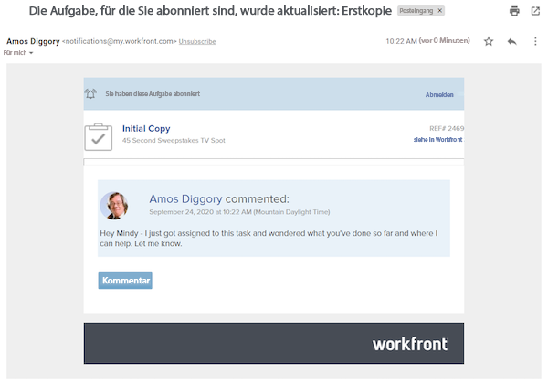
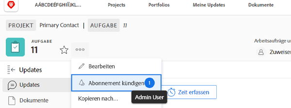

# Abonnieren von Arbeitselementen

Ereignisbenachrichtigungen halten Sie über die Ihnen zugewiesenen Arbeiten auf dem neuesten Stand. Möglicherweise möchten Sie Arbeitsaufgaben verfolgen, die Ihnen nicht zugewiesen sind, aber sich auf Ihre Arbeit auswirken könnten. Ein Abonnement für ein bestimmtes Element ist hier die perfekte Lösung.

Sie interessieren sich zum Beispiel für den Fortschritt der Aufgabe „Ausgangskopie“. Sie sind zwar nicht mit dieser Aufgabe betraut, aber für die Bearbeitung dieser Ausgangskopie verantwortlich und möchten wissen, wie es damit aussieht. Sie können die Aufgabe abonnieren und erhalten bei Aktualisierungen eine E-Mail-Benachrichtigung, die Sie in Echtzeit über den Fortgang der Arbeiten informiert.

Es ist wichtig zu wissen, dass Abonnement-E-Mails und In-App-Benachrichtigungen nur dann gesendet werden, wenn Kommentare zu einem Element abgegeben werden. Bei anderen Aktionen, z. B. Änderungen des Fälligkeitsdatums oder der Zuweisung, werden keine E-Mails und Benachrichtigungen versendet.

Um ein Arbeitselement zu abonnieren, müssen Sie mindestens über die Berechtigung zur Ansichtsfreigabe des Elements verfügen.

Fenster ![[!UICONTROL Aufgabenzugriff]](assets/admin-fund-user-notifications-11.png)

Sobald Sie Zugriff auf das Arbeitselement haben, können Sie es abonnieren, indem Sie:

1. Die Landingpage des Projekts, der Aufgabe oder des Problems aufrufen.
1. Auf das Menü **[!UICONTROL Aktionen]** klicken.
1. Auf **[!UICONTROL Abonnieren]** klicken.

Option ![[!UICONTROL Abbonieren] im Aufgabenmenü](assets/admin-fund-user-notifications-12.png)

Sie können sehen, wer das Arbeitselement sonst noch abonniert hat, indem Sie den Mauszeiger über die Zahl neben [!UICONTROL Abonnieren/Abmelden] im Menü bewegen.

Wenn Sie für das Arbeitselement über die Berechtigungen [!UICONTROL Verwalten] oder [!UICONTROL Freigeben] verfügen, können Sie andere Benutzende für ein Projekt, eine Aufgabe oder ein Problem abonnieren, indem Sie:

1. Auf die Zahl neben der Option **[!UICONTROL Abonnieren]** klicken.
1. Den Namen der Person(en), die Sie für das Arbeitselement abonnieren möchten, hinzufügen.
1. Auf **[!UICONTROL Speichern]** klicken.

Fenster ![[!UICONTROL Abonnieren]](assets/admin-fund-user-notifications-15.png)

Die Personen, die Sie abonnieren, werden nicht über das Abonnement benachrichtigt. Alle Abonnentinnen und Abonnenten erhalten eine Anzeigeberechtigung für das Element. Wenn die Abonnentin bzw. der Abonnent für das Element jedoch bereits über die Berechtigungen [!UICONTROL Mitwirken] oder [!UICONTROL Verwalten] verfügt, bleiben diese Berechtigungen unverändert.

Ein Eintrag auf der Registerkarte [!UICONTROL Updates] des jeweiligen Elements zeigt auch an, wer wann ein Abonnement abgeschlossen hat. Auf der Registerkarte [!UICONTROL Updates] wird auch protokolliert, wenn jemand durch eine andere Person abonniert wird.

Seite ![[!UICONTROL Updates] für eine Aufgabe mit Anzeige eines Abonnements](assets/admin-fund-user-notifications-16.png)

Um eine Person abzumelden, klicken Sie erneut auf die Sprechblase, um das Fenster [!UICONTROL Abonnenten] zu öffnen. Klicken Sie dann auf das X neben dem Namen der Person. Die Person wird nicht darüber informiert, dass sie abgemeldet wurde.

Menüoption ![[!UICONTROL Abmelden] für ein Projekt](assets/admin-fund-user-notifications-14.png)

<!---
learn more URL: Subscribe to items in Workfront
--->
