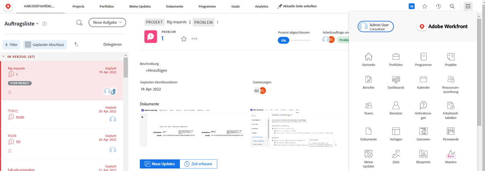
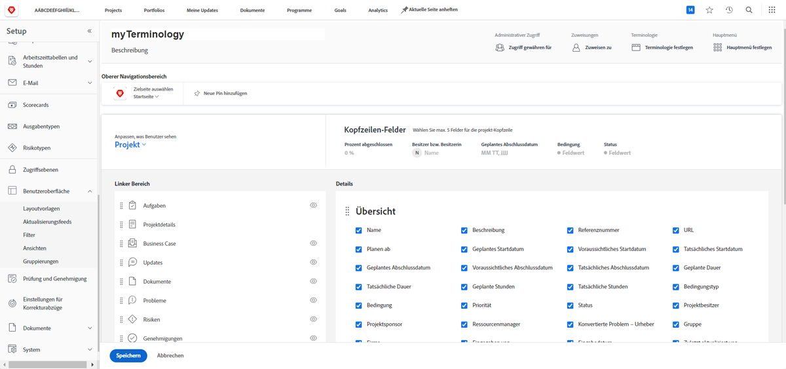
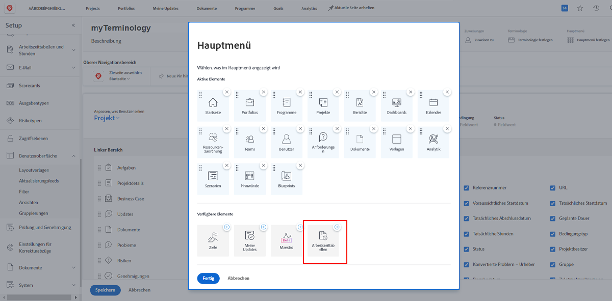
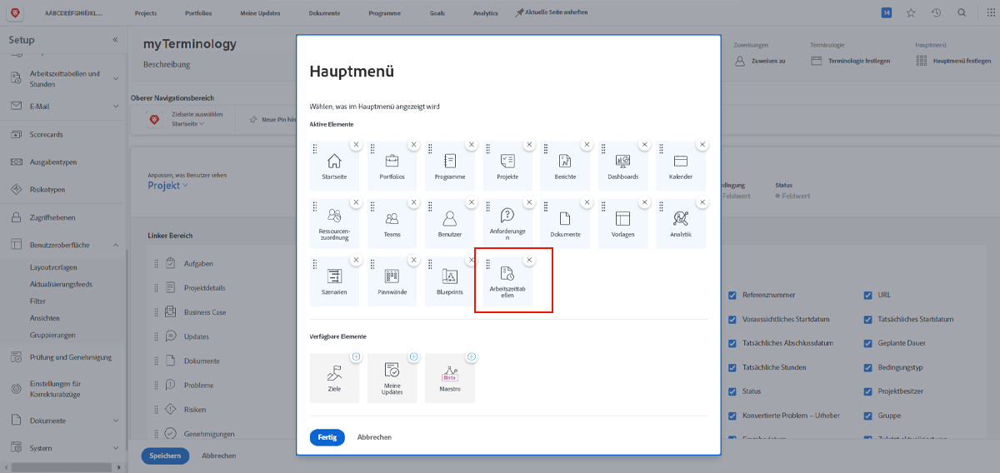

# Was sind Layoutvorlagen?

Workfront verfügt über viele gute Tools, mit denen Sie Ihre Arbeit erledigen können. Aber zu viel von einer guten Sache kann überwältigend sein.

Mit Layout-Vorlagen können Systemadministratoren und Gruppenadministratoren das Benutzererlebnis anpassen und diesen Benutzern ermöglichen, sich auf das für sie wichtige zu konzentrieren.

Beispielsweise protokolliert der Großteil Ihrer Organisation keine Zeit. Das Beratungsteam führt jedoch Rechnungen von Kunden durch, sodass diese Zeit protokollieren müssen, um eine korrekte Rechnungsstellung sicherzustellen. Mit einer Layout-Vorlage können Timesheets für diejenigen ausgeblendet werden, die sie nicht benötigen, und für diejenigen angezeigt werden, die sie benötigen.

## Vor der Erstellung

Workfront empfiehlt, mit Ihren Benutzern zu sprechen, bevor Sie eine Layoutvorlage erstellen. Die Einbeziehung der Benutzer, die die Layout-Vorlage verwenden werden, wie z. B. die Gruppenadministratoren, wird es sehr viel einfacher machen, die richtigen Informationen und Tools vor den richtigen Personen zu platzieren.

Außerdem scheuen Sie sich nicht, Änderungen vorzunehmen, nachdem eine Vorlage erstellt wurde. Erhalten Sie weiterhin Feedback zu den Anforderungen und möchten Sie sehen und darauf zugreifen. Denken Sie daran, dass Layoutvorlagen Ihren Benutzern ein sauberes und einfaches Erlebnis bieten sollen.
