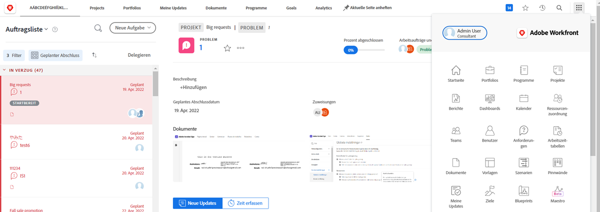
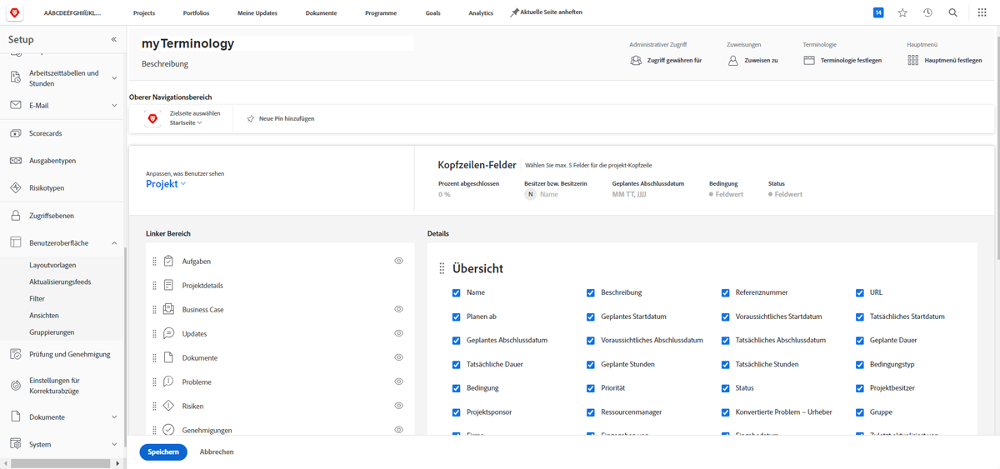
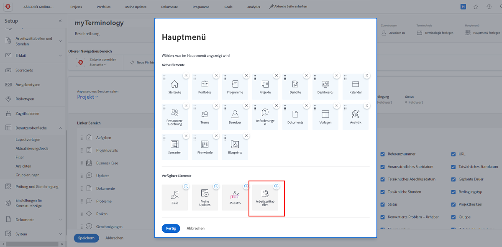
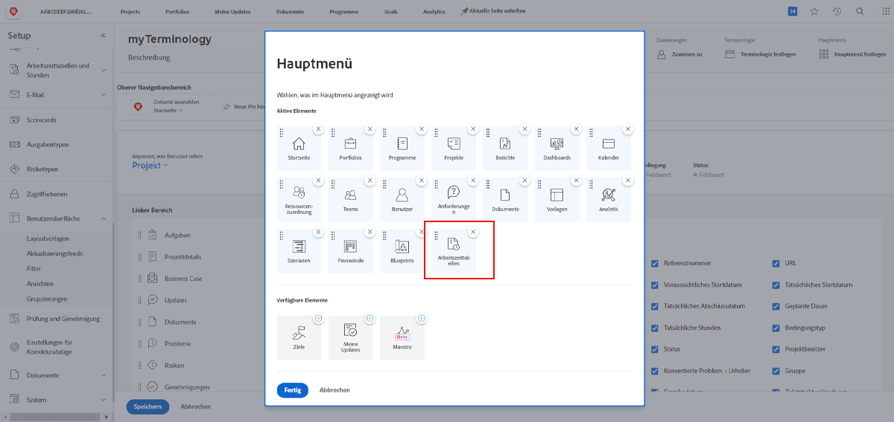

# Was sind Layout-Vorlagen?

Workfront bietet viele gute Tools, die Ihnen helfen, Ihre Arbeit zu erledigen. Aber zu viel des Guten kann überwältigend sein.

Mithilfe von Layout-Vorlagen können System- und Gruppenadmins die Benutzererfahrung anpassen und den Benutzenden die Möglichkeit geben, sich auf das zu konzentrieren, was für sie wichtig ist.

Der Großteil Ihres Unternehmens erfasst beispielsweise keine Zeit. Das Berater-Team stellt der Kundschaft jedoch Rechnungen aus und muss daher die Zeit erfassen, um eine genaue Abrechnung zu gewährleisten. Mit einer Layout-Vorlage können Arbeitszeittabellen für diejenigen ausgeblendet werden, die sie nicht benötigen, und für diejenigen angezeigt werden, die sie benötigen.

## Vor dem Aufbau

Workfront empfiehlt, vor der Erstellung einer Layout-Vorlage mit Ihren Benutzenden zu sprechen. Durch die Einbeziehung derjenigen, die die Layout-Vorlage verwenden werden, wie z. B. der Gruppenadmins, können die richtigen Informationen und Werkzeuge viel einfacher an die richtigen Personen weitergegeben werden.

Und scheuen Sie sich nicht, Änderungen vorzunehmen, nachdem eine Vorlage erstellt wurde. Holen Sie sich weiterhin Rückmeldungen darüber ein, was sie brauchen und sehen wollen und worauf sie zugreifen wollen. Denken Sie daran, dass Layout-Vorlagen dazu gedacht sind, eine saubere und einfache Erfahrung für Ihre Benutzenden zu schaffen.
