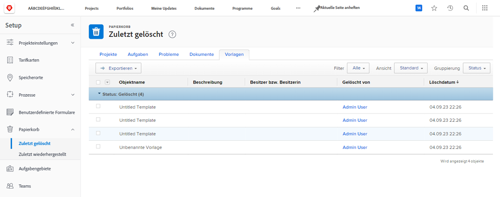
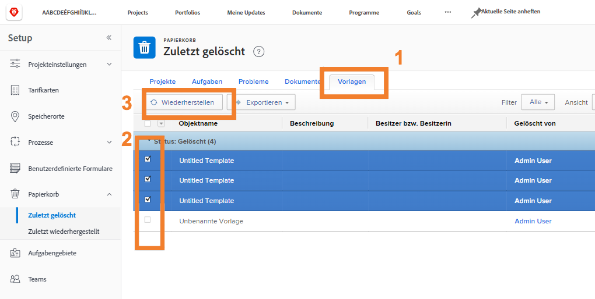
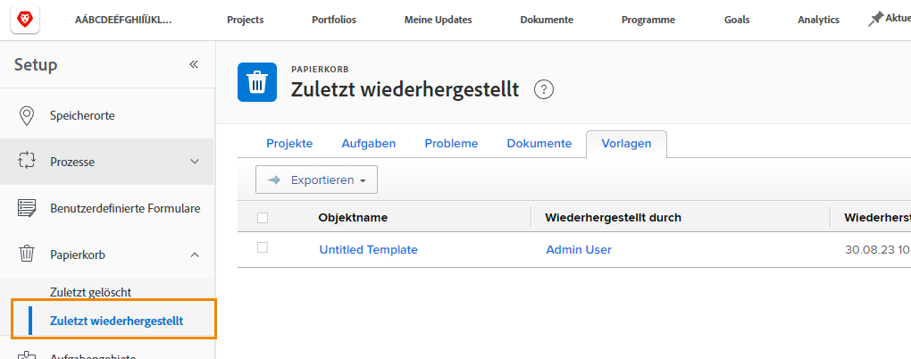

# Wiederherstellen von Objekten aus dem Papierkorb

Die Projektarbeit unterliegt vielen Veränderungen. Es kann sein, dass Sie etwas löschen, nur um 30 Minuten später festzustellen, dass die Aufgabe doch benötigt wurde oder das Dokument für das Problem, das Sie zu lösen versuchen, wichtig war.

Wenn ein Objekt aus dem Papierkorb gelöscht wird, legt Workfront es bis zu 30 Tage lang im Papierkorb ab. Systemadmins können das Objekt mit all seinen Informationen (Aktualisierungen, erfasste Stunden, Dokumente usw.) an seinem ursprünglichen Speicherort in Workfront wiederherstellen.

## Wiederherstellen eines Objekts

1. Wählen Sie **Setup** im **Hauptmenü**.
1. Klicken Sie im linken Bereich auf **Papierkorb**.
1. Wählen Sie **Kürzlich gelöscht**.

Jedes wiederherstellbare Objekt hat eine Registerkarte, um die Suche nach dem jeweiligen Objekt zu erleichtern.

1. Klicken Sie auf die Registerkarte des gewünschten Objekts.
1. Markieren Sie das Kontrollkästchen neben den Objekten, die Sie wiederherstellen möchten.
1. Klicken Sie auf die Schaltfläche **Wiederherstellen**.

Die wiederherzustellenden Objekte werden kurz im Abschnitt [!UICONTROL In Bearbeitung] angezeigt. Nach der Aktualisierung des Bildschirms erscheinen die Objekte nicht mehr auf dem Bildschirm, da sie wiederhergestellt worden sind. Die Elemente werden an der Stelle angezeigt, an der sie sich zuvor in [!DNL Workfront] befanden, was Sie auf dem Bildschirm [!UICONTROL Zuletzt wiederhergestellt] überprüfen können.

Gruppenadmins können ein Projekt wiederherstellen, das mit der von ihnen verwalteten Gruppe verknüpft ist, zusammen mit allen Aufgaben, Problemen und Dokumenten, die mit dem Projekt verknüpft sind.

<!--
learn more URL
Restoring deleted items
Viewing items that have been recently restored
-->
