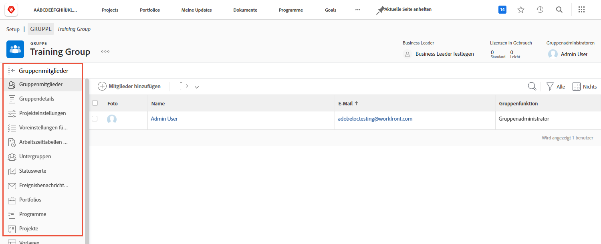

# Grundlegendes zur Notwendigkeit von Gruppenadmins

<!---
21.4 updates have been made
--->

Wenn Sie die bzw. der Systemadmin eines großen Unternehmens oder eines Unternehmens mit vielen [!DNL Workfront]-Benutzenden sind, kann die Pflege der [!DNL Workfront] -Einstellungen für jede Gruppe und Untergruppe sehr zeitaufwendig sein.

Die Ernennung von Gruppenadmins, die einige Verwaltungsfunktionen für ihre eigenen Gruppen in [!DNL Workfront] ausführen können, trägt zu einer besser ausgewogenen Verteilung der Last bei, wenn es um die Aktualisierung und Wartung des Systems geht.

Gruppenadmins sind in der Regel besser mit den täglichen Herausforderungen ihrer Gruppe vertraut, sodass sie sich um die Bedürfnisse der Gruppe kümmern können. So können Sie sich als Systemadmin auf die [!DNL Workfront]-Konfigurationen konzentrieren, die Ihrem Unternehmen als Ganzes zugute kommen.

In [!DNL Workfront] können Gruppenadmins unter anderem Folgendes tun:

* Erstellen von Untergruppen und Hinzufügen von Benutzenden zu den Untergruppen.
* Erstellen von Layout-Vorlagen für ihre Gruppe.
* Erstellen von Genehmigungsprozessen für die Gruppe.
* Erstellen der Status von Workflows auf Gruppenebene.
* Über die Gruppenseite können Sie auf Projekte, Programme und Portfolios zugreifen, die mit der Gruppe verbunden sind.
* Verwalten Sie Projekt-, Aufgaben- und Problemeinstellungen auf Gruppenebene.
* Verwalten Sie die Zeiterfassungseinstellungen auf Gruppenebene.
* Verwalten Sie Ereignisbenachrichtigungen auf Gruppenebene.
* Melden Sie sich als andere Gruppenmitglieder an.
* Weisen Sie der Gruppe eine Geschäftsleiterin oder einen Geschäftsleiter zu.
* Leiten Sie ein Unternehmen.

Als System- oder Gruppenadmin können Sie innerhalb der von Ihnen verwalteten Gruppen und Untergruppen weitere Untergruppen erstellen. Diesen Untergruppen können wiederum eigene Gruppenadmins zugewiesen werden.

>[!NOTE]
>
>Eine Gruppe kann maximal 14 Untergruppenebenen umfassen.

**Erfahren Sie mehr über Gruppenadmins**

<!---
bullet points below need hyperlinks
--->

Eine Liste der Aktionen, die Systemadmins, Gruppenadmins und Untergruppenadmins in [!DNL Workfront] ausführen können, finden Sie im Artikel „Zulässige Aktionen für verschiedene Arten von Admins“.

## Verwalten einer Gruppe

Verwalten Sie Gruppenmitglieder, Untergruppen, Gruppenstatus, Gruppenprojekteinstellungen und vieles mehr schnell und effizient über die Gruppenseite in [!DNL Workfront].

1. Wählen Sie **[!UICONTROL Setup]** aus dem **[!UICONTROL Hauptmenü]** aus.
1. Wechseln Sie im linken Bedienfeld zu **[!UICONTROL Gruppen]**.
1. Wählen Sie den Namen einer Gruppe aus, um sie zu öffnen.
1. Öffnen Sie den Abschnitt, den Sie aktualisieren möchten, indem Sie im linken Bedienfeld darauf klicken.

<!---
learn more URLs
Create and manage groups 
Create and manage subgroups 
Business leader overview 
--->
