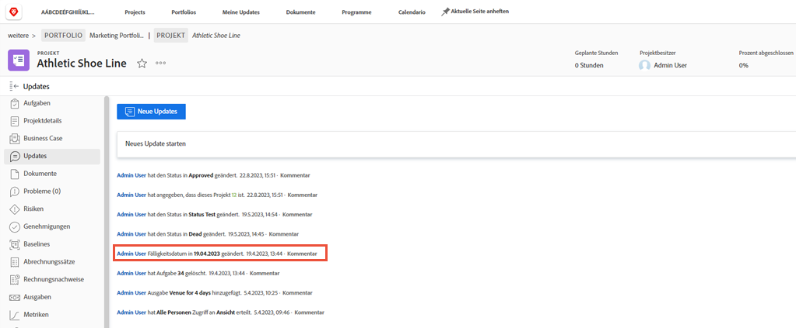

# Anmelden als eine andere Benutzerin bzw. ein anderer Benutzer

Eine Funktion, die Workfront-Admins bei der Einrichtung des Benutzererlebnisses hilfreich finden werden, ist „Anmelden als“. Diese Funktion im Bereich [!UICONTROL Setup] ermöglicht es Ihnen, sich als eine andere Person anzumelden, ohne sich von Ihrem eigenen Konto abmelden zu müssen.

Die Seite ![[!UICONTROL Anmelden als] im Bereich [!UICONTROL Setup]](assets/admin-fund-log-in-as-1.png)

## Vorteile von „Anmelden als“

Diese Funktion ist aus verschiedenen Gründen nützlich:

* Admins können Benutzenden zugewiesene Layout-Vorlagen in der Vorschau anzeigen, um sicherzustellen, dass die Menüelemente oder Dashboards ordnungsgemäß angezeigt werden.
* Beim Testen von Workflows ist es hilfreich, sicherzustellen, dass die Berechtigungen einer Person korrekt eingerichtet sind.
* Admins können diese Funktion sogar verwenden, um für Benutzende, die verhindert sind, eine Aufgabe als abgeschlossen zu kennzeichnen oder eine Genehmigung vorzunehmen.

## Zugriff auf „Anmelden als“

1. Wählen Sie **[!UICONTROL Setup]** aus dem **[!DNL Main Menu]** aus.
1. Klicken Sie im linken Bedienfeld auf **[!UICONTROL Anmelden als]**.
1. Geben Sie den Namen der Person ein, als die Sie sich anmelden wollen.

Registerkarte ![[!UICONTROL Zugriffsprotokoll] auf der Seite [!UICONTROL Anmelden als]](assets/admin-fund-log-in-as-3.png)

Nach der Anmeldung zeigt eine Benachrichtigung oben im Bildschirm an, als wer Sie angemeldet sind.

Die Nachricht ![[!UICONTROL Aktuell angemeldet als] am oberen Rand des Fensters von [!DNL Workfront]](assets/admin-fund-log-in-as-2.png)

## Auf der Registerkarte „Aktualisierungen“ werden Aktivitäten verfolgt

Wenn sich Admins als eine andere Person angemeldet haben und in deren Namen Änderungen/Aktualisierungen vorgenommen haben, werden die Änderungen im Bereich „Updates“ für dieses spezifische Element angezeigt. Das folgende Beispiel zeigt, dass Joan Harris ein Fälligkeitsdatum im Namen von Roy Campbell geändert hat.

