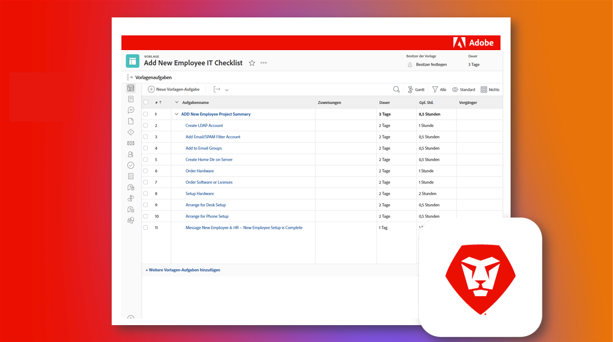

# Übernahme einer bestehenden Adobe Workfront-Instanz

Das Wunderbare an Workfront ist, dass es so anpassbar ist. Die Herausforderung an Workfront besteht darin, dass es so anpassbar ist. Und wenn Sie ein neues System oder eine Gruppe sind und eine bestehende Workfront-Instanz übernehmen, kann es überwältigend sein, herauszufinden, wie sie ursprünglich konfiguriert und eingerichtet wurde.

Über unsere Checkliste für geerbte Instanzen können Sie jedoch alles erfahren, was Sie über Ihre Instanz wissen müssen.

  

In der „Checkliste für geerbte Instanzen“ können Sie einen umfassenden Satz von Fragen, Ressourcen und Links überprüfen, um ein klares Verständnis der Konfiguration zu erhalten.

Die Checkliste wurde sowohl als Blueprint in Workfront als auch als herunterladbare Excel-Tabelle erstellt. Wir empfehlen die Verwendung des Blueprints, um Ihre Arbeit direkt in Workfront zu verwalten und zu dokumentieren.

Sowohl der Blueprint als auch die Tabelle sind nach Themen und nicht nach Zeitleisten sortiert, damit Sie so vorgehen können, wie es für Sie und Ihre Organisation am sinnvollsten ist. Die angegebenen Zeiträume sind nur ein Beispiel und Sie sollten sie an Ihre spezifischen Bedürfnisse anpassen. Das muss nicht alles in einer Sitzung erledigt werden.

Wenn möglich, empfehlen wir Ihnen, mit anderen in Ihrer Organisation zusammenzuarbeiten, um diese Elemente zu überprüfen und zu dokumentieren und diese Dokumentation bei größeren Änderungen auf dem neuesten Stand zu halten. Zukünftige Admins in Ihrer Instanz werden es Ihnen danken.

* <b>Um den Blueprint herunterzuladen</b>, navigieren Sie zum Hauptmenü in Ihrer eigenen Workfront-Instanz und wählen Sie „Blueprints“ aus. Suchen Sie den Blueprint mit dem Titel „Grundlagen für geerbte Instanzen | Checkliste“ und klicken Sie auf „Installieren“. Wählen Sie Ihre Produktions- oder Sandbox-Umgebung aus und fahren Sie mit der Konfiguration fort. Weitere Informationen zur Installation und Konfiguration von Blueprints finden Sie [hier](https://experienceleague.adobe.com/docs/workfront/using/administration-and-setup/blueprints/blueprints-install.html?lang=de).

* <b>Um die Excel-Checkliste herunterzuladen</b>, klicken Sie [hier](assets/adobe-workfront-system-admin-playbook-inherited-instance.xlsx).

Unabhängig davon, ob Sie den Blueprint oder die Excel-Checkliste verwenden, können Sie sich diesen Prozess in drei Hauptphasen gliedern: Erkennung, Audit und Dokumentation. Nachfolgend finden Sie Beschreibungen und ideale Ergebnisse.

 
 

## Phase 1: Lernen und Entdecken

<b>Vorgeschlagener Zeitraum: 4 Wochen</b>

Zunächst müssen Sie verstehen, wie Ihre Workfront-Instanz heute eingerichtet ist.

Hierzu gehören die Durchführung von Interviews mit Interessengruppen und das Durchgehen vorhandener Dokumentationen, um zu verstehen, wie verschiedene Gruppen in Ihrem Unternehmen Workfront nutzen.

Wenn Sie aus technologischer Sicht nicht mit Workfront vertraut sind, führen Sie das Systemadmin-Training durch. Dies bietet den erforderlichen Einblick in die Funktionsweise verschiedener Einstellungen und deren Auswirkungen auf jedes Tool und möglicherweise jede Benutzerin und jeden Benutzer in Workfront.

Am Ende dieser Phase sollten Sie über Folgendes verfügen:

* Ein klares Verständnis der Gründe für die Verwendung von Workfront durch Ihr Unternehmen

* Ein allgemeines Gefühl für den Zustand Ihrer Instanz, einschließlich der wichtigsten Anwendungsfälle

* Ein Dokument, in dem beschrieben wird, was gut funktioniert und welche Herausforderungen und/oder Lücken zwischen Prozess- und Benutzeranforderungen bestehen
 
 

## Phase 2: Systemprüfung

<b>Vorgeschlagener Zeitraum: 4 Wochen</b>

Nach der ersten Erkennung wird empfohlen, eine eher technische Prüfung Ihrer Instanz durchzuführen. Dafür müssen Sie Änderungen oder Verbesserungen festlegen, die möglicherweise vorgenommen werden müssen, um sicherzustellen, dass Ihre aktuelle Einrichtung und Konfiguration Ihren geschäftlichen Anforderungen entspricht.

Am Ende dieser Phase sollten Sie über Folgendes verfügen:

* Einen genaueren Überblick über den aktuellen Status Ihrer Instanz

* Es wurden Änderungen oder Verbesserungen identifiziert, die Sie an Ihrer Instanz vornehmen möchten, um geschäftlichen Anforderungen gerecht zu werden.
 
 

## Phase 3: Dokumentation und Optimierung

<b>Vorgeschlagener Zeitraum: Anfänglich = 2 Wochen; fortlaufende Aktualisierung </b>

Basierend auf dem, was Sie in den Phasen 1 und 2 gelernt haben, möchten Sie gegebenenfalls eine Dokumentation Ihrer Instanz erstellen oder aktualisieren und Fahrpläne erstellen, um strategische und programmspezifische Herausforderungen zu bewältigen.

Während diese Phase noch läuft, sollten Sie Folgendes haben:

* Eine geschriebene zentrale Dokumentation, die Fragen auf den Registerkarten in diesem Dokument beantwortet

* Ein visuelles Diagramm der Workflows, Automatisierungen und Integrationen mit der höchsten Priorität

* Ein Rückstand oder Fahrplan, der künftige Verbesserungen dokumentiert, um organisatorische und strategische Herausforderungen zu verbessern

 
Indem Sie jede Phase mithilfe der Checkliste für geerbte Instanzen durchlaufen, sollten Sie als neue System- oder Gruppenadmins ein besseres Verständnis davon haben, wie Ihre Workfront-Instanz konfiguriert ist, welche Anpassungen oder Verbesserungen vorgenommen werden müssen, und Ihre Dokumentation konsolidieren, um das Workfront-Erlebnis Ihres Unternehmens zu optimieren.

 
 

Weitere Informationen finden Sie unten:
* [Webinar: Tipps zur Übernahme einer geerbten Instanz](https://experienceleaguecommunities.adobe.com/t5/workfront-discussions/webinar-system-admin-essentials-tips-for-taking-over-an-existing/td-p/571873)
* [Festlegen von Zielen für Ihre Workfront-Implementierung](https://experienceleague.adobe.com/docs/workfront/using/administration-and-setup/get-started-administration/define-wf-goals-objectives.html?lang=de)
* [Blog-Beitrag: Executive Sponsoring and Value to Leadership](https://experienceleaguecommunities.adobe.com/t5/workfront-blogs/customer-success-tips-executive-sponsorship-and-value-to/ba-p/518353)
* [Blog-Beitrag: Einführung in Adobe Workfront-KPIs](https://experienceleaguecommunities.adobe.com/t5/workfront-blogs/kpi-dashboards-in-the-new-workfront-experience-introduction-to/ba-p/549001)
