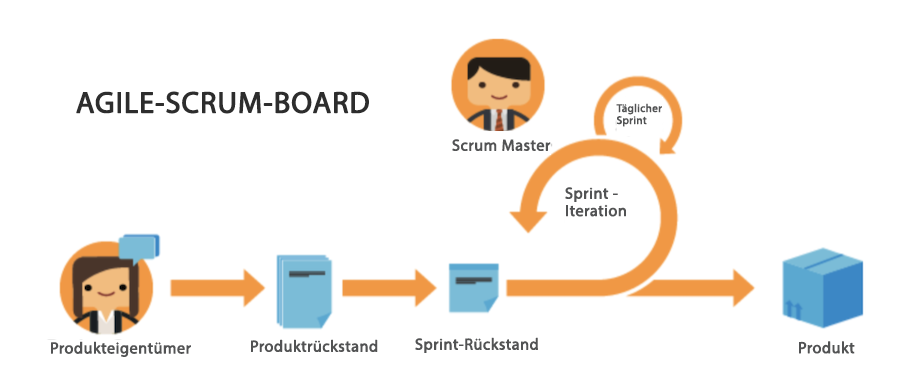

# Vorteile der Verwendung von agilem Vorgehen

## Möglichkeit, sich schnell anzupassen und zu schwenken

Wie der Name schon sagt, ermöglicht es die agile Methodik den Teams, die Richtung und den Fokus ggf. schnell zu ändern. Software- und Marketing-Unternehmen sind sich besonders stark der Tendenz bewusst, dass sich die Nachfrage von Woche zu Woche ändert. Agiles Vorgehen ermöglicht es Teams, ihre Arbeit neu zu bewerten und in bestimmten Schritten anzupassen, um sicherzustellen, dass sich der Fokus auch für das Team ändert, wenn sich die Arbeit und die Kundenlandschaft ändern.

## Transparenz bezüglich der Arbeit eines Teams

Agile-Teams nutzen tägliche Besprechungen, die sogenannten Standups, um sicherzustellen, dass sich das Team auf die nach Prioritäten geordnete Liste der zu entwickelnden Funktionen oder Produkte konzentriert. Sie sind nicht mehr verwirrt, weil sie nicht wissen, woran die anderen in ihrem Team arbeiten. Sie führen regelmäßige Berichte darüber, was das Team am Vortag erreicht hat, welche Probleme/Hindernisse möglicherweise gelöst werden müssen und woran sie an diesem Tag arbeiten wollen.

Diese Transparenz und einheitliche Richtung ermöglichen es allen, schneller voranzukommen.

## Häufiges Feedback

Der letzte große Vorteil der Einführung von agilem Vorgehen ist die Feedback-Schleife, die am Ende jeder Iteration eingebaut wird (zur Erinnerung: eine Iteration ist eine bestimmte Zeitspanne, in der das Team auf die Fertigstellung bestimmter Ergebnisse hinarbeiten muss). Mit der Feedback-Schleife kann ein Team auf die letzten Wochen zurückblicken, um festzustellen, welche Probleme aufgetreten sind, wie sich der Plan in Zukunft entwickeln kann, was die Kundschaft jetzt braucht, wenn sich die früheren Anforderungen geändert haben, und welche Erfahrungen das Team gesammelt hat.
