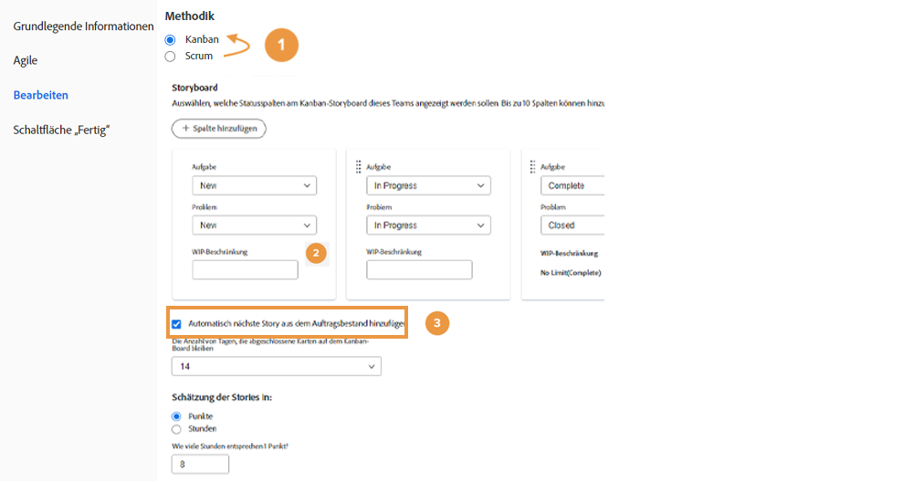
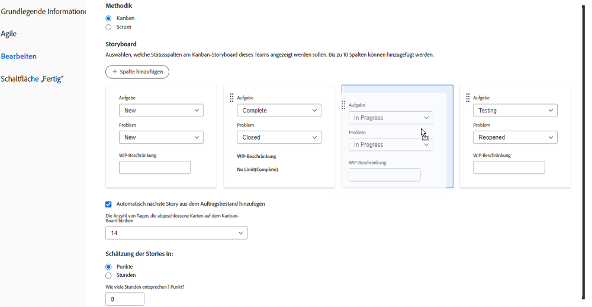
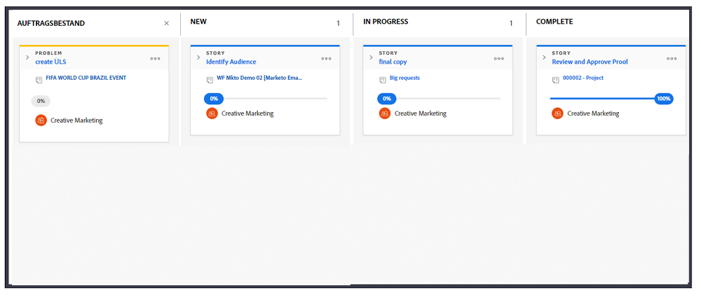
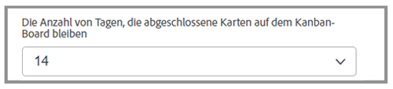

# Erstellen eines Kanban-Teams

Das Creative Marketing-Team verwendet Scrum bereits seit einiger Zeit. Die Team-Mitglieder schätzen die flexible Umgebung eines agilen Teams, aber es fällt ihnen schwer, einen bestimmten Zeitraum für Storys festzulegen, da sich die Prioritäten für das Team häufig ändern.

Für sie gibt es eine Alternative zu Scrum. Sie heißt Kanban.

Kanban eignet sich für Teams, die nicht definieren möchten, woran sie innerhalb des Zeitrahmens arbeiten. Bei einer Scrum-basierten Iteration ist genau das erforderlich. Stattdessen ermöglicht Kanban es Teams, ihren Rückstand kontinuierlich aufzuarbeiten.

Machen wir das Creative Marketing-Team von einem Scrum-Team zu einem Kanban-Team[1]. Nehmen Sie diese Änderung im Abschnitt „Agil“ der Team-Einstellungen vor.

Nachdem Sie die Methodik geändert haben, müssen Sie festlegen, wie viele Storys ein Kanban-Team in jeder Spalte gleichzeitig haben kann, indem Sie das „WIP-Limit“ anpassen. [2]. WIP steht für „Work in Progress“. Die Zahl, die Sie hier eingeben, hängt davon ab, wie viele aktive Elemente das Team handhaben kann. Sie wird auf dem Storyboard des Teams angezeigt, um einfacher daran zu erinnern, ob das Team überlastet ist oder nicht. Sie (und jedes Mitglied des Teams mit Bearbeitungsrechten) können das WIP-Limit auch direkt im Storyboard ändern.

Beachten Sie, dass Sie Statusspalten per Drag-and-Drop in die gewünschte Reihenfolge ziehen können.

Kanban-Teams können sich auch entscheiden, die nächste Story im Rückstand automatisch auf dem Storyboard erscheinen zu lassen, wenn eine Story abgeschlossen ist ([siehe Nummer 3 im obersten Bild]). Dies hilft Teams, die einen kontinuierlichen Arbeitszyklus bevorzugen.

Das folgende Bild zeigt, wie es aussieht, wenn eine neue Story automatisch auf dem Storyboard erscheint, sobald eine Story abgeschlossen ist.

Um Ihre abgeschlossene Arbeit effizienter zu verwalten, bleiben Storys nach Abschluss standardmäßig für weitere 14 Tage auf dem Storyboard.

Bei Bedarf kann diese Einstellung im Fenster mit den Team-Einstellungen auf zwischen 1 und 30 Tage eingestellt werden.

Beachten Sie, dass es trotz dieser anderen Methodik bei der Arbeit in einer agilen Umgebung immer noch wichtig ist, kontinuierlich den Rückstand zu pflegen, indem Story-Anforderungen besprochen werden und die Story-Priorität angepasst wird. Jedes Mal, wenn Sie neue Prioritäten für den Rückstand festlegen möchten, müssen Sie dies eine Registerkarte weiter, auf der Registerkarte „Rückstand“, tun.
