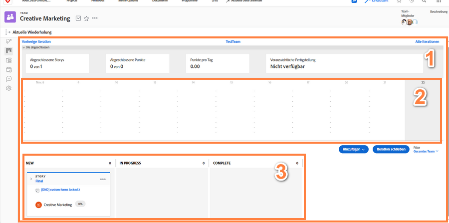

# Erstellen eines agilen Scrum-Teams

## Einrichten eines Scrum-Teams

Ein agiles Team in Workfront schließt seine Arbeit auf der Iterationsseite [1] ab. Der Burndown-Chart [2] oben auf der Seite gibt einen Überblick über die Fortschritte, die in dieser Iteration bisher erzielt wurden. Unter dem Burndown-Chart befinden sich die Storys [3], für die sich das Team für diese Iteration verpflichtet hat.

In diesem Video erfahren Sie, wie Sie ein agiles Team erstellen, die Scrum-Methode auswählen und Einstellungen für das Scrum-Team festlegen.

### Einrichten eines brandneuen Scrum-Teams

Da Sie nun wissen, wie es nach der Einrichtung aussehen wird, können Sie direkt mit der Einrichtung in Workfront beginnen. Gehen wir die Einrichtung anhand einer Fallstudie für ein Unternehmen namens Swains durch. Sie sind für den Betrieb des kreativen Teams verantwortlich und haben dem kreativen Marketing-Team die Zustimmung gegeben, nach Agile zu wechseln.

Dieses spezifische Team hat sich für die Scrum-Methodik entschieden, weil es davon begeistert ist, dass es mit dem Storyboard viel mehr Überblick darüber hat, wer was tut und in welchem Status oder Stadium sich die Arbeitselemente befinden. Die Möglichkeit, kurze Iterationen zu planen, passt gut zu ihren aktuellen Arbeitsanforderungen. Dem Team werden in der Regel zwei bis drei Wochen lang Marketing-Kampagnen angeboten. Es muss in der Lage sein, innerhalb einer so kurzen Zeit zu bestimmen, was das Team tun oder handhaben kann.

## Erstellen eines agilen Scrum-Teams in Workfront

In diesem Video lernen Sie Folgendes:

- Erstellen eines agilen Teams
- Wählen der Scrum-Methode
- Festlegen der Einstellungen für das Scrum-Team

>[!VIDEO](https://video.tv.adobe.com/v/346281/?quality=12&learn=on&enablevpops)

Sie haben bereits ein Team in Workfront, das Sie in ein agiles Team umwandeln möchten? Kein Problem! Gehen Sie zu den Team-Einstellungen und aktivieren Sie die Option „Dies ist ein Agile-Team“.

## Einrichtungsänderung des Scrum-Teams

Die Option „Auf der Registerkarte ‚Probleme‘ anzeigen“ ist nicht mehr auf der Seite mit den Team-Einstellungen enthalten, da die Registerkarte „Probleme“ von agilen Teams nicht mehr benötigt wird. Die einem Team zugewiesenen Probleme finden Sie auf der Registerkarte „Rückstand“, wodurch es einfacher ist, Iterationen zu planen, die sowohl Aufgaben als auch Probleme enthalten.
