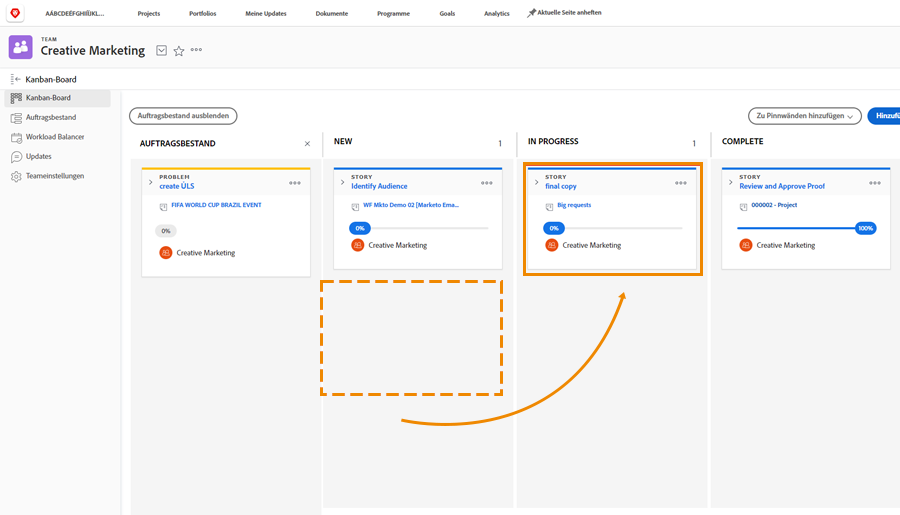
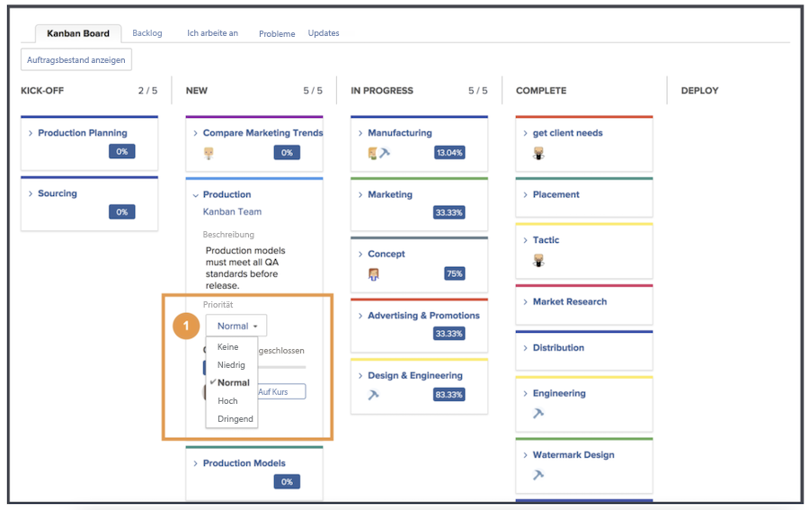
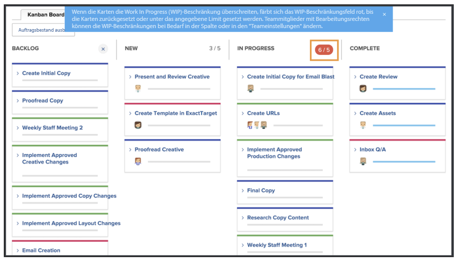

# Verwalten der Arbeit als Kanban-Team

Verwalten von Arbeiten als Kanban-Team Hinzufügen von Geschichten zum Kanban-Backlog Es gibt mehrere Möglichkeiten, Geschichten zum Backlog des Creative Marketing-Teams hinzuzufügen.

Das Team kann Geschichten direkt aus seinem Rückstand hinzufügen.
Sie können auch Aufgaben für ein Projekt zugewiesen werden. Wenn dem Creative Marketing-Team Anfragen übermittelt wurden, werden diese Anforderungen im Tab Anforderungen des Teams angezeigt. Diese werden im Backlog des Teams angezeigt, wenn das Team die Anforderung auswählt und in einen Artikel konvertiert.

## Verwenden des Kanban-Pinnwänden

Nach der Priorisierung von Geschichten im Rückstand ist es an der Zeit, zum Kanban-Board zu wechseln. Sie können Zuweisungen vornehmen, indem Sie die Avatare der Teammitglieder, die an dieser Geschichte arbeiten, auf die Karte ziehen und dort ablegen.

Wenn Fortschritte bei Geschichten erzielt werden, wird das Team sie in den entsprechenden Status auf dem Storyboard versetzen. Team-Mitglieder können die Kanban-Flags verwenden, um anzugeben, ob eine Geschichte auf Track, Blocked oder Ready to Pull ist. Dies teilt anderen Team-Mitgliedern mit, welche Arbeitselemente auf dem Weg sind und ob sie bereit sind, bearbeitet zu werden oder nicht.

Team-Mitglieder können auch direkt auf dem Storyboard Aktualisierungen an den Karten vornehmen, um Änderungen in Bereichen wie Beschreibung, Status oder Priorität widerzuspiegeln. Dazu klicken sie auf das Dropdown-Menü auf einer Storykarte und bearbeiten sie in das entsprechende Feld [1].

## Kanban-Story-Ausführung

Beachten Sie, dass Sie eine Grenze von fünf Geschichten für laufende Arbeiten verwenden. Wenn Sie sich Ihre Pinnwand ansehen, sehen Sie, dass beim Verschieben von Aufgaben in Statusspalten die Anzahl der Aufgaben in jeder Spur rechts oben in jeder Statusspalte angezeigt wird.

Wenn Sie die Beschränkung in einer Statusspalte überschreiten, die &quot;Neu&quot;oder &quot;Gestartet&quot;entspricht, wird eine Fehlermeldung angezeigt, die angibt, dass Sie die Grenze für laufende Arbeiten überschritten haben.

Wenn Ihr Team beschließt, dass es mehr oder weniger Elemente gleichzeitig verarbeiten kann, können Sie (und andere Team-Mitglieder mit Bearbeitungsrechten) die laufende Nummer direkt im Storyboard ändern, indem Sie auf die WIP-Nummer klicken und sie bearbeiten, um Ihre neue Entscheidung widerzuspiegeln.
