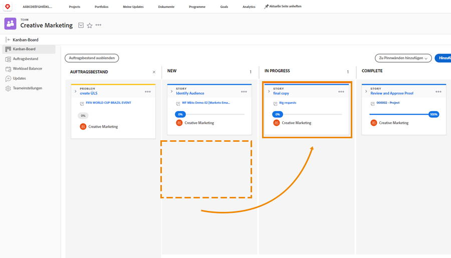
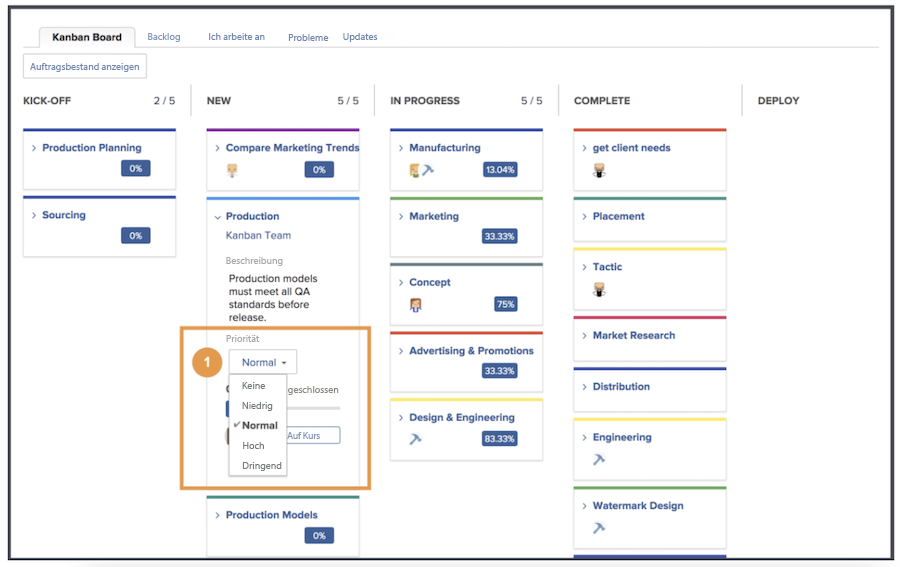
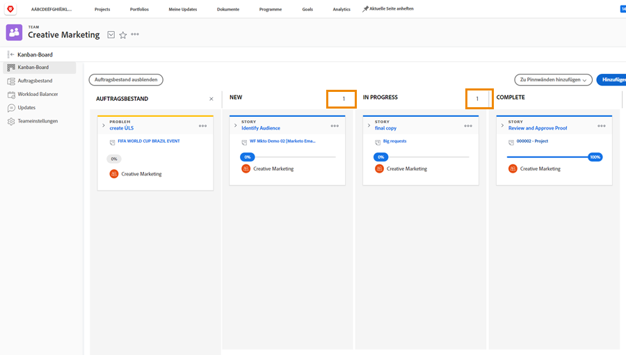
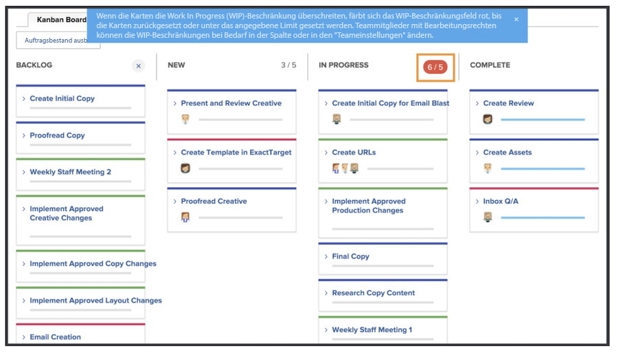

# Verwalten der Arbeit als Kanban-Team

Verwalten der Arbeit als Kanban-Team
Storys zum Kanban-Rückstand hinzufügen
Es gibt mehrere Möglichkeiten, Storys zum Rückstand des Creative-Marketing-Teams hinzuzufügen.

Das Team kann Storys direkt aus seinem Rückstand hinzufügen.
Es kann auch Aufgaben für ein Projekt zugewiesen bekommen. Wenn dem Creative Marketing-Team Anfragen übermittelt wurden, werden diese Anfragen in der Registerkarte „Anfragen des Teams“ angezeigt. Diese werden im Rückstand des Teams angezeigt, wenn das Team die Anfrage auswählt und in eine Story konvertiert.

## Verwenden der Kanban-Pinnwand

Nach der Priorisierung von Geschichten im Rückstand ist es an der Zeit, zur Kanban-Pinnwand zu wechseln. Sie können Zuweisungen vornehmen, indem Sie die Avatare der Team-Mitglieder, die an dieser Geschichte arbeiten, auf die Story-Karte ziehen und dort ablegen.

Beim Fortschreiten der Storys verschiebt das Team sie in den entsprechenden Status auf dem Storyboard. Team-Mitglieder können die Kanban-Flags verwenden, um anzugeben, ob der Status einer Story „On Track“, „Blocked“ oder „Ready to Pull“ ist. Dies teilt anderen Team-Mitgliedern mit, welche Arbeitselemente auf dem richtigen Weg sind und ob sie bereit sind, bearbeitet zu werden oder nicht.

Team-Mitglieder können auch direkt auf dem Storyboard Aktualisierungen an den Karten vornehmen, um Änderungen in Bereichen wie Beschreibung, Status oder Priorität widerzuspiegeln. Dazu klicken sie auf das Dropdown-Menü auf einer Story-Karte und bearbeiten das entsprechende Feld [1].

## Ausführung einer Kanban-Story

Beachten Sie, dass Sie eine Beschränkung von fünf Storys für laufende Arbeiten verwenden. Wenn Sie sich Ihre Pinnwand ansehen, sehen Sie, dass beim Verschieben von Aufgaben in Statusspalten die Anzahl der Aufgaben in jeder Spur rechts oben in jeder Statusspalte angezeigt wird.

Wenn Sie die Beschränkung in einer Statusspalte überschreiten, die „Neu“ oder „Gestartet“ entspricht, wird eine Fehlermeldung angezeigt, die angibt, dass Sie die Beschränkung für laufende Arbeiten überschritten haben.

Wenn Ihr Team beschließt, dass es mehr oder weniger Elemente gleichzeitig verarbeiten kann, können Sie (und andere Team-Mitglieder mit Bearbeitungsrechten) die laufende Anzahl direkt im Storyboard ändern, indem Sie auf die WIP-Zahl klicken und sie bearbeiten, um Ihre neue Entscheidung widerzuspiegeln.
