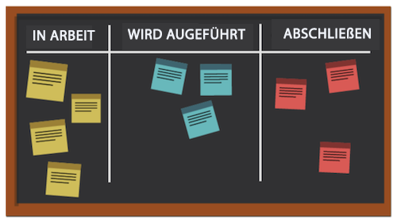
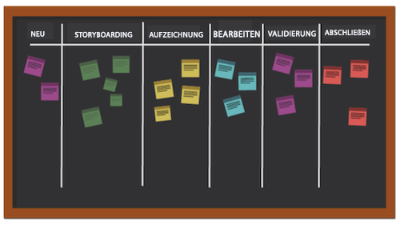

# Was ist die Kanban-Methode und wie funktioniert sie?

Im Gegensatz zu anderen agilen Methoden, die sich auf einen zyklischen Prozess konzentrieren, konzentriert sich die Kanban-Methode auf einen optimierten Workflow. Kanban versucht, den Arbeitsfluss zu verbessern, indem es die Arbeit visualisiert, indem ein Kanban-Board verwendet, eine Grenze für die Menge der Arbeit, die in Gang sein kann, festlegt und den Fluss analysiert, um kontinuierliche Verbesserungen zu erzielen.

Sehen wir uns einige der Schlüsselelemente von Kanban an.

## Wichtigste Player

Die Schlüsselspieler in einem Kanban-Team ähneln denen in einem Scrum-Team, allerdings ist kein Scrum Übergeordnet. Es kann dennoch sinnvoll sein, dass jemand als Projektmanager oder Verantwortlicher fungiert, aber theoretisch sollte diese Rolle natürlich auftreten, wenn es notwendig wird.

## Visualisierung: Kanban-Board

Es gibt viele Möglichkeiten, Ihr Kanban-Board zu formatieren. Teams arbeiten von einer Pinnwand, die über eine beliebige Anzahl von Spalten verfügen kann. Jede Spalte stellt den Status der durchgeführten Arbeit dar.

Im vereinfachtesten Gremium könnte die erste Spalte &quot;zu tun&quot;lauten, die zweite &quot;Gestartet&quot;und die dritte &quot;vollständig&quot;.

Viele Unternehmen verfügen über eine eigene Terminologie für die Spaltennamen, oder sie können sogar jeden Schritt in einem Prozess auflisten, doch der Zweck ist derselbe. Teammitglieder verschieben ihre Geschichten von Spalte zu Spalte, je nachdem, in welchem Zustand sich die Arbeit befindet.

## Priorisierung

Team-Mitglieder arbeiten mit einem Produkt-Manager oder Projekt-Manager zusammen, um sicherzustellen, dass die Meldungen im Rückstand und andere Statusspalten priorisiert werden und dass die Arbeit weiter in Richtung Fertigstellung geht. Der Produktmanager ist weiterhin dafür verantwortlich, dass die Stimme des Kunden gehört und das Produkt in die richtige Richtung bewegt wird.

## Beschränken der Arbeit im Prozess

Ein einzigartiger Aspekt von Kanban ist, dass Teams ihre Kapazität für die Anzahl der Geschichten, die sie zu jeder Zeit verarbeiten können, begrenzt. Teams wählen eine bestimmte Anzahl von Geschichten aus, die sie in ihren Spalten &quot;zu tun&quot; und &quot;In Bearbeitung&quot; haben wollen, und sie gehen nicht über diese Anzahl, um einen Burnout zu verhindern. Sobald eine Geschichte auf &quot;abgeschlossen&quot;verschoben wurde, wird eine Meldung aus dem Rückstand in der Spalte &quot;zu erledigen&quot;platziert.

## Kontinuierliche Verbesserung

Kanban ermöglicht eine kontinuierliche Verbesserung durch ein System für Teams zur Messung ihrer Effektivität. Sie können deutlich sehen, wie ihre Arbeitsabläufe ablaufen, wie lange jeder Workflow dauert und wie oft sie ihre Ergebnisse pünktlich zur Verfügung stellen. Dies erleichtert das Experimentieren mit verschiedenen Methoden zur Optimierung der Ausgabe.
