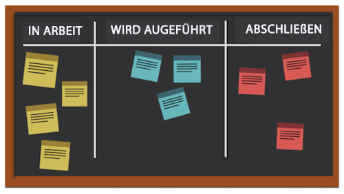
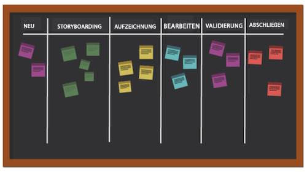
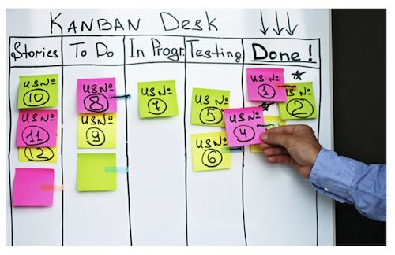

# Was ist die Kanban-Methode und wie funktioniert sie?

Im Gegensatz zu anderen agilen Methoden, die sich auf einen zyklischen Prozess konzentrieren, ist die Kanban-Methode auf einen optimierten Workflow ausgerichtet. Kanban zielt darauf ab, den Arbeitsfluss zu verbessern, indem die Arbeit mithilfe einer Kanban-Tafel visualisiert, ein Grenzwert für das durchführbare Arbeitsvolumen festgelegt und der Fluss analysiert wird, um kontinuierliche Verbesserungen vorzunehmen.

Sehen wir uns einige der Schlüsselelemente von Kanban an.

## Die wichtigsten Beteiligten

Die wichtigsten Beteiligten in einem Kanban-Team sind denen in einem Scrum-Team ähnlich, nur dass niemand es leitet. Es kann immer noch sinnvoll sein, dass jemand das Projekt leitet oder beaufsichtigt, aber theoretisch sollte diese Rolle bei Bedarf ganz natürlich entstehen.

## Visualisierung: Kanban-Tafel

Es gibt viele Möglichkeiten, Ihre Kanban-Tafel zu gestalten. Die Teams arbeiten mit einer Tafel mit einer beliebigen Anzahl von Spalten. Jede Spalte stellt den Status der durchgeführten Arbeit dar.

Im einfachsten Fall könnte die erste Spalte „Zu erledigen“, die zweite „In Bearbeitung“ und die dritte „Abgeschlossen“ heißen.

Viele Unternehmen haben ihre eigenen Begriffe für die Spaltennamen oder listen sogar jeden einzelnen Prozessschritt auf, aber die Absicht ist dieselbe. Die Team-Mitglieder verschieben ihre Storys von Spalte zu Spalte, je nachdem, in welchem Zustand sich die Arbeit befindet.

## Priorisierung

Die Team-Mitglieder arbeiten mit einer Person zusammen, die Produkte oder Projekte verwaltet, um sicherzustellen, dass die Storys im Rückstand und in anderen Statusspalten priorisiert werden und die Arbeit weiter auf die Fertigstellung zusteuert. Die Produkt-Managerin bzw. der Produkt-Manager ist nach wie vor dafür verantwortlich, dass die Stimme der Kundschaft gehört wird und sich das Produkt in die richtige Richtung entwickelt.

## Begrenzung laufender Arbeiten

Ein einzigartiger Aspekt von Kanban ist, dass die Teams eine Kapazitätsgrenze für die Anzahl der Storys haben, die sie zu einem bestimmten Zeitpunkt bearbeiten können. Die Teams wählen eine bestimmte Anzahl von Storys aus, die ihre Spalten „Zu erledigen“ und „In Bearbeitung“ enthalten dürfen, und überschreiten diese Zahl nicht, um einen Burnout zu vermeiden. Sobald eine Story den Status „Abgeschlossen“ erreicht hat, nimmt eine Story aus dem Rückstand ihren Platz in der Spalte „Zu erledigen“ ein.

## Kontinuierliche Verbesserung

Kanban ermöglicht eine kontinuierliche Verbesserung, indem es den Teams ein System zur Messung ihrer Effektivität bietet. So können sie klar erkennen, wie ihre Workflows funktionieren, wie viel Zeit jeder Teil des Workflows in Anspruch nimmt und wie oft sie ihre Arbeitsergebnisse pünktlich fertigstellen können. Dies erleichtert das Experimentieren mit verschiedenen Methoden zur Ergebnisoptimierung.
