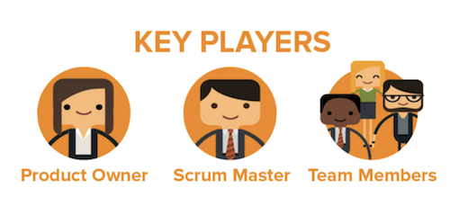
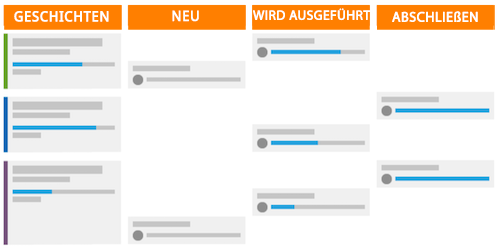

# Was ist die Scrum-Methode und wie funktioniert sie?

Die Scrum-Methode umfasst das Flexibilitätsmodell, unterscheidet sich aber von anderen Methoden dadurch, dass sie definierte Rollen für die Team-Mitglieder vorsieht – wie Produkteigentümer, Scrum Master usw. -- und definierte Praktiken, um Arbeiten zu definieren und abzuschließen.

## Übersicht über das Scrum-Team

Wenn Sie entscheiden, ob Sie zu Scrum wechseln möchten, müssen Sie sich die Struktur Ihrer Teams ansehen, um zu sehen, ob sie einfach zur neuen Methodik übertragen werden können. Ein Scrum-Team besteht aus drei Arten von Mitgliedern: einem Produkteigentümer, einem Scrum Master und den Team-Mitgliedern.

### Produkteigentümer

Die Produkteigentümer sind für das Produkt verantwortlich und haben eine Vorstellung dafür, was das Produkt ist oder sein soll. Sie sind ein Sprachrohr für die Kundschaft und die wichtigste Triebkraft für Geschäftsentscheidungen und die Priorisierung von Produkt-Features.

### Scrum Master

Scrum Master helfen dem Team, die Arbeit zu erledigen, indem sie die benötigten Ressourcen finden und einen Konsens im Team schaffen, um die Arbeit so effizient wie möglich zu erledigen. Sie erleichtern auch die Kommunikation und die Absprachen während des gesamten Prozesses.

### Team-Mitglieder

Ein Team ist in der Regel funktionsübergreifend und hat Mitglieder mit vielen verschiedenen Aufgabengebieten und Fähigkeiten. Sie sind für die Planung, Ausführung und Bereitstellung von Produktinkrementen zuständig. Sie werden davon profitieren, wenn sie sich physisch am selben Ort befinden oder Zugang zu Tools haben, die eine schnelle und einfache Zusammenarbeit ermöglichen, sowohl untereinander als auch bei den täglichen Team-Besprechungen.

## Zusammenarbeit im Scrum-Team

Nachdem Sie diese wichtigen Player zusammengestellt haben, folgen sie einem neuen Arbeitsablauf, um ihre Arbeit zu erledigen und ein Produkt an den Kunden zu liefern. Auch hier wird im Vergleich zur traditionellen oder Wasserfall-Methode nicht mehr ein linearer Prozess verfolgt, bei dem ein Plan für ein Endprodukt erstellt wird und dann die Schritte oder Phasen durchlaufen werden, die für die Lieferung dieses Produkts erforderlich sind. Stattdessen erstellen Scrum-Teams zunächst einen Rückstand.

### Aufbau eines Rückstands

Das Scrum-Team sieht sich eine Liste vorrangiger Merkmale und gewünschter Features an, die als Storys bezeichnet werden. Sie müssen die Kundschaft fragen und im Team erörtern, was sie von dem System oder Produkt, das sie entwickeln wollen, erwartet und braucht.

Sobald sie ihre Haupt-Storys erstellt haben, müssen sie ihren Rückstand aufbereiten. Als Team müssen sie vier wichtige Schritte durchlaufen:

* Große Storys in kleinere Schritte aufteilen, indem sie besprechen, was zu jeder Story getan werden muss.

* Prioritäten der Storys setzen und entscheiden, welche Features zuerst entwickelt werden sollen.

* Die Anforderungen und Akzeptanzkriterien festlegen, damit eine Story als erledigt gilt.

* Den Aufwand für das Team für die Fertigstellung jeder Story und des Rückstands abschätzen. Dies kann in Stunden oder in Punkten geschehen. Mithilfe von Punkten lässt sich angeben, wie schwierig oder komplex die Story ist, anstatt die Zeit zu planen, die für jede Komponente der Story benötigt wird.

### Iterationsplanung

Nachdem der Rückstand vergrößert und priorisiert wurde, ist es an der Zeit, die Iteration zu planen. (Viele Organisationen verwenden das Wort &quot;sprint&quot;und &quot;iteration&quot;synonym.) Das Team entscheidet anhand der als einsatzbereit angesehenen Storys, welche Storys abgeschlossen werden sollen. Das Team weist Arbeitsaufträge zu und entscheidet über die Dauer der Iteration.

### Ausführen der Iteration

Jetzt ist es Zeit, die Iteration auszuführen. Die Team-Mitglieder beginnen mit ihrer Arbeit wie ein herkömmliches Team, führen aber jetzt eine schnelle, tägliche Besprechung durch, das „Standup-Meeting“.

Die Team-Mitglieder stehen bei diesem kurzen Treffen buchstäblich auf (Standup) und beantworten drei Fragen:

* Was habe ich gestern erledigt?
* Was werde ich heute erledigen?
* Auf welche Hindernisse stoße ich bei der Durchführung meiner Arbeitsaufträge?

Diese Treffen sorgen dafür, dass alle Beteiligten auf demselben Stand sind und schnell vorankommen.

## Verwendung eines Burndown-Diagramms und eines Storyboards zur Verfolgung des Fortschritts

Da ein Team die drei Hauptfragen in seinen Konstanten beantwortet, ist es wichtig, dass sie ihren Fortschritt hin zum Abschluss der Iteration überwachen und verfolgen. Auf diese Weise können sie feststellen, ob sie sich schnell genug durch ihre Storys bewegen, um am Ende der Iteration alle Features pünktlich zu liefern. Im Scrum-Prozess gibt es zwei Komponenten, um dies zu tun.

### Storyboard

Mithilfe eines Storyboards bewegen Teams ihre Storys durch Statusspalten, um anzuzeigen, wann Arbeitselemente neu, in Bearbeitung oder abgeschlossen sind.

### Burndown-Chart

Mithilfe eines Burndown-Charts kann überwacht werden, ob das Team die Storys mit ausreichender Geschwindigkeit fertigstellt. Burndown-Charts können für einzelne Iterationen oder die gesamte Produktversion verwendet werden.

