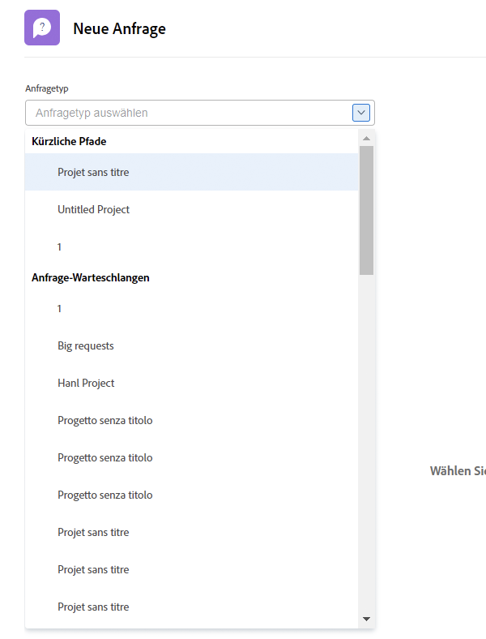
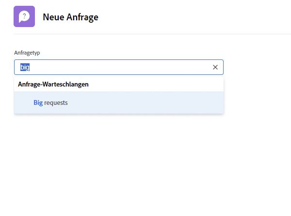

# Anfrage stellen

In diesem Video lernen Sie Folgendes:

* Zum Anfragebereich navigieren
* Anfrage stellen
* Eingereichte Anfragen anzeigen
* Einen Entwurf einer Anfrage finden

>[!VIDEO](https://video.tv.adobe.com/v/336092/?quality=12&learn=on&enablevpops)

## Schnell und einfach auf die Pfade in der Anfrage-Warteschlange zugreifen

Wenn Sie in das Feld [!UICONTROL Anfragetyp] klicken, werden die letzten drei Anfragepfade, die Sie kürzlich eingereicht haben, automatisch oben in der Liste angezeigt. Wählen Sie eine Option, um eine weitere Anfrage in derselben Warteschlange zu stellen.

Am Ende der Liste stehen alle Warteschlangen, auf die Sie Zugriff haben. Wenn Sie sich nicht sicher sind, welche Warteschlange Sie für Ihre Anfrage verwenden sollen, nutzen Sie die Suche nach Schlüsselwörtern, um schnell und einfach die gewünschte Warteschlange zu finden.

Bei der Eingabe von Schlüsselwörtern zeigt [!DNL Workfront] Übereinstimmungen an, sodass Sie den für Ihre Bedürfnisse geeigneten Pfad für die Anfrage-Warteschlange finden können. Um beispielsweise eine Anfrage für einen Post in den sozialen Medien zu stellen, geben Sie „Social Media“ in das Feld [!UICONTROL Anfragetyp] ein, und die Liste wird dynamisch aktualisiert, um alle Übereinstimmungen anzuzeigen.

Wählen Sie die gewünschte Option aus, füllen Sie das Anfrageformular aus und senden Sie die Anfrage ab.

<!---
Learn more
Requests area overview
Create and submit Workfront requests
Guides
Make a work request
--->
