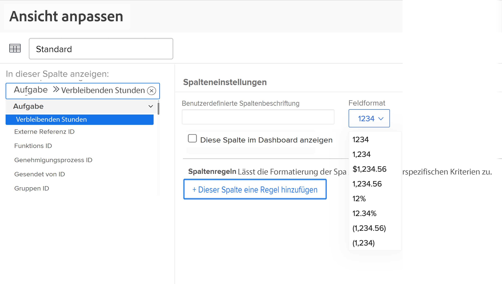
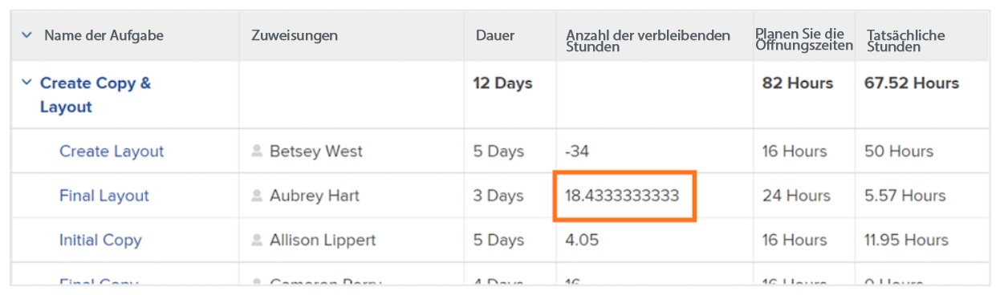
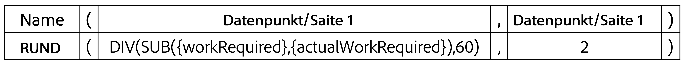

# Erstellen eines SUB-, SUM-, DIV- oder PROD-Datenausdrucks

In diesem Video lernen Sie Folgendes:

* Funktionsweise der Ausdrücke SUB, SUM, DIV und PROD
* Erstellen eines SUB-Datenausdrucks in einem berechneten Feld

>[!VIDEO](https://video.tv.adobe.com/v/335177/?quality=12&learn=on&enablevpops=1)

## Zusätzliche Informationen: ROUND-Ausdruck

### Erstellen eines ROUND-Ausdrucks

Der ROUND-Ausdruck rundet eine beliebige Zahl auf eine bestimmte Anzahl von Dezimalstellen.

Meistens wird der ROUND-Datenausdruck in Verbindung mit einem anderen Datenausdruck verwendet und wenn das Formatfeld entweder Text oder Zahl bleibt.

Erstellen wir ein berechnetes Feld, um den Unterschied zwischen den geplanten und tatsächlich erfassten Stunden für eine Aufgabe zu ermitteln, wofür der SUB-Ausdruck erforderlich ist und das wie folgt aussieht:

**SUB({workRequired},{actualWorkRequired})**

Da die Zeit in Minuten verfolgt wird und das bevorzugte Format die Informationen in Stunden anzeigen soll, muss der Ausdruck außerdem durch 60 geteilt werden und damit wie folgt aussehen:

**DIV(SUB({workRequired},{actualWorkRequired}),60)**

Wenn das Format beim Erstellen des berechneten Felds im benutzerdefinierten Formular in „Zahl“ geändert wird, können Sie das Zahlenformat ändern, wenn Sie das Feld zu einer Ansicht hinzufügen.

Wenn das Feldformat bei der Erstellung eines benutzerdefinierten Feldes jedoch auf „Text“ eingestellt ist, kann das Format in der Ansicht nicht einfach geändert werden. Es muss der ROUND-Ausdruck verwendet werden, um zu vermeiden, dass in Ihrem Projekt solche Zahlen angezeigt werden:

<b>Verwenden des ROUND-Datenausdrucks in einem berechneten Feld</b>

Der ROUND-Ausdruck enthält den Namen des Ausdrucks (ROUND) und in der Regel zwei Datenpunkte. Bei diesen Datenpunkten kann es sich um einen Ausdruck oder ein Feld in Workfront handeln, gefolgt von einer Zahl, die angibt, wie viele Dezimalstellen Sie verwenden möchten.

Ein Ausdruck ist wie folgt strukturiert: ROUND(Datenpunkt, #)

Verwenden Sie im Ausdruck zur Berechnung der Differenz zwischen geplanten und tatsächlichen Stunden diesen Ausdruck - DIV({workRequired},{actualWorkRequired}),60) - als ersten Datenpunkt. Stellen Sie dann sicher, dass die Zahl, die von diesem Ausdruck stammt, auf höchstens 2 Dezimalstellen gerundet wird.

Der Ausdruck könnte wie folgt geschrieben werden: ROUND(DIV(SUB({workRequired},{actualWorkRequired}),60),2).
