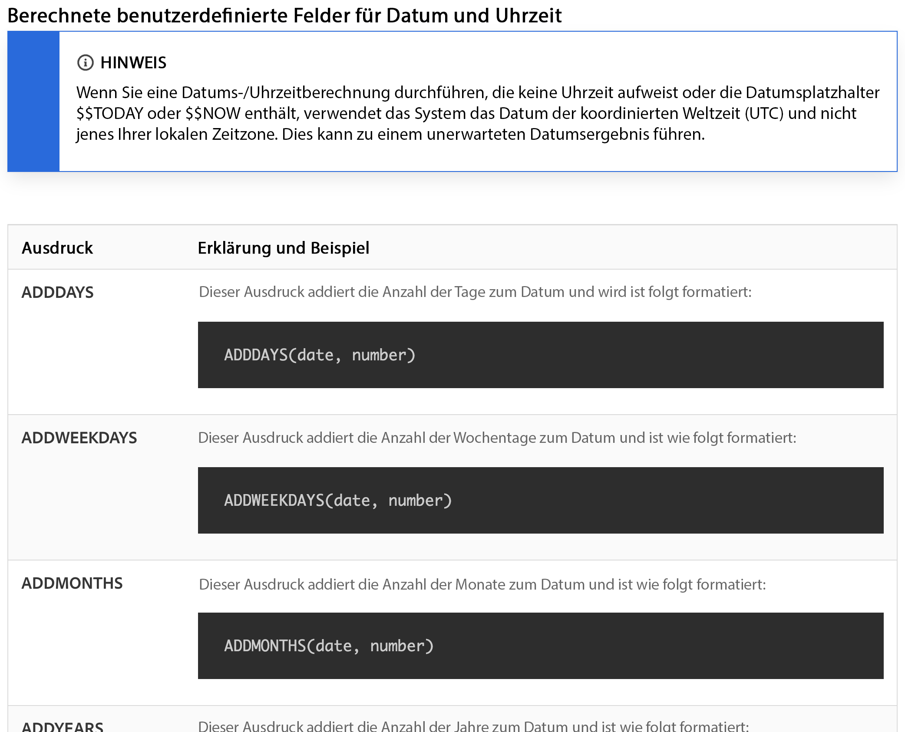
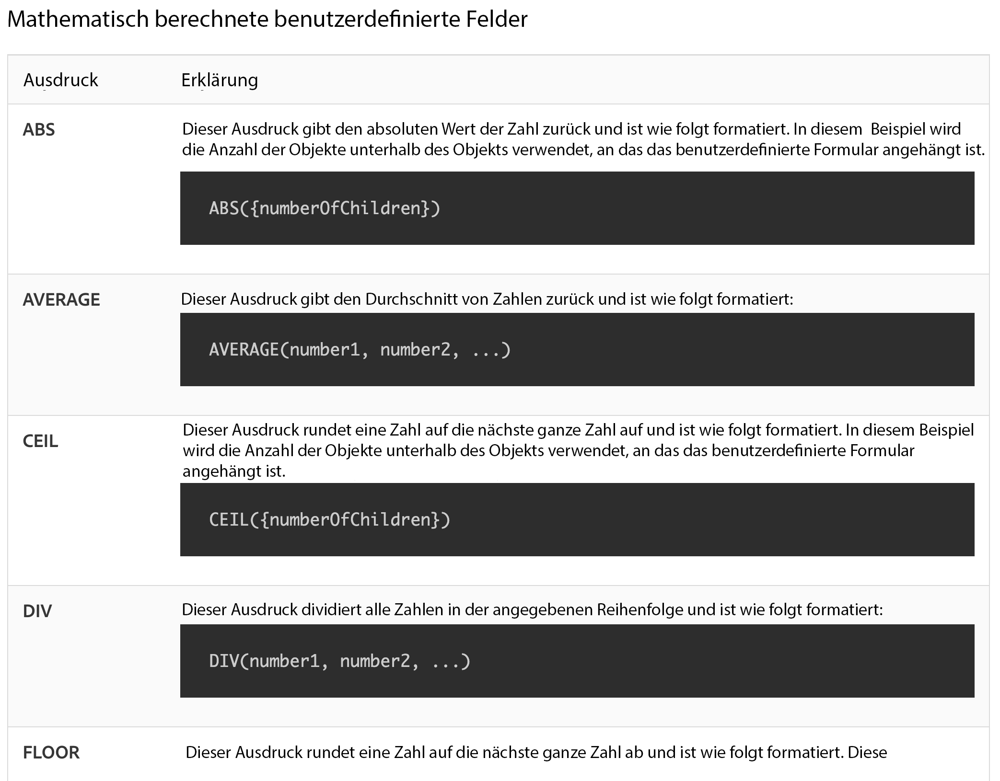

# Verstehen von Datums- und Uhrzeitinformationen und mathematischen Ausdrücken

## Datums- und Uhrzeitausdrücke

Mit Datums- und Uhrzeitausdrücken können Sie wichtige Daten in den Vordergrund Ihrer Berichte rücken, automatisch die Anzahl der Arbeitstage berechnen, die zum Abschließen einer Aufgabe benötigt wurden, oder Zeitstempel aus einer Ansicht entfernen, wenn sie nicht benötigt werden.

Beim Ansehen der verfügbaren Datums- und Uhrzeitausdrücke stehen Ihnen verschiedene Optionen zur Verfügung.

Es gibt zwei Datums- und Uhrzeitausdruckssätze, die am häufigsten von [!DNL Workfront]-Kundinnen und -Kunden genutzt werden:

* ADDDAYS/ADDWEEKDAY/ADDMONTHS/ADDYEARS und
* DATEDIFF/WEEKDAYDIFF

## Mathematische Ausdrücke

Mathematische Ausdrücke ermöglichen es [!DNL Workfront], automatisch Berechnungen vorzunehmen, ob einfach oder kompliziert.

Beim Ansehen der verfügbaren Datums- und Uhrzeitausdrücke stehen Ihnen verschiedene Optionen zur Verfügung.

Workfront-Kundinnen und -Kunden verwenden gemeinhin die beiden folgenden mathematischen Ausdruckssätze:

* SUB, SUM, DIV, PROD
* ROUND

<b>HINWEIS</b>: Eine vollständige Liste der Ausdrücke und weitere Informationen zu den einzelnen Ausdrücken finden Sie auf der Dokumentationsseite „Ausdrücke für berechnete Daten“.