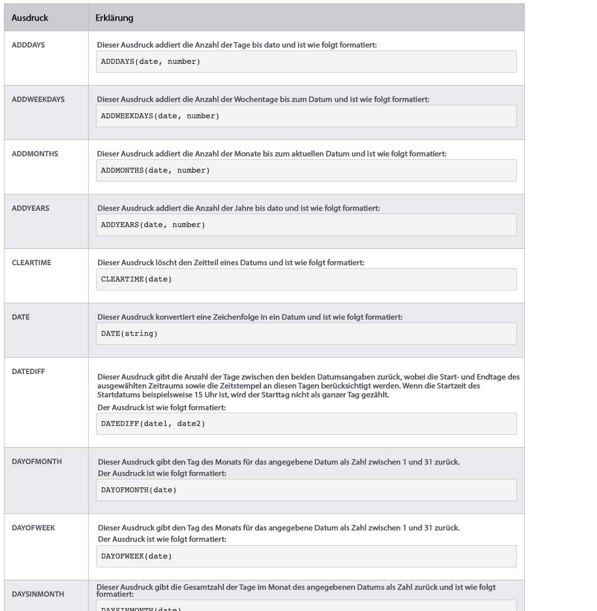

# Datums- und Uhrzeitinformationen und mathematische Ausdrücke

## Datums- und Uhrzeitausdrücke

Mit Datums- und Uhrzeitausdrücken können Sie wichtige Daten an die Vorderseite Ihrer Berichte ziehen, automatisch die Anzahl der Arbeitstage berechnen, die zum Abschließen einer Aufgabe benötigt wurden, oder Zeitstempel aus der Ansicht entfernen, wenn sie nicht benötigt werden.

Wenn Sie sich die verfügbaren Datums- und Uhrzeitausdrücke ansehen, stehen Ihnen verschiedene Optionen zur Verfügung.

Es gibt zwei Datums- und Uhrzeitausdruckssätze, die am häufigsten von [!DNL Workfront] Kunden:

* ADDDAYS/ADDWEEKDAY/ADDMONTHS/ADDYEARS und
* DATEDIFF/WEEKDAYDIFF

## Mathematische Ausdrücke

Mathematische Ausdrücke ermöglichen [!DNL Workfront] automatisch Berechnungen, ob einfach oder kompliziert.

Wenn Sie sich die verfügbaren Datums- und Uhrzeitausdrücke ansehen, stehen Ihnen verschiedene Optionen zur Verfügung.

[!DNL Workfront] -Kunden verwenden in der Regel die beiden folgenden mathematischen Ausdruckssätze:

* Unterabschnitt, SUM, DIV, PROD
* ROUND
