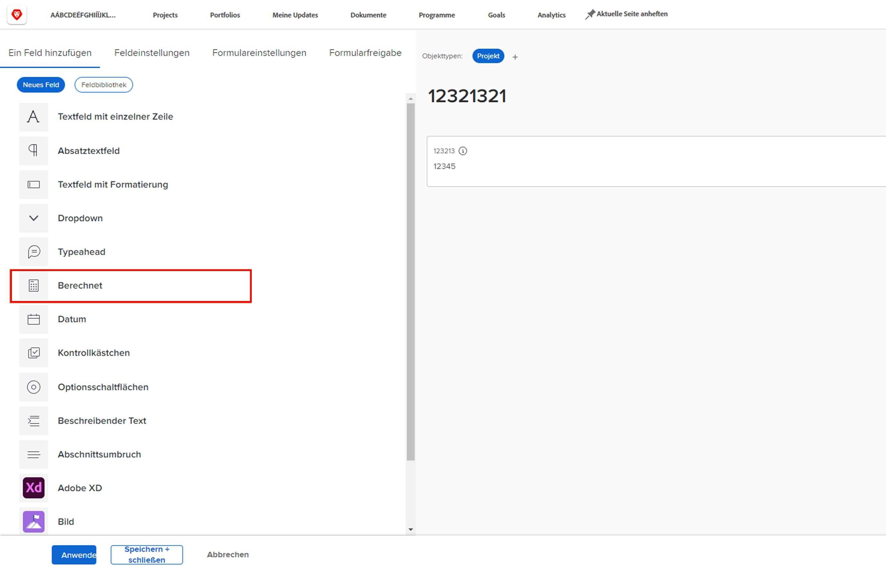
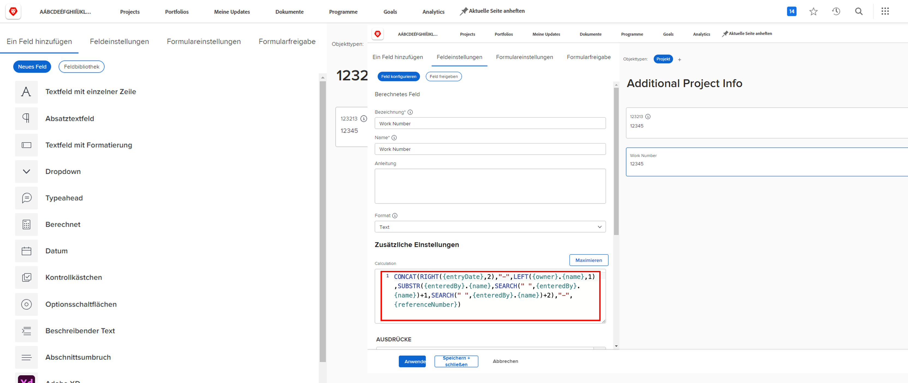
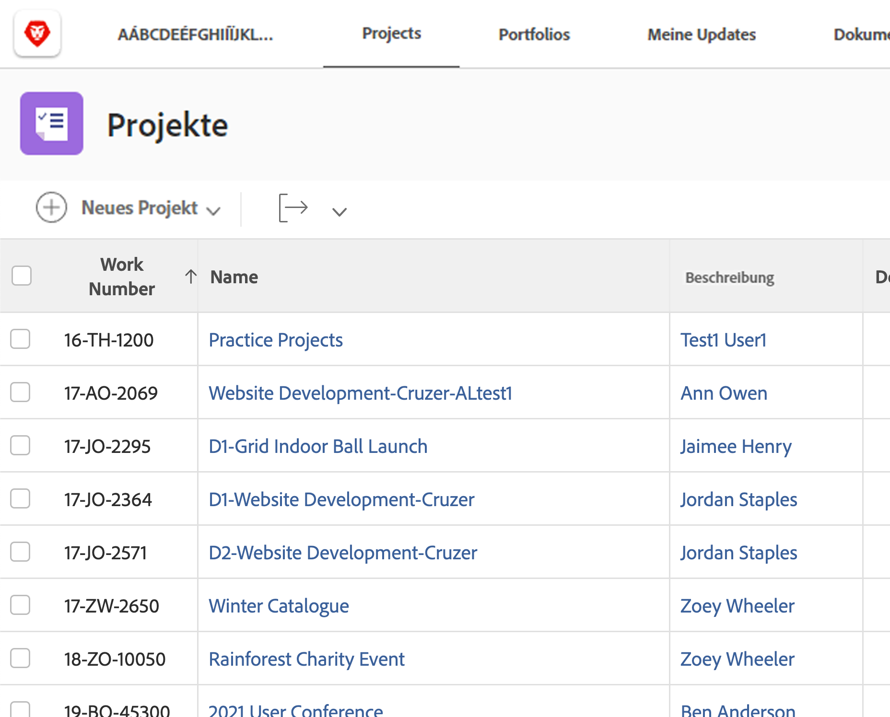
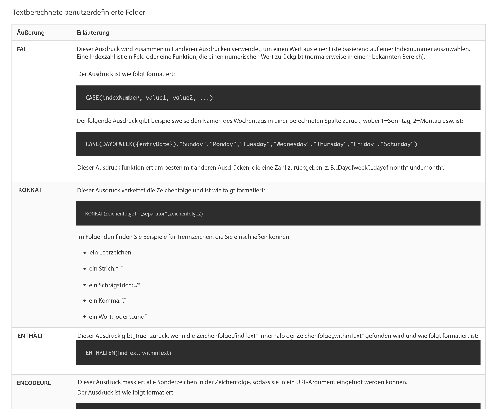

# Erste Schritte mit berechneten Feldern und Ausdrücken

<!-- **Note**: The expression examples shown are simple and some may be mitigated by fields already supplied by  . However, the examples are used to illustrate the foundational knowledge needed in order to build expressions in Workfront.-->

[!DNL Workfront] bietet eine Vielzahl von Feldern, die in verschiedenen Geschäftsbereichen vorkommen und regelmäßig für das Arbeitsmanagement verwendet werden. Felder wie geplanter Abschlussdatum, Projekt-Budget, Name des Aufgabenverantwortlichen usw.

Jede Organisation verfügt jedoch über branchen- und unternehmensspezifische Daten, die gesammelt werden müssen, um zu verstehen, ob die Unternehmensziele erreicht werden. Ihre Organisation möchte beispielsweise Folgendes verfolgen:

* Welcher Geschäftsbereich ein Projekt beitragen wird.
* Wenn die Finanzierung von Lieferanten, intern oder beidem stammt.
* Welche Auflösung ist für verwendete Bilder erforderlich?

Obwohl diese Felder nicht von Natur aus in [!DNL Workfront]können Sie benutzerdefinierte Dateneingabefelder und vorausgefüllte Antwortfelder mit Mehrfachauswahl über ein benutzerdefiniertes Formular erstellen.

Dieser Lernpfad konzentriert sich auf das berechnete Feld. Sie erfahren, was ein berechnetes Feld ist, welche verschiedenen Arten von Informationen Sie über Datenausdrücke in das berechnete Feld ziehen können und wie Sie diese berechneten Felder erstellen, um Ihre Datenerfassung und Berichterstellung zu verbessern.

**Erinnerung an benutzerdefinierte Formulare**

Felder sind objektspezifisch. Wenn Sie beispielsweise ein berechnetes Feld für ein benutzerdefiniertes Aufgabenformular erstellen, können Sie dieses Feld in einem beliebigen Aufgabenbericht verwenden.

## Was ist ein berechnetes Feld?

In einem berechneten Feld werden benutzerdefinierte Daten gespeichert, die mithilfe von Datenausdrücken und vorhandenen Workfront-Feldern erstellt wurden.

Ihre Organisation verfügt beispielsweise über eine bestimmte Projektnummerierung bzw. eine bestimmte Arbeitsnummer, die Folgendes enthält:

* Jahr der Erstellung des Projekts,
* Initialen des Projekteigentümers und
* Die [!DNL Workfront] Referenznummer des Projekts.

Mithilfe von Ausdrücken in einem berechneten Feld können Sie alle Informationen abrufen, die bereits in [!DNL Workfront] und erstellen Sie die eindeutige Projekt-ID oder Arbeitsnummer, die dann einem Bericht wie folgt hinzugefügt werden kann:

Je nach den benötigten spezifischen Daten können berechnete Felder einfach sein, mit ein oder zwei Ausdrücken oder komplizierter sein, wenn mehrere eingebettete Ausdrücke verwendet werden. Beachten Sie bitte Folgendes: [!DNL Workfront] kann nur für berechnete Felder bereits gespeicherte oder in das System abgerufene Daten verwenden.

## Textausdrücke

Textausdrücke suchen, zerlegen und kombinieren Informationen, die in [!DNL Workfront] , um aussagekräftigere Daten zu erstellen oder bessere Einblicke in die Arbeit Ihrer Organisation zu erhalten.

Textausdrücke können beispielsweise für Folgendes verwendet werden:

* Zeigen Sie in einer Spalte einer Projektansicht &quot;Mehr als 5.000 $&quot;an, wenn die Projektkosten über 5.000 $ liegen, oder &quot;Unter 5.000 $&quot;, wenn die Ausgaben darunter liegen.

* Geben Sie jedem Projekt eine eindeutige Nummer, die das Jahr enthält, in dem das Projekt erstellt wurde, sowie die  [!DNL Workfront] Referenznummer, Projektname und Initialen des Projektinhabers.

* Erstellen Sie einen Bericht, der alle Projekte auflistet, die keinem Portfolio und/oder Programm zugewiesen sind, damit Sie diesen Bericht in Ihren Manager-Sitzungen verwenden können.

Textausdrücke können in einem benutzerdefinierten Feld verwendet werden, um diese Arten von Suchen und Kombinationen in [!DNL Workfront].
TE Wenn Sie sich die möglichen Textausdrücke ansehen, finden Sie mehrere Optionen.

Am häufigsten werden sechs Textausdrücke verwendet:

* ZUSAMMENFÜGEN
* LINKS/RECHTS
* CONTAINS
* IF
* ISBLANK