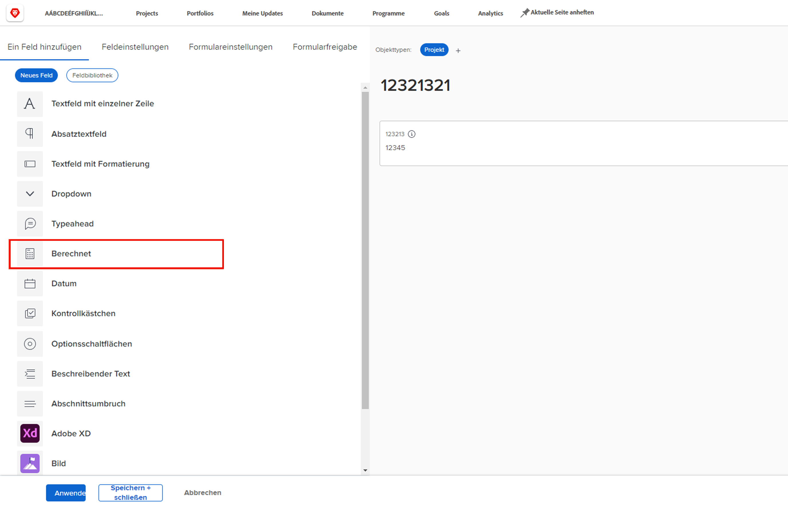
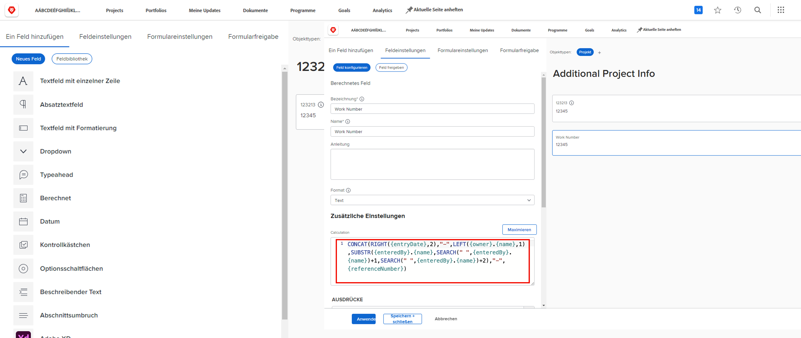
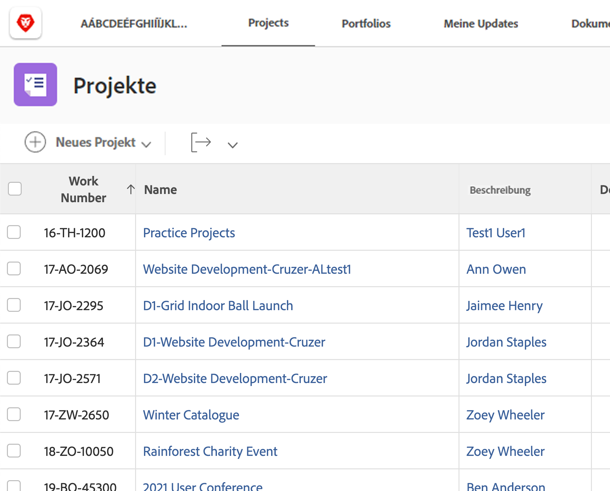
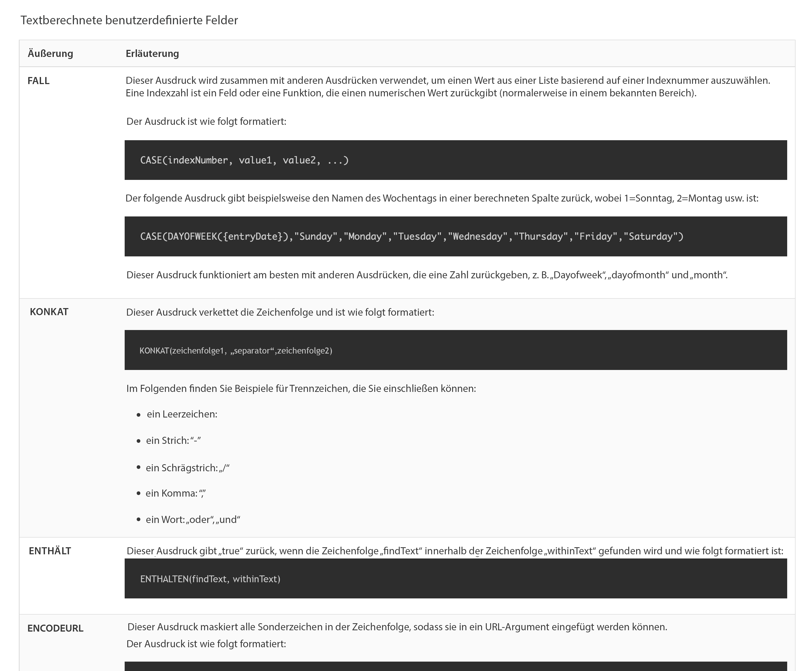

# Erste Schritte mit berechneten Feldern und Ausdrücken

<!--
**Note**: The expression examples shown are simple and some may be mitigated by fields already supplied by  . However, the examples are used to illustrate the foundational knowledge needed in order to build expressions in Workfront.
-->

Workfront bietet eine Vielzahl von Feldern, die in verschiedenen Geschäftsbereichen üblich sind und regelmäßig für die Arbeitsverwaltung verwendet werden. Felder wie das geplante Abschlussdatum, das Projekt-Budget, der Name der bzw. des Aufgabenverantwortlichen usw.

Jede Organisation verfügt jedoch über branchen- und unternehmensspezifische Daten, die gesammelt werden müssen, um zu verstehen, ob die Unternehmensziele erreicht werden. Nehmen wir beispielsweise an, Ihre Organisation möchte Folgendes verfolgen:

* Zu welchem Geschäftsbereich ein Projekt beitragen wird.
* Ob die Finanzierung durch Lieferanten, intern oder aus beiden Quellen erfolgt.
* Welche Auflösung für die verwendeten Bilder erforderlich ist.

Obwohl diese Felder nicht von Anfang an in [!DNL Workfront] integriert sind, können Sie benutzerdefinierte Dateneingabefelder und vorausgefüllte Antwortfelder mit Mehrfachauswahl über ein benutzerdefiniertes Formular erstellen.

Der Schwerpunkt dieses Lernpfads liegt auf dem berechneten Feld. Sie erfahren, was ein berechnetes Feld ist, welche verschiedenen Arten von Informationen Sie über Datenausdrücke in das berechnete Feld ziehen können und wie Sie diese berechneten Felder erstellen, um Ihre Datenerfassung und Berichterstellung zu verbessern.

## Was ist ein berechnetes Feld?

In einem berechneten Feld werden benutzerdefinierte Daten gespeichert, die mithilfe von Datenausdrücken und vorhandenen Workfront-Feldern erstellt wurden.

Ihr Unternehmen verfügt beispielsweise über ein spezielles Projekt- oder Arbeitsnummerierungssystem, das die folgenden Daten enthält:

* Jahr der Erstellung des Projekts,
* Initialen der Projektbesitzerin bzw. des -besitzers und
* die [!DNL Workfront]-Projektreferenznummer.

Mithilfe von Ausdrücken in einem berechneten Feld können Sie jede bereits in [!DNL Workfront] gespeicherte Information verwenden und eine eindeutige Projekt-ID oder Arbeitsnummer erstellen, die dann zu einem Bericht wie diesem hinzugefügt werden kann:

Je nach den benötigten Daten können berechnete Felder einfach sein und einen oder zwei Ausdrücke verwenden, oder sie können komplizierter sein und mehrere eingebettete Ausdrücke verwenden. Denken Sie aber daran, dass Workfront für berechnete Felder nur bereits gespeicherte oder in das System abgerufene Daten verwenden kann.

## Textausdrücke

Textausdrücke suchen, zerlegen und kombinieren Informationen in [!DNL Workfront], um aussagekräftigere Daten zu erstellen oder bessere Einblicke in die Arbeit Ihrer Organisation zu erhalten.

Textausdrücke können beispielsweise für Folgendes verwendet werden:

* Anzeigen von „Mehr als 5.000 $“ in einer Spalte einer Projektansicht, wenn die Projektkosten über 5.000 $ liegen, oder von „Unter 5.000 $“, wenn die Ausgaben darunter liegen.

* Geben Sie jedem Projekt eine eindeutige Nummer, die das Jahr der Erstellung des Projekts sowie die [!DNL Workfront]-Referenznummer, den Projektnamen und die Initialen der Person, die das Projekt besitzt, beinhaltet.

* Erstellen Sie einen Bericht, der alle Projekte auflistet, die keinem Portfolio und/oder Programm zugewiesen sind, damit Sie diesen Bericht in Ihren Manager-Sitzungen verwenden können.

Textausdrücke können in einem benutzerdefinierten Feld verwendet werden, um diese Arten von Suchen und Kombinationen in Workfront durchzuführen.

Wenn Sie sich die möglichen Textausdrücke ansehen, finden Sie mehrere Optionen.

Am häufigsten werden sechs Textausdrücke verwendet:

* ZUSAMMENFÜGEN
* LEFT / RIGHT
* CONTAINS
* IF
* ISBLANK