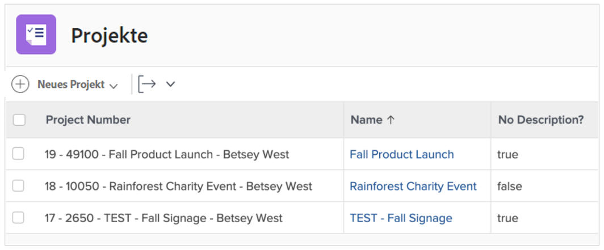
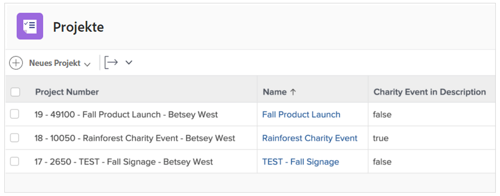
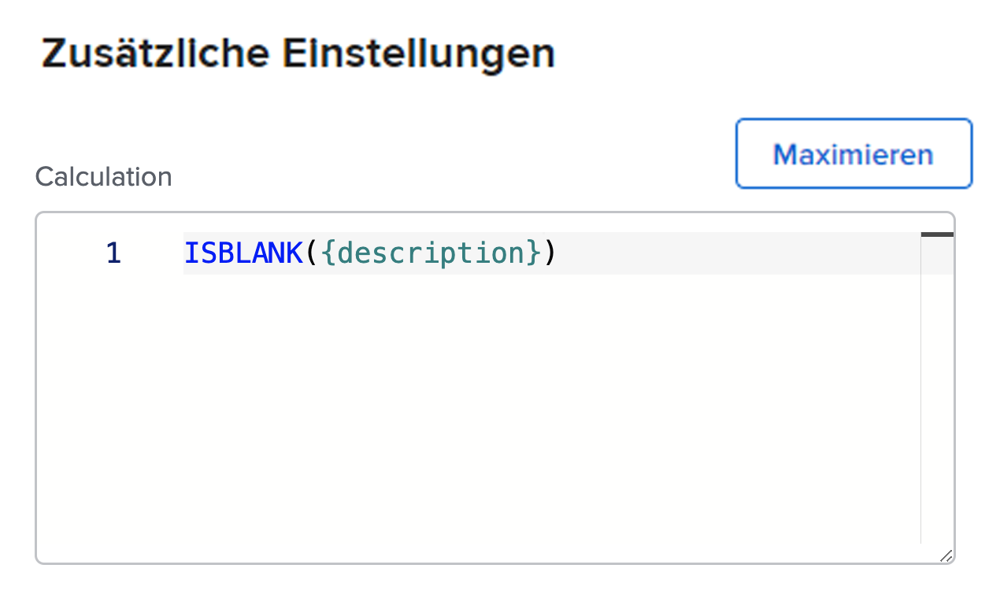
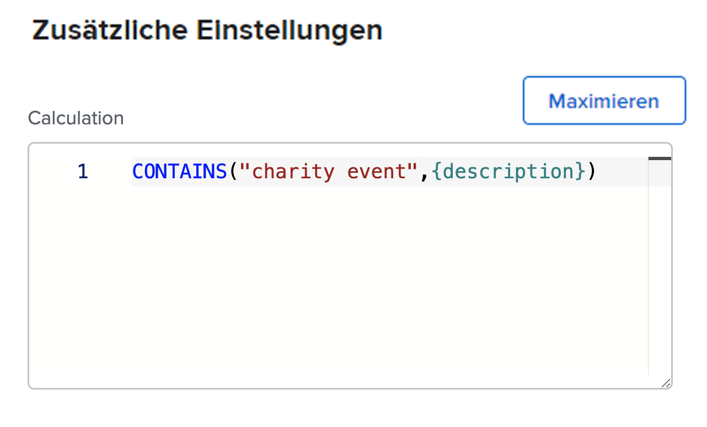

# Verwenden der Ausdrücke ISBLANK und CONTAINS

Sowohl die CONTAINS- als auch die ISBLANK-Ausdrücke werden verwendet, um einfache true- oder false-Werte bereitzustellen. Der Unterschied besteht darin, dass der ISBLANK-Ausdruck prüft, ob das Feld überhaupt einen Wert enthält, während der CONTAINS-Textausdruck nach einer bestimmten Zeichenfolge in einem Feld sucht.

Um beispielsweise zu sehen, ob ein Projekt eine Beschreibung enthält, verwenden Sie den ISBLANK-Ausdruck. Wenn das Beschreibungsfeld leer ist, gibt der Ausdruck den Wert „true“ zurück. Wenn das Beschreibungsfeld nicht leer ist, wird der Wert „false“ zurückgegeben.

Um in der Beschreibung nach einem bestimmten Wert zu suchen, z. B. „Wohltätigkeitsveranstaltung“, verwenden Sie den Textausdruck CONTAINS. Wenn in der Beschreibung „Wohltätigkeitsveranstaltung“ gefunden wird, lautet das berechnete Feld „true“. Es wird „false“ angezeigt, wenn kein „Wohltätigkeitsereignis“ gefunden wird.

## ISBLANK

Der ISBLANK-Textausdruck enthält den Namen des Ausdrucks und einen Datenpunkt.

**ISBLANK({data point})**

Im obigen Beispiel – wo Sie wissen möchten, ob das Projekt eine Beschreibung enthält – lautet der Ausdruck:

ISBLANK({description})

## CONTAINS

Der Textausdruck CONTAINS enthält den Namen des Ausdrucks, das gesuchte Wort oder die gesuchte Wortgruppe und das Feld, in dem gesucht werden soll.

**CONTAINS(„Phrase“,{fields})**

Stellen Sie sicher, dass Sie das gesuchte Wort oder die gesuchte Wortgruppe in Anführungszeichen setzen. Andernfalls ist der Ausdruck nicht gültig.

Im obigen Beispiel (Suche nach „Wohltätigkeitsveranstaltung“ in der Projektbeschreibung) lautet der Ausdruck:

**CONTAINS(„Wohltätigkeitsveranstaltung“,{description})**

**Hinweis**: Beim CONTAINS-Ausdruck wird zwischen Groß- und Kleinschreibung unterschieden. Wenn beispielsweise „Wohltätigkeitsveranstaltung“ im Beschreibungsfeld großgeschrieben ist, schreiben Sie diesen Satz im Ausdruck groß.

**CONTAINS(„Wohltätigkeitsveranstaltung“,{description})**

Die Ausdrücke ISBLANK und CONTAINS eignen sich gut, wenn Sie sehen möchten, ob ein Wert überhaupt vorhanden ist. Es kann jedoch nützlicher sein zu wissen, was der Wert ist, ihn tatsächlich zu sehen oder eine Art Deskriptor zu haben, um bessere Einblicke zu erhalten.

Anstatt beispielsweise nur zu wissen, dass ein Projekt aus einer Anfrage konvertiert wurde, möchten Sie den Namen der ursprünglichen Anfrage kennen.

Verwenden Sie in diesem Fall den CONTAINS-Ausdruck in Verbindung mit einem IF-Ausdruck.

In den meisten Fällen werden die Textausdrücke ISBLANK und CONTAINS mit einem IF-Textausdruck verwendet.
