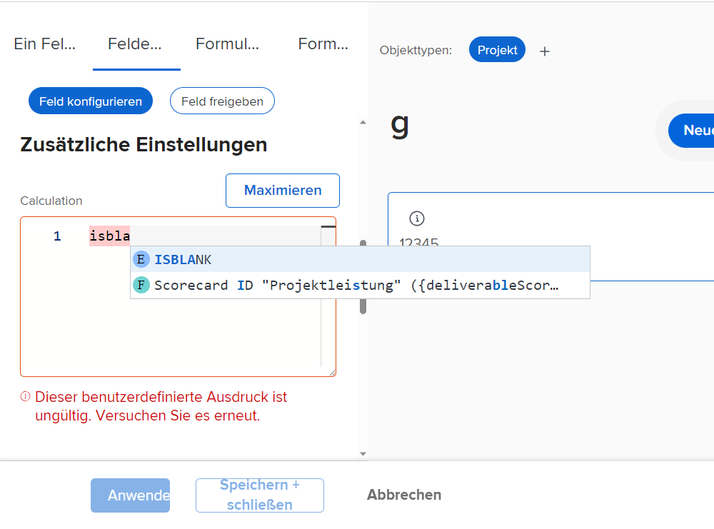
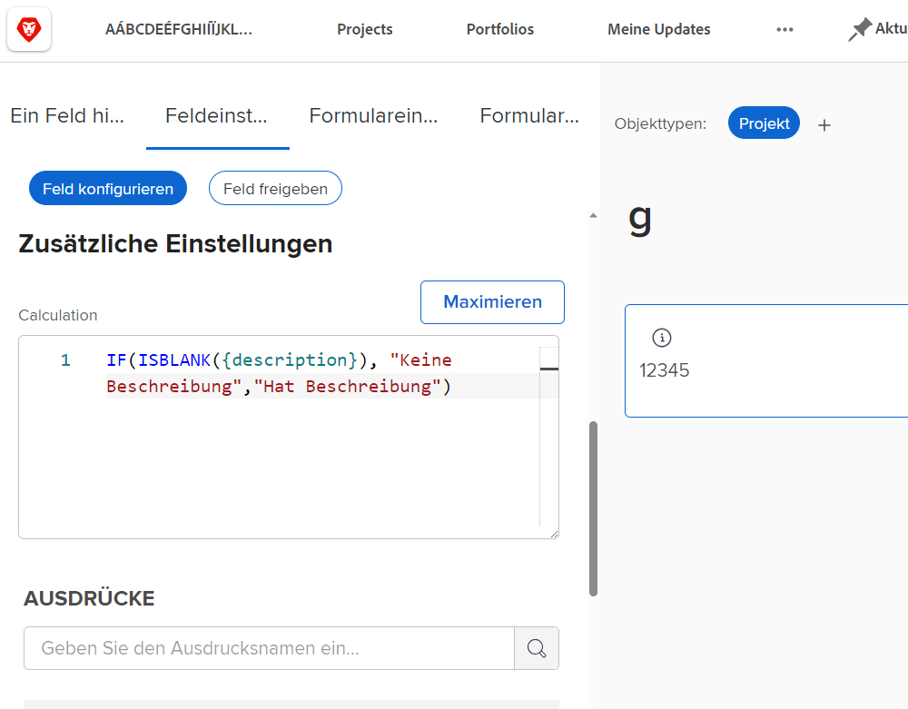
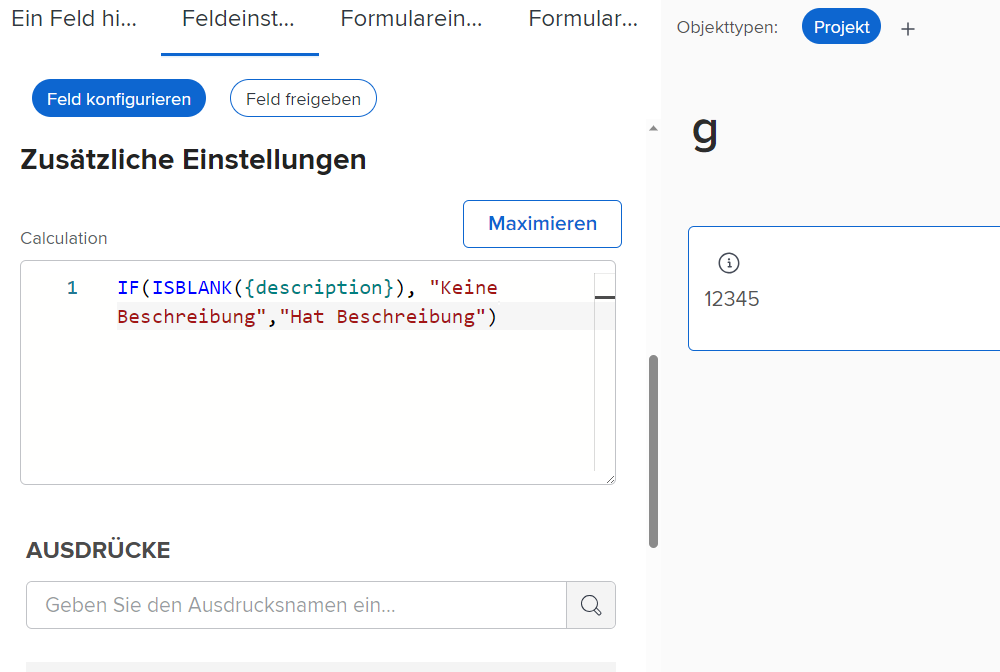
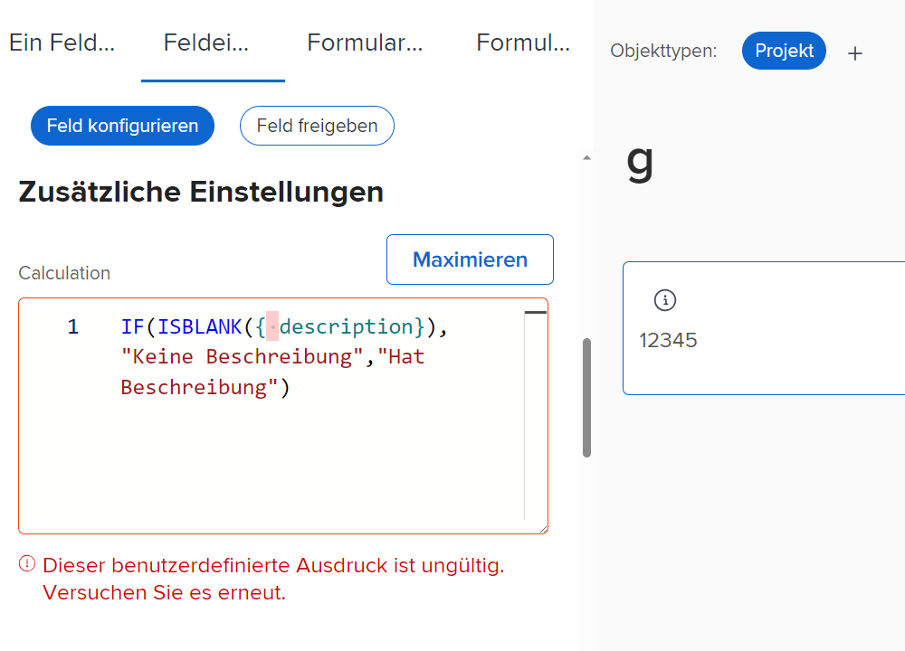
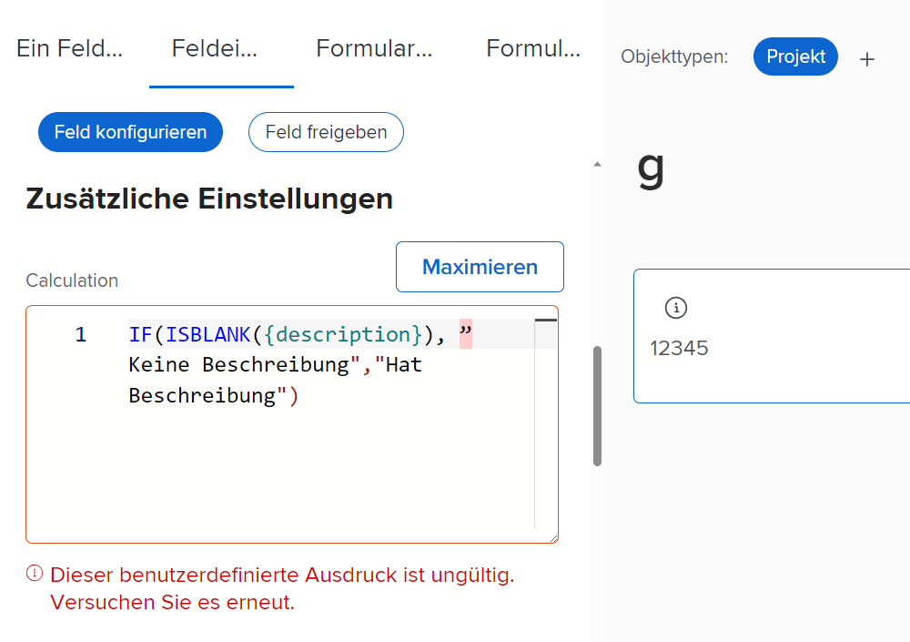
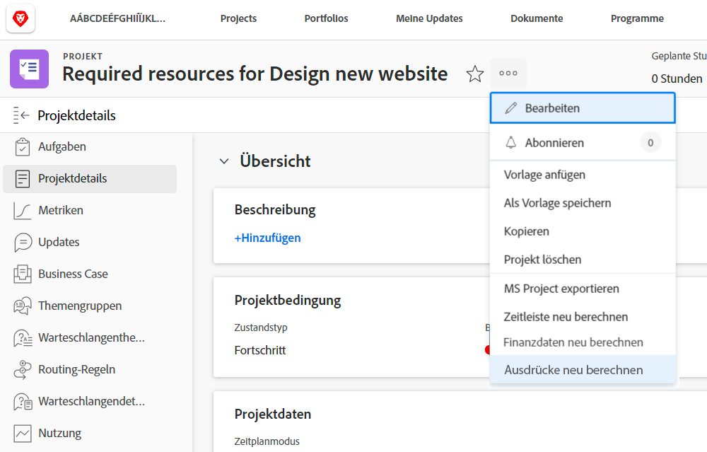
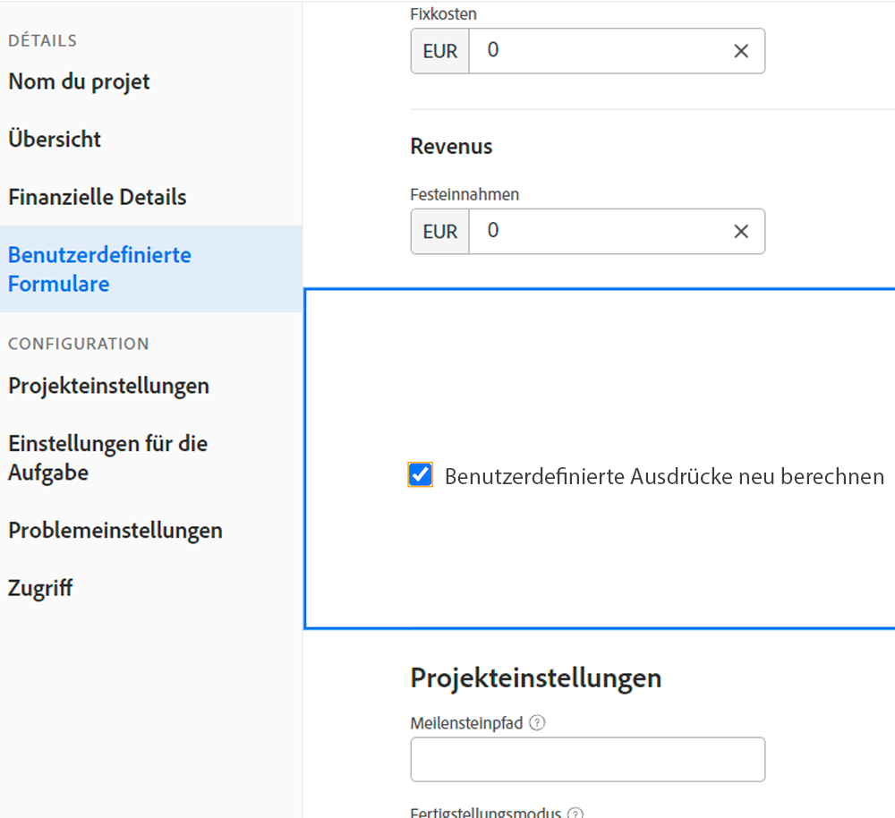

# Informationen zu berechneten Feldausdrücken

Im Folgenden finden Sie eine Liste von Konzepten, die Sie für die Arbeit mit benutzerdefinierten berechneten Feldern in Workfront kennen sollten.

## Groß- und Kleinschreibung bei Ausdrucksnamen

Bei den Namen von Ausdrücken kommt es auf die Groß- und Kleinschreibung an. Wenn Sie den Ausdrucksnamen schreiben, können Sie Großbuchstaben, Kleinbuchstaben oder eine Mischung aus beidem verwenden.

Der Ausdruck muss jedoch in Großbuchstaben geschrieben werden, damit das System ihn erkennt und das Feld speichert.

## Stunden werden in Minuten gespeichert

Die Stunden in der Workfront-Datenbank werden in Minuten gespeichert. Wenn Sie sich auf Felder wie „Geplante Stunden“ oder „Tatsächliche Stunden“ beziehen, teilen Sie den Wert durch 60, um die Zeit in Stunden und nicht in Minuten anzugeben.

## Leerzeichen haben keinen Einfluss auf die Ausdrücke

Es wird empfohlen, Ausdrücke mit nur wenigen oder ganz ohne Leerzeichen zwischen den einzelnen Ausdrücken zu schreiben.

* IF(ISBLANK({description}),„Ohne Beschreibung“, „Mit Beschreibung“)

Wenn es jedoch hilft, den Sachverhalt besser zu verstehen, können die Ausdrücke um einige Leerzeichen ergänzt werden. Die zusätzlichen Leerzeichen sollten nicht dazu führen, dass der Ausdruck einen Wert in [!DNL Workfront] nicht erfassen oder berechnen kann.

* IF (ISBLANK ({description}), „Ohne Beschreibung“ , „Mit Beschreibung“ )

Nur Felder und geschweifte Klammern dürfen keine Leerzeichen enthalten. Andernfalls erhalten Sie eine Fehlermeldung und können das Feld oder das benutzerdefinierte Formular nicht speichern.

## Anführungszeichen müssen gerade sein

Verwenden Sie nur gerade Anführungszeichen in einem Ausdruck (&quot;). Bei typografischen Anführungszeichen (“), zeigt das System [!DNL Workfront] weiterhin die Meldung „Benutzerdefinierter Ausdruck ungültig“ an.

## Berechnungen werden beim Speichern von Formularen und beim Bearbeiten von Objekten aktualisiert

Dies ist ein wichtiger Aspekt berechneter Felder, den Sie kennen sollten.

Die in einem berechneten Feld angezeigten Informationen bleiben gleich und veralten, wenn das benutzerdefinierte Formular nicht neu berechnet wird.

Ausdrücke können mit der Option „Ausdrücke neu berechnen“ im Menü „Mehr“ auf einem Objekt aktualisiert werden.

Sie möchten zum Beispiel ansehen, wie viele Tage ein Problem offen ist. Erstellen Sie ein berechnetes Feld namens „Offene Tage“ mit dem Ausdruck DATEDIFF.

* Feldname = Offene Tage
* Ausdruck = DATEDIFF({entryDate},$$TODAY)

Nach dem Speichern kann die Anzahl der Tage zwischen dem Zeitpunkt, an dem das Problem zum ersten Mal erstellt oder in Workfront eingegeben wurde, und dem heutigen Datum auf der Detailseite eines Objekts oder in einer Berichtsansicht angezeigt werden.

Wenn Sie am nächsten Tag dieselbe Detailseite oder Berichtsansicht aufrufen, erwarten Sie, dass diese Zahl um eins erhöht wird. Wenn die Zahl heute 5 ist, sollte sie morgen 6 sein. Am nächsten Tag sollte sie 7 sein, dann 8 usw.

Das Feld zeigt jedoch weiterhin jeden Tag 5 an. Das Feld muss „neu ausgeführt“ oder neu berechnet werden, um die Informationen zu aktualisieren.

So aktualisieren Sie ein Feld mithilfe der Option „Ausdrücke neu berechnen“:

* Klicken Sie auf den Namen des Objekts, um es zu öffnen.
* Klicken Sie auf das Menü „Mehr“.
* Wählen Sie in der Liste „Ausdrücke neu berechnen“.

Sie können auch mehrere Ausdrücke gleichzeitig neu berechnen, indem Sie die Funktion „Massenbearbeitung“ in einer Liste oder einem Bericht verwenden. Angenommen, Sie haben einen Bericht mit einer Liste von Ausgaben erstellt, in der die Berechnung der offenen Tage in einer Spalte angezeigt wird. Wenn Sie alle Probleme gleichzeitig neu berechnen möchten:

* Wählen Sie alle Probleme im Bericht aus.
* Wählen Sie die Option „Bearbeiten“, um alle ausgewählten Probleme auf einmal zu bearbeiten.
* Klicken Sie auf die Beschriftung „Benutzerdefinierte Formulare“ auf der linken Seite, um dann zum Abschnitt für benutzerdefinierte Formulare zu scrollen.
* Aktivieren Sie das Kontrollkästchen „Benutzerdefinierte Ausdrücke neu berechnen“ am Ende des Abschnitts „Benutzerdefinierte Formulare“.
* Klicken Sie auf „Änderungen speichern“.

Der Bildschirm wird aktualisiert und zeigt aktualisierte Informationen im berechneten Feld an.

**Hinweis**: Es gibt zwar auch andere Möglichkeiten, Ausdrücke in einem berechneten Feld zu aktualisieren oder neu zu berechnen, aber dies ist die schnellste und einfachste Methode.

## Berechnungen können von Formular zu Formular innerhalb desselben Feldes variieren

Sobald ein berechnetes Feld in einem benutzerdefinierten Formular gespeichert wird und das benutzerdefinierte Formular gespeichert wird, wird das berechnete Feld der Feldbibliothek hinzugefügt, damit es in anderen benutzerdefinierten Formularen verwendet werden kann.

Wenn Sie jedoch ein berechnetes Feld auf Formular A und das gleiche berechnete Feld auf Formular B haben, ist zwar der erste Gedanke, dass die Berechnungen genau gleich sind. Das ist aber nicht immer der Fall. Das berechnete Feld in Formular A könnte in Formular B auf eine ganz andere Weise berechnet werden.

Wenn ein berechnetes benutzerdefiniertes Feld aus der Feldbibliothek ausgewählt und zu einem benutzerdefinierten Formular hinzugefügt wird, wird das Feld hinzugefügt, aber die Berechnung bleibt leer. Ein Grund dafür ist, dass sich die Berechnung möglicherweise auf Felder bezieht, die für einen anderen Objekttyp nicht vorhanden sind.

Stellen Sie sich z. B. vor, Sie haben ein berechnetes Feld mit der Bezeichnung „Tage bis zur Fertigstellung“ erstellt, um festzustellen, wie lange es dauerte, eine Aufgabe in einem Projekt zu erledigen.

* WEEKDAYDIFF({actualStartDate},{actualCompletionDate})

Dasselbe können Sie bei einer Iteration tun. Sie können denselben Ausdruck verwenden; allerdings sind die für ein Aufgabenobjekt verfügbaren Felder nicht immer auch für ein Iterationsobjekt verfügbar. [!DNL Workfront] gibt Ihnen deswegen die Möglichkeit, die Berechnung mit den richtigen Objektfeldern zu erstellen.

**Profi-Tipp**: Kopieren Sie beim Erstellen von benutzerdefinierten Feldern den berechneten Ausdruck aus dem Feld „Berechnung“ in das Feld „Anweisungen“. Dieses Feld wird nicht gelöscht, wenn dem benutzerdefinierten Formular aus der Feldbibliothek ein berechnetes benutzerdefiniertes Feld hinzugefügt wird.

Je nach Bedarf können berechnete Felder in benutzerdefinierten Formularen recht einfach oder sehr komplex sein. In Ausdrücke können andere Ausdrücke und Werte eingebettet oder verschachtelt sein, um den Detailgrad zu erreichen, der erforderlich ist, um sich ein besseres Bild von der Arbeit in Ihrem Unternehmen zu machen.

<!--Depending on the need, calculated fields in custom forms can be quite simple or very complex. Expressions can embed, or nest, other expressions and values to provide the level of detail needed to get a better picture of what is going on with the work being done at your organization. 

Most of the examples and exercises in this course have been relatively simple to provide a base understanding of the expressions most commonly used and how to build those expressions in a custom calculated field. 

Now you're ready to start building your own calculated custom fields.-->
