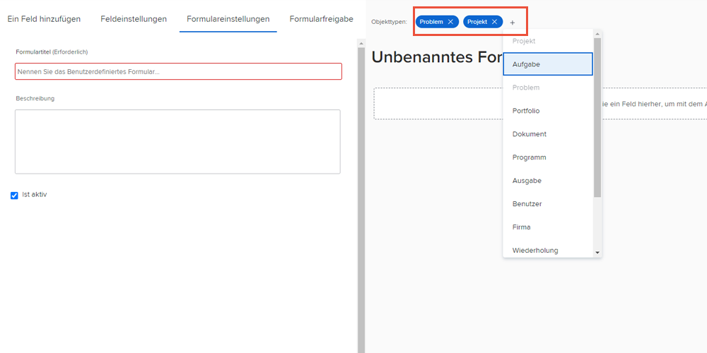

# Benutzerdefiniertes Formular erstellen und freigeben

In diesem Video erfahren Sie, wie Sie:

* Festlegen, welche Objekte für Ihr Formular verwendet werden sollen
* Hinzufügen eindeutiger Felder in verschiedenen Formaten
* Organisieren von Feldern mithilfe von Abschnitten und Logik
* Formulare für andere Benutzer freigeben

>[!VIDEO](https://video.tv.adobe.com/v/335172/?quality=12&learn=on)

## Benutzerdefinierte Formulare können mit mehreren Objekttypen verwendet werden

Wenn Sie auf die [!UICONTROL Neues benutzerdefiniertes Formular] -Schaltfläche können Sie so viele Objekte auswählen, wie Sie für ein einzelnes benutzerdefiniertes Formular verwenden möchten. Alle Felder, die Sie diesem Formular hinzufügen, stehen allen ausgewählten Objekten zur Verfügung, wenn das benutzerdefinierte Formular an sie angehängt wird.

![Benutzerdefiniertes Formularfenster mit [!UICONTROL Neues benutzerdefiniertes Formular] Objektoptionen](assets/create-custom-form.png)

Wenn Sie ein benutzerdefiniertes Formular bearbeiten, können Sie alle ausgewählten Objekttypen sehen. Sie können Objekttypen aus dieser Liste hinzufügen oder löschen.

Möglicherweise möchten Sie ein benutzerdefiniertes Formular vom Typ Projekt und Problem erstellen. Wenn Sie an ein Problem angehängt sind, können Sie alle Felder ausfüllen, die das Problem betreffen. Wenn Sie sich später dazu entscheiden, das Problem in ein Projekt zu konvertieren, wird das benutzerdefinierte Formular automatisch in das Projekt geladen und die Daten, die Sie in die Felder des benutzerdefinierten Formulars zur Ausgabe einfügen, stehen zur Ansicht oder Bearbeitung im benutzerdefinierten Formular des Projekts zur Verfügung.

## Benutzerdefinierte Feldoptionen

**[!UICONTROL Titel] und [!UICONTROL Name] fields**

Die [!UICONTROL Titel] und [!UICONTROL Name] -Felder in einem benutzerdefinierten Feld dienen unterschiedlichen Zwecken. [!UICONTROL Titel] ist der Feldname, der Benutzern angezeigt wird in [!DNL Workfront]. [!UICONTROL Name] kann mit Integrationen wie API verwendet werden.

![Benutzerdefiniertes Formularfenster zeigt [!UICONTROL Titel] und [!UICONTROL Name] fields](assets/custom-forms-field-label-and-name.png)

Dies bietet die Flexibilität, die Beschriftung für den Benutzer so zu ändern, dass sie den Änderungen in Ihrer Organisation entspricht, ohne dass sich dies auf Integrationen oder andere Verbindungen auswirkt, die auf einen bestimmten Feldnamen angewiesen sind.

**[!UICONTROL Textfeld mit Formatierung]**

Die [!UICONTROL Textfeld mit Formatierung]enthält grundlegende Text-Markup-Tools, mit denen Benutzer beim Ausfüllen des Felds in einem benutzerdefinierten Formular fett, kursiv oder unterstrichen hinzufügen können.

![Benutzerdefiniertes Formularfenster zeigt [!UICONTROL Textfeld mit Formatierung] option](assets/custom-forms-text-field-with-formatting.png)

Das Feld hat außerdem eine Längenbeschränkung von 15.000 Zeichen, wodurch genügend Platz für wichtige Informationen und Formatierungen zur Verfügung steht, um anderen das Lesen zu erleichtern.

**[!UICONTROL Typahead] field**

Die [!UICONTROL Typahead] -Feld ermöglicht es dem System, automatisch eine Liste von Optionen basierend auf dem für das Feld ausgewählten Objekt auszufüllen.

![Benutzerdefiniertes Formularfenster zeigt [!UICONTROL Typahead] Feldoption](assets/custom-forms-typeahead-1.png)

Wenn Sie beispielsweise eine [!UICONTROL Typahead] Feld namens &quot;Name der Marketing-Manager-Genehmigung&quot;und wählen Sie [!UICONTROL Benutzer] als referenzierten Objekttyp angezeigt, wird eine Liste von Benutzernamen angezeigt, wenn ein Benutzer dieses Feld in einem benutzerdefinierten Formular ausfüllt. Die [!UICONTROL Typahead] -Feld dient dazu, Ihre benutzerdefinierten Daten mit den im System erfassten Informationen zu verbinden und die manuelle Pflege vieler Optionen in Dropdown-Feldern zu vermeiden.

![Benutzerdefiniertes Formularfenster zeigt [!UICONTROL Typahead] Dropdown-Menü](assets/custom-forms-typeahead-2.png)
