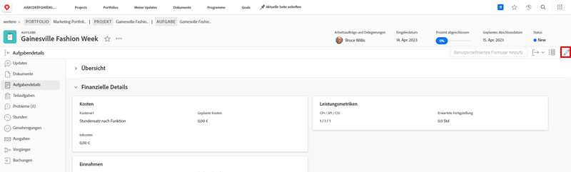

# Bearbeiten eines benutzerdefinierten Formulars

<!---
21.4 updates have been made here
--->

Sie können Informationen in einem benutzerdefinierten Formular bearbeiten, nachdem das Formular an ein Objekt angehängt wurde.

1. Navigieren Sie zu dem Objekt, für das Sie Informationen im benutzerdefinierten Formular bearbeiten möchten.
1. Klicken Sie im linken Bedienfeld auf [Objekttyp] **[!UICONTROL Details]**.
1. Erweitern Sie das benutzerdefinierte Formular, indem Sie auf den Pfeil neben dem Namen klicken.
1. Klicken Sie auf ein einzelnes Feld im benutzerdefinierten Formular, um in den Bearbeitungsmodus für dieses Feld zu wechseln. Sie können auch auf das Symbol [!UICONTROL Bearbeiten] in der oberen rechten Ecke klicken, um alle benutzerdefinierten Formulare zu bearbeiten oder Abschnitte der benutzerdefinierten Formulare zu bearbeiten.
1. Geben Sie Informationen in ein einzelnes benutzerdefiniertes Feld ein, auch wenn die erforderlichen Felder in anderen benutzerdefinierten Formularen auf dem Objekt noch nicht ausgefüllt sind.
1. Klicken Sie auf **[!UICONTROL Änderungen speichern]**.

