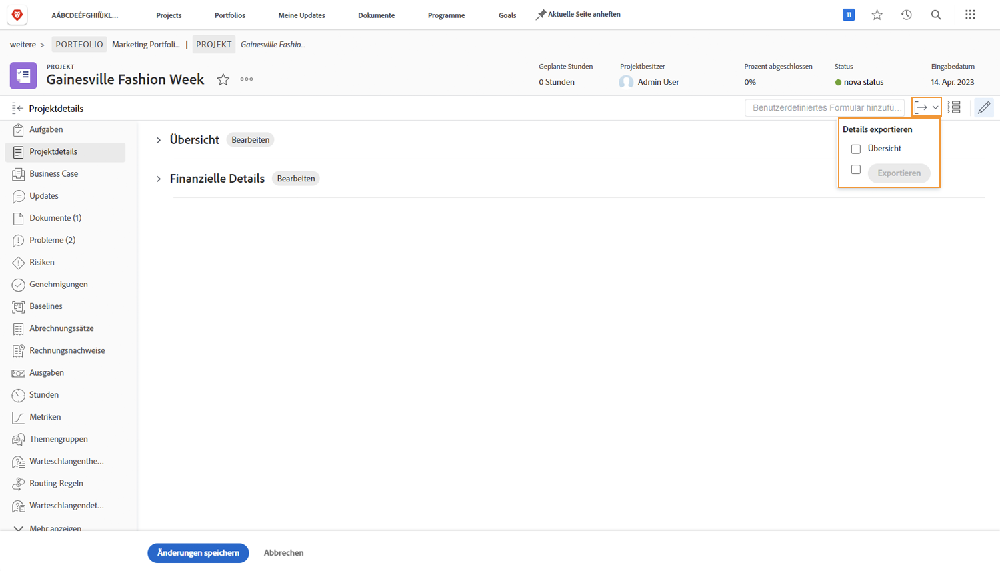
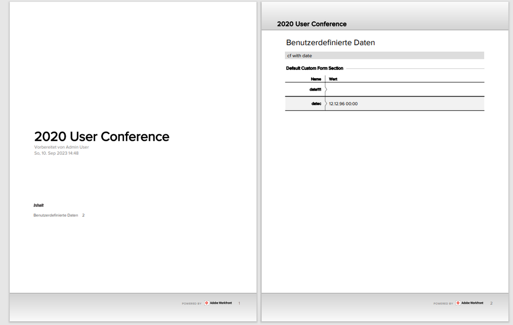

# Exportieren eines benutzerdefinierten Formulars als PDF

Die Erfassung einzigartiger Daten einer Organisation ist ein wesentlicher Bestandteil des Arbeitsmanagements. Benutzerdefinierte Formulare werden häufig zu diesem Zweck verwendet. Wenn Sie benutzerdefinierte Formulare exportieren können, können diese einfach zirkuliert und freigegeben werden. Sie können benutzerdefinierte Formulare aus Projekten, Aufgaben oder Problemen exportieren, wenn Sie auf das Formular im [!UICONTROL Details] -Abschnitt der Objekte.

Sie können auch die [!UICONTROL Übersicht] -Bereich in der exportierten PDF.

So exportieren Sie beispielsweise ein benutzerdefiniertes Formular namens Videomarketing-Informationen , das an ein Projekt angehängt ist:

1. Klicken Sie auf **[!UICONTROL Export]** Symbol. Alle benutzerdefinierten Formulare, die an das Projekt angehängt sind, werden im Dropdown-Menü angezeigt, einschließlich der [!UICONTROL Übersicht] Abschnitt.
1. Wählen Sie Videomarketing-Informationen aus der Liste aus.
1. Klicken **[!UICONTROL Export]** am Ende der Liste.

Eine formatierte PDF-Datei wird heruntergeladen.

