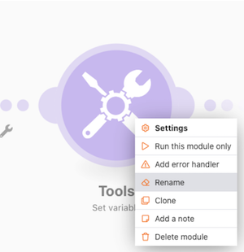
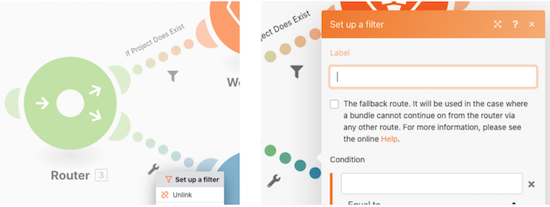
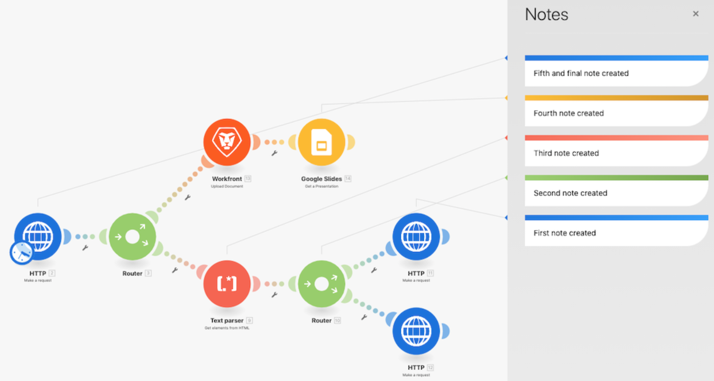
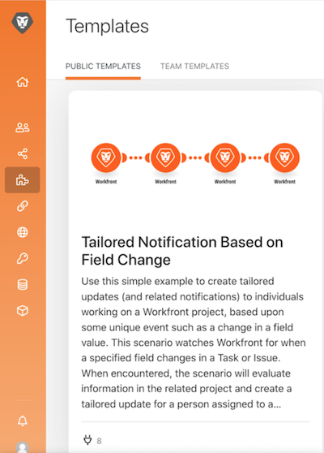
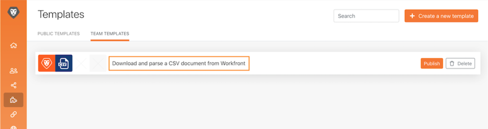
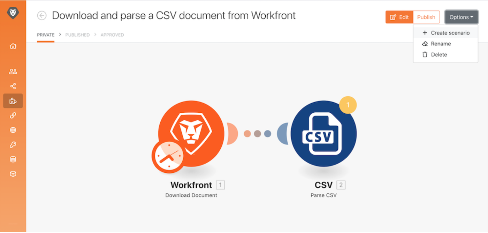
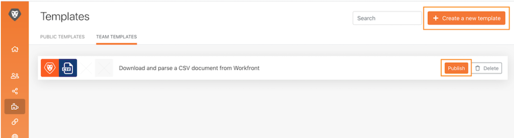
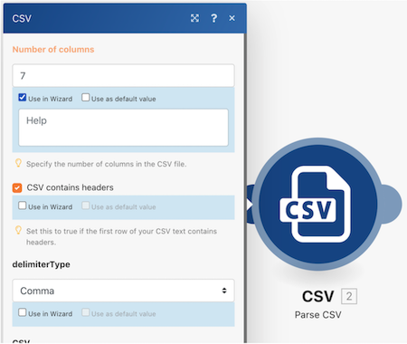

# Zugänglichkeit und Klarheit

Am Anfang der Workfront Fusion-Schulung haben Sie einige grundlegende Best Practices kennengelernt, um Szenarien einfach zu lesen, zu teilen und zu verstehen. Diese Vorgehensweisen erleichtern zukünftigen Benutzenden von Workfront Fusion oder anderen Benutzenden die Fehlerbehebung oder Unterstützung Ihrer Workfront Fusion-Instanz. Befolgen Sie bei der Erstellung von Szenarien die unten stehenden Richtlinien.

## Beschriftungen und Notizen

In der Regel besteht ein Hauptziel in Workfront Fusion immer darin, einfache Szenario-Designs zu haben. Im Folgenden finden Sie einige Möglichkeiten, um einfach zu interpretierende Designs zu erstellen.

* Stellen Sie sicher, dass Sie alle Module benennen. Klicken Sie mit der rechten Maustaste auf ein Modul und wählen Sie „Umbenennen“ aus. Modulbeschriftungen sollten kurz, aber verständlich ausdrücken, was das Modul leistet. Beispiel: „Erstellt MKTG-Proj mit CSH-Vorlage.“
  
* Beschriften Sie auch Routing-Pfade. Selbst wenn ein Pfad keinen Filter direkt nach einem Router verwendet, können Sie eine Bezeichnung anwenden, ohne die Filterlogik auszufüllen. Auf diese Weise können andere verstehen, welche Bündel welche Pfade warum durchlaufen. Um eine Bezeichnung für einen Routerpfad ohne Filter zu erstellen, klicken Sie mit der rechten Maustaste auf den Pfad, fügen Sie eine Bezeichnung hinzu und speichern Sie sie.
  
* Fügen Sie gegebenenfalls Notizen in einem Szenario hinzu, wenn die Beschriftung eines Moduls oder Routing-Pfads zu kurz wäre, um zu verdeutlichen, was tatsächlich passiert. Sie können während des Entwurfs- und Iterationsvorgangs jederzeit Notizen hinzufügen.

Es kann jedoch am einfachsten sein, Notizen am Ende des Szenario-Entwurfs hinzuzufügen, wenn Sie bereit zum Starten sind. Arbeiten Sie vom Ende Ihres Szenario-Entwurfs (ganz unten rechts) rückwärts. Auf diese Weise befinden sich die Notizen, die für den Anfang Ihres Szenarios gelten, oben in der Liste, wenn Sie das Notizenbedienfeld öffnen.

Nachdem Sie das Notizenbedienfeld gespeichert oder geschlossen haben, werden die Notizen so sortiert, dass die zuletzt erstellten ganz oben stehen. In der Abbildung unten wird die als erstes erstellte Notiz unten in der Liste angezeigt. Notizen wurden absichtlich von unten rechts bis zum obigen Pfad und schließlich bis zum Trigger erstellt, also im Wesentlichen in der umgekehrten Reihenfolge, in der ein Datenbündel das Szenario durchlaufen würde. Dadurch werden die Hinweise in der Reihenfolge angezeigt, in der das Szenario tatsächlich für das Datenbündel ausgeführt wird.

## Workfront Fusion-Vorlagen

Eine hervorragende Möglichkeit, die Beschriftung von Modulen und Routing-Pfaden zu optimieren, ist die Verwendung von Vorlagen. Vorlagen, die den Best Practices entsprechen, können die Erstellung von Szenarien für gängige Anwendungsfälle beschleunigen.

### Vorlagenbeispiel

Überprüfen Sie beim Starten eines Szenarios zunächst, ob eine brauchbare Vorlage verfügbar ist. Sie möchten beispielsweise ein Szenario erstellen, das mit dem Herunterladen eines CSV-Dokuments aus Workfront beginnt und dieses dann analysiert.

Klicken Sie auf den Bereich „Vorlagen“, um zu sehen, ob es öffentliche Vorlagen gibt, die Ihren Anforderungen entsprechen.

Klicken Sie auf die Registerkarte „Team-Vorlagen“, um zu sehen, ob jemand in Ihrem Team eine Vorlage erstellt hat, die nützlich sein könnte.

Wenn Sie eine Vorlage finden, die Sie verwenden möchten, klicken Sie auf den Namen, um sie zu öffnen.

Klicken Sie dann oben rechts auf „Optionen“ und wählen Sie „Szenario erstellen“ aus.

### Erstellen einer Vorlage

Sie können eine Vorlage im Abschnitt „Team-Vorlagen“ erstellen. Die von Ihnen erstellte Vorlage steht Ihnen und Ihrem Team zur Verfügung. Wenn Sie jedoch auf die Schaltfläche „Veröffentlichen“ klicken, können Sie sie für Personen außerhalb Ihres Teams freigeben.

Beim Erstellen der Vorlage können Sie einen Assistenten einschließen, der Benutzende anleitet, die die Vorlage zum Erstellen von Szenarien verwenden, indem sie die Verbindungen, zugeordnete Daten und andere Bedienfeldfelder nach Bedarf ändern.

Aktivieren Sie das Kontrollkästchen „Im Assistenten verwenden“, um Anweisungen hinzuzufügen, die verfügbar sind, wenn eine Benutzerin oder ein Benutzer ein Szenario mit Ihrer Vorlage erstellt. Diese Informationen werden im Feld „Hilfe“ angezeigt. Damit Benutzende diesen Text bei Verwendung der Vorlage sehen können, aktivieren Sie „Als Standardwert verwenden“.

## Möchten Sie mehr erfahren? Wir empfehlen Folgendes:

[Workfront Fusion-Dokumentation](https://experienceleague.adobe.com/de/docs/workfront-fusion/using/get-started-with-fusion/understand-workfront-fusion/workfront-fusion-overview)
