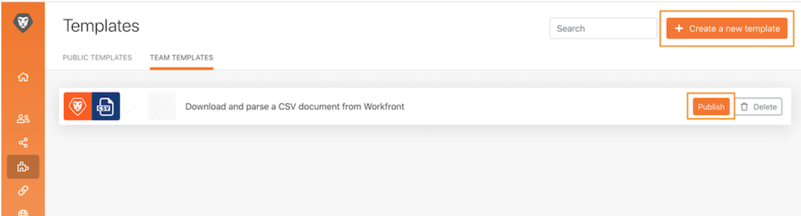

# Zugänglichkeit und Klarheit

Anfang der Workfront Fusion-Schulung haben Sie einige grundlegende Best Practices erfahren, um Szenarien einfach zu lesen, zu teilen und zu verstehen. Diese Vorgehensweisen erleichtern zukünftigen Workfront Fusion-Benutzern oder anderen Benutzern die Fehlerbehebung oder Unterstützung Ihrer Workfront Fusion-Instanz. Befolgen Sie bei der Erstellung von Szenarien die unten stehenden Richtlinien.

## Beschriftungen und Hinweise

In der Regel besteht ein Hauptziel in Workfront Fusion immer darin, einfache Szenario-Designs zu haben. Im Folgenden finden Sie einige Möglichkeiten, um einfach zu interpretierende Designs zu erstellen.

* Stellen Sie sicher, dass Sie alle Module benennen. Klicken Sie mit der rechten Maustaste auf ein Modul und wählen Sie Umbenennen aus. Modulbeschriftungen sollten kurz, aber verständlich für die Leistung des Moduls sein. Beispiel: &quot;Erstellen Sie MKTG-Proj mit CSH-Vorlage.&quot;
  
* Auch Routing-Pfade beschriften. Selbst wenn ein Pfad keinen Filter direkt nach einem Router verwendet, können Sie eine Bezeichnung anwenden, ohne die Filterlogik auszufüllen. Auf diese Weise können andere verstehen, welche Pakete welche Pfade und warum durchlaufen. Um eine Bezeichnung für einen Routerpfad ohne Filter zu erstellen, klicken Sie mit der rechten Maustaste auf den Pfad, fügen Sie einen Titel hinzu und speichern Sie ihn.
  
* Fügen Sie gegebenenfalls Notizen in einem Szenario hinzu, wenn die Beschriftung eines Moduls oder Routing-Pfads zu kurz sein soll, um zu verdeutlichen, was tatsächlich passiert. Sie können während des Entwurfs- und Iterationsvorgangs jederzeit Notizen hinzufügen.

Es kann jedoch am einfachsten sein, Notizen am Ende des Szenario-Designs hinzuzufügen, wenn Sie bereit zum Starten sind. Arbeiten Sie am Ende Ihres Szenario-Designs (ganz unten, rechts) rückwärts. Auf diese Weise befinden sich die Notizen, die für den Anfang Ihres Szenarios gelten, oben in der Liste, wenn Sie das Notizenbedienfeld öffnen.

Nachdem Sie das Notizenbedienfeld gespeichert oder geschlossen haben, werden die Notizen mit den zuletzt erstellten am oberen Rand sortiert. In der Abbildung unten wird die erste erstellte Anmerkung unten in der Liste angezeigt. Notizen wurden absichtlich von unten rechts bis zum obigen Pfad und schließlich bis zum Trigger erstellt. Im Wesentlichen die umgekehrte Reihenfolge, in der ein Datenbündel das Szenario durchlaufen würde. Dadurch werden die Hinweise in der Reihenfolge angezeigt, in der das Szenario tatsächlich im Datenbündel ausgeführt wird.

## Workfront Fusion-Vorlagen

Eine hervorragende Möglichkeit, die Beschriftung von Modulen und Routing-Pfaden zu optimieren, ist die Verwendung von Vorlagen. Best-Practice-Vorlagen können die Erstellung von Szenarien für gängige Anwendungsfälle beschleunigen.

### Vorlagenbeispiel

Überprüfen Sie beim Starten eines Szenarios zunächst, ob eine Vorlage verfügbar ist, die helfen wird. Sie möchten beispielsweise ein Szenario erstellen, das mit dem Herunterladen eines CSV-Dokuments aus Workfront beginnt und dann analysiert.

Klicken Sie auf den Bereich Vorlagen , um zu sehen, ob öffentliche Vorlagen Ihren Anforderungen entsprechen.

Klicken Sie auf den Tab Teamvorlagen , um zu sehen, ob jemand in Ihrem Team eine Vorlage erstellt hat, die nützlich sein könnte.

Wenn Sie eine Vorlage finden, die Sie verwenden möchten, klicken Sie auf den Namen, um sie zu öffnen.

Klicken Sie dann oben rechts auf &quot;Optionen&quot;und wählen Sie &quot;Szenario erstellen&quot;.

### Erstellen einer Vorlage

Sie können eine Vorlage im Abschnitt Teamvorlagen erstellen. Die von Ihnen erstellte Vorlage steht Ihnen und Ihrem Team zur Verfügung. Wenn Sie jedoch auf die Schaltfläche Veröffentlichen klicken, können Sie sie für Personen außerhalb Ihres Teams freigeben.

Beim Erstellen der Vorlage können Sie einen Assistenten einfügen, der Personen, die sie zum Erstellen ihrer Szenarien verwenden, sowie die Verbindungen, zugeordneten Daten und anderen Bedienfeldfeldern entsprechend ändert.

Aktivieren Sie das Kontrollkästchen &quot;Im Assistenten verwenden&quot;, um Anweisungen hinzuzufügen, die verfügbar sind, wenn ein Benutzer ein Szenario mit Ihrer Vorlage erstellt. Diese Informationen werden im Feld Hilfe angezeigt. Damit Benutzer diesen Text bei Verwendung der Vorlage sehen können, aktivieren Sie Als Standardwert verwenden .

## Möchten Sie mehr erfahren? Wir empfehlen Folgendes:

[Dokumentation zu Workfront Fusion](https://experienceleague.adobe.com/docs/workfront/using/adobe-workfront-fusion/workfront-fusion-2.html?lang=en)
