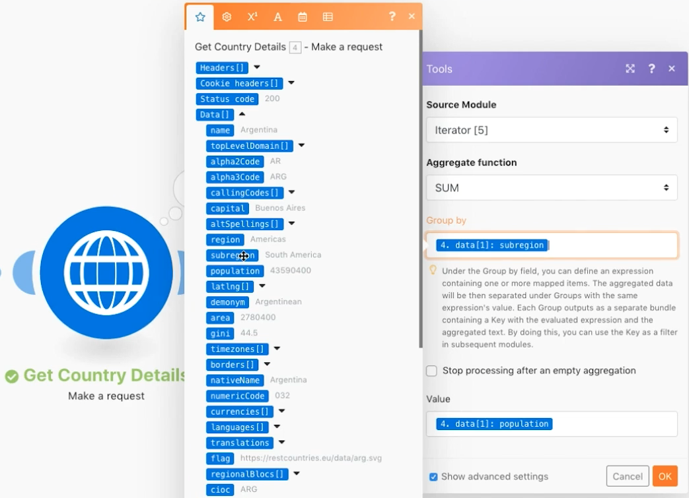

# Erweiterte Aggregation

Erfahren Sie, wie Sie beim Aggregieren Gruppierungen verwenden.

## Übungsübersicht

Rufen Sie einen Webdienst auf, um Details zu mehreren Ländern zurückzugeben und die Gesamtbevölkerung aller Länder, gruppiert nach Subregion, zu identifizieren.

## Schritte, die ausgeführt werden müssen

**Rufen Sie Länderdetails ab.**

1. Erstellen Sie ein neues Szenario und nennen Sie es &quot;Erweiterte Aggregation&quot;.
1. Setzen Sie das Trigger-Modul auf ein HTTP - Erstellen Sie ein Anfragemodul.
1. Verwenden Sie diese URL, `https://restcountries.com/v2/lang/es`, die Ihnen eine Liste aller Länder anzeigt, in denen Spanisch gesprochen wird.
1. Belassen Sie die Methode auf &quot;Get&quot;.
1. Aktivieren Sie das Kontrollkästchen Antwort analysieren .
1. Benennen Sie dieses Modul &quot;Get Countries&quot;um.
1. Klicken Sie auf Speichern und einmal ausführen.

   **Die Ausgabe ist ein einzelnes Bundle, aber es kommt in einem Array mit 24 Sammlungen, eines für jedes Spanisch sprechende Land.**

   

   **Sie müssen für jedes Land Subregion-Informationen erfassen, sodass Sie eine zusätzliche HTTP-Anfrage stellen müssen.**

1. Fügen Sie eine weitere Anfrage hinzu, um Informationen zur Subregion zu erhalten. Es wird nur das erste Land zurückgeben, aber das ist vorerst in Ordnung. Hinzufügen eines weiteren HTTP Anforderungsmoduls und Verwenden der URL `https://restcountries.com/v2/name/{country name}`.
1. Um den Namen des ersten Landes abzurufen, wechseln Sie zum Zuordnungsbereich und klicken Sie auf Daten und dann im Array auf Name . Die [1] im Datenfeld bedeutet, dass es das erste Element im Array zurückgibt.

   + Klicken Sie auf die Zahl und ändern Sie den Index bei Bedarf, in diesem Fall aber nur das erste Element.

1. Aktivieren Sie im Zuordnungsbereich die Option Antwort analysieren und klicken Sie dann auf OK.
1. Benennen Sie &quot;Länderdetails abrufen&quot;um.
1. Klicken Sie auf Speichern und dann einmal ausführen.

   + Die Ausgabe ist Informationen für ein einzelnes Land.

1. Um die anderen Länder zu erhalten, müssen Sie durch das Array navigieren. Fügen Sie einen Iterator hinzu, der eine Liste mit Elementen übernimmt und ein Bundle für jedes Element in der Liste ausgibt.

   **Fügen Sie den Iterator und Aggregator hinzu.**

1. Klicken Sie mit der rechten Maustaste zwischen den HTTP-Modulen und fügen Sie das Iterator Flow Control-Modul hinzu.
1. Wählen Sie im Feld Array die Option Daten aus dem Modul Get Countries .

   

1. Aktualisieren Sie im Modul &quot;Länderdetails abrufen&quot;das URL-Feld, um das Namensfeld vom Iterator und nicht vom Modul &quot;Länder abrufen&quot;zu übernehmen.

   

1. Fügen Sie nun nach &quot;Länderdetails abrufen&quot;einen numerischen Aggregator hinzu, um die Populationen zu gruppieren und zu summieren.
1. Das Quellmodul ist das Iteratormodul.
1. Die Aggregatfunktion ist SUM.
1. Der Wert lautet [Daten:Population] über das Modul Länderdetails abrufen .
1. Klicken Sie unten auf die Option Erweiterte Einstellungen anzeigen und gruppieren Sie nach [data:subregion] über das Modul Länderdetails abrufen .

   

   **Schließen Sie mit einem Text-Aggregator ab, um die im numerischen Aggregator gruppierten Elemente zu aggregieren.**

1. Fügen Sie am Ende einen Text-Aggregator hinzu.
1. Das Quellmodul ist der numerische Aggregator.
1. Fügen Sie im Textbereich &quot;Die Gesamtpopulation von [SCHLÜSSEL] is [result].&quot;

   

1. Speichern und einmal ausführen.

   + Überprüfen Sie die Ausgabe des finalen Moduls.
