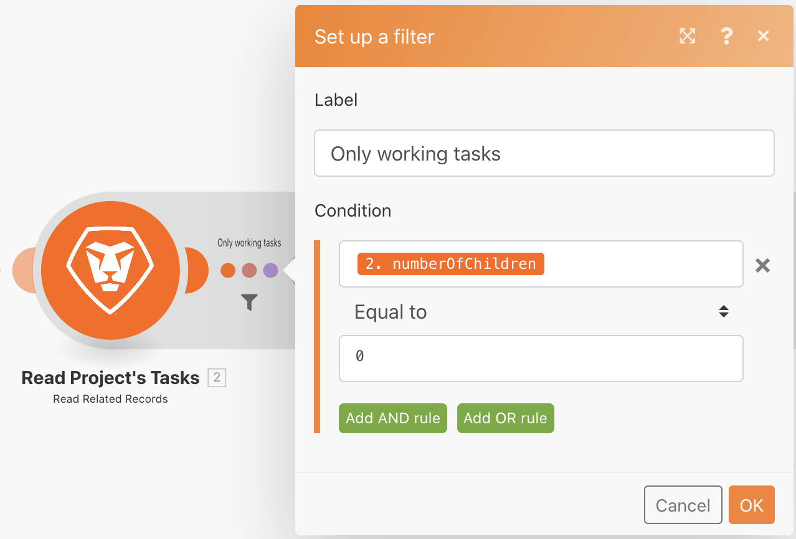
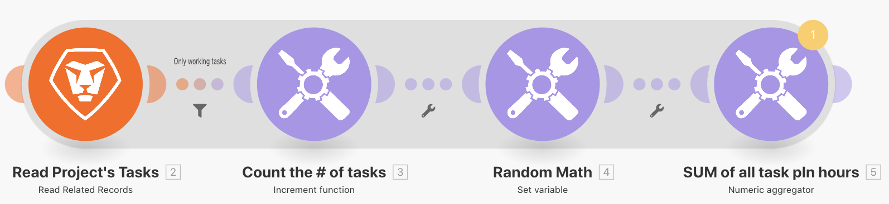

# Übung zur Aggregation

Erfahren Sie, wie Sie mehrere Informationsbündel in einem einzigen Wert zusammenfassen.

## Übungsübersicht

Fassen Sie anhand des Szenarios „Einführung in die Iteration“, das Sie in der letzten Übung erstellt haben, die geplanten Stunden für jede Arbeitsaufgabe im Projekt zusammen und senden Sie sich selbst eine E-Mail mit diesen Informationen.

## Zu befolgende Schritte

**Fügen Sie einen Filter hinzu und summieren Sie die geplanten Stunden.**

1. Klonen Sie das Szenario „Einführung in die Iteration“, das Sie in der vorherigen Übung erstellt haben, und nennen Sie es „Einführung in die Aggregation“.
1. Fügen Sie einen Filter zwischen den Modulen „Projektaufgaben lesen“ und „Anzahl der Aufgaben zählen“ ein. Nennen Sie den Filter „Nur Arbeitsaufgaben“.
1. Setzen Sie die Bedingung auf Anzahl der untergeordneten Elemente [Numerischer Operator: Gleich] 0.

   

1. Fügen Sie nach dem Modul „Zufallsmathematik“ ein Tool-Modul „Numerischer Aggregator“ ein.
1. Setzen Sie das Quellmodul auf „Projektaufgaben lesen“.
1. Setzen Sie die Aggregatfunktion auf „SUMME“.
1. Setzen Sie den Wert auf das Feld „Arbeit“ im Modul „Projektaufgaben lesen“.
1. Benennen Sie dieses Modul in „SUMME aller geplanten Aufgabenstunden“ um.

   

   **Beachten Sie den Schatten, der anzeigt, dass die Aggregation die Iteration beendet.**

   

   **Senden Sie eine E-Mail mit aggregierten Stunden.**

1. Fügen Sie in der E-Mail-App nach dem numerischen Aggregator ein Modul „E-Mail senden“ hinzu.
1. Schicken Sie die E-Mail an sich selbst.
1. Die Betreffzeile lautet „Projektdetails“.
1. Geben Sie in das Inhaltsfeld ein: „Ein Projekt mit dem Namen [Projektname] enthält eine Gesamtzahl von [Ergebnis] geplanten Stunden.“ Der „[Projektname]“ stammt aus dem Modul „Einen Eintrag lesen“ und das „[Ergebnis]“ aus dem Aggregatormodul.

   

1. Speichern Sie und führen Sie einmal aus. Suchen Sie die E-Mail in Ihrem Posteingang.

Innerhalb der Iteration kann auf die einzelnen Bündel zugegriffen werden. Außerhalb der Iteration kann im Modul „E-Mail senden“ jedoch nur auf aggregierte Felder zugegriffen werden.
