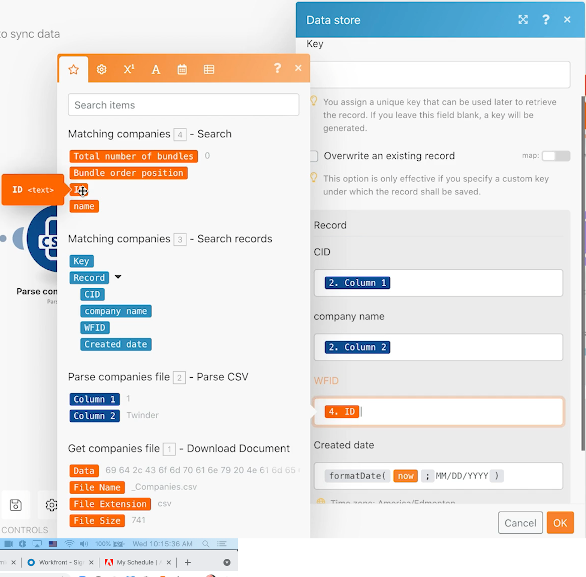

# Datenspeicher

Erfahren Sie, wie Sie Unternehmensnamen zwischen zwei Systemen synchronisieren.

## Übungsübersicht

Dies ist der erste Teil einer unidirektionalen Synchronisation von Unternehmen in Workfront und einem anderen System. Derzeit wird nur zwischen einem Fusion-Datenspeicher und Workfront synchronisiert. Eine Tabelle in einem Datenspeicher verfolgt die Workfront ID (WFID) und die Unternehmens-ID in der CSV-Datei (CID) für jedes Unternehmen. Dies ermöglicht eine bidirektionale Synchronisation zu einem späteren Zeitpunkt.

## Schritte, die ausgeführt werden müssen

**Laden Sie die Datei von Workfront herunter.**

1. Wählen Sie im Ordner &quot;Fusion Exercise Files&quot;von Workfront &quot;_Companies.csv&quot;aus und klicken Sie auf &quot;Document Details&quot;.
1. Kopieren Sie die erste ID-Nummer aus der URL-Adresse.
1. Erstellen Sie in Fusion ein neues Szenario mit dem Namen &quot;Verwenden von Datenspeichern zum Synchronisieren von Daten&quot;.
1. Wählen Sie für das Trigger-Modul das Workfront-Modul &quot;Dokument herunterladen&quot;aus.
1. Richten Sie Ihre Workfront-Verbindung ein und fügen Sie die Dokument-ID ein, die aus der Workfront-URL kopiert wurde.
1. Nennen Sie dieses Modul &quot;Get company file&quot;.
1. Fügen Sie jetzt ein CSV-Parse-Modul hinzu.
1. Geben Sie für das Feld Anzahl der Spalten den Wert 2 ein.
1. Ordnen Sie Daten aus dem Dokumentmodul herunterladen im CSV-Feld zu.
1. Nennen Sie dieses Modul &quot;Parse companies file&quot;.
1. Speichern Sie das Szenario und klicken Sie einmal auf Ausführen .

   **Erstellen Sie einen Datenspeicher und eine Datenstruktur.**

1. Fügen Sie ein Datenspeicher-Suchdatensatzmodul hinzu.
1. Erstellen Sie einen neuen Datenspeicher mit dem Namen &quot;Unternehmenssynchronisierung&quot;.
1. Erstellen Sie im Datenspeicher eine Datenstruktur mit dem Namen &quot;Unternehmenssynchronisierung (Zeichenfolge)&quot;.
1. Erstellen Sie vier Felder.

   + CID - Die Unternehmens-ID in der CSV-Datei
   + Firmenname
   + WFID - Die Workfront-Unternehmens-ID
   + Erstellungsdatum - Stellen Sie sicher, dass der Datentyp date ist.

   

1. Klicken Sie in der Datenstruktur auf Speichern , legen Sie dann die Datenspeichergröße auf 1 fest und speichern Sie den Datenspeicher.
1. Richten Sie im Datenspeichermodul weiterhin einen Filter ein, bei dem die CID mit der Kennung des Unternehmens aus dem CSV-Modul analysieren übereinstimmt (Spalte 1).
1. Klicken Sie auf Erweiterte Einstellungen anzeigen und wählen Sie die Option &quot;Fortsetzung der Ausführung des Szenarios oder der Route, auch wenn dieses Modul ohne Ergebnisse zurückgibt&quot;.

   

1. Benennen Sie dieses Modul &quot;Matching company&quot;um.
1. Fügen Sie ein Workfront-Suchdatensatzmodul hinzu.
1. Wählen Sie als Datensatztyp Firma aus.
1. Suchkriterien ist der Unternehmensname in Workfront gleich dem Unternehmensnamen in der CSV-Datei.
1. Wählen Sie für Ausgaben den Unternehmensnamen und die ID aus.

   

1. Klicken Sie auf OK und benennen Sie dieses Modul &quot;Matching companies&quot; um.

   **Erstellen Sie unterschiedliche Pfade, je nachdem, ob das Unternehmen in Workfront oder im Datenspeicher vorhanden ist.**

   **Routing-Pfad 1 - Erstellen Sie ein Unternehmen.**

1. Fügen Sie rechts neben dem Workfront-Suchdatensatzmodul ein Router-Modul hinzu.
1. Fügen Sie dem obersten Pfad ein Workfront-Modul zum Erstellen von Datensätzen hinzu.
1. Setzen Sie den Datensatztyp auf Firma.
1. Wählen Sie Name aus den Feldern, die zugeordnet werden sollen. Ordnen Sie das Namensfeld der Ausgabe aus dem CSV-Parse-Modul zu (Spalte 2).
1. Benennen Sie dieses Modul &quot;Unternehmen erstellen&quot;um.

   

1. Fügen Sie nach dem Router einen Filter hinzu, um nur ein Unternehmen zu erstellen, wenn es noch nicht in Workfront ist. Nennen Sie ihn &quot;Nicht in Workfront&quot;.
1. Stellen Sie die Bedingung auf die ID aus dem Workfront-Suchmodul ein und ist nicht vorhanden.

   

   **Bereiten Sie sich darauf vor, den Datenspeicher im nächsten Pfad zu aktualisieren.**

1. Fügen Sie am Ende des obersten Pfads ein Set variable-Modul hinzu.
1. Setzen Sie den Variablennamen auf &quot;Workfront ID&quot;.
1. Legen Sie den Variablenwert auf die ID aus dem Modul Unternehmen erstellen fest.
1. Benennen Sie dieses Modul um &quot;Workfront ID festlegen&quot;.

   **Routing-Pfad 2 - Aktualisieren Sie den Datenspeicher.**

1. Erstellen Sie einen Filter für Routing-Pfad 2. Nennen Sie ihn &quot;Nicht im Datenspeicher&quot;.

1. Stellen Sie die Bedingung auf den Schlüssel aus dem Datenspeichermodul ein und ist nicht vorhanden.

   

1. Das erste Modul in diesem Pfad ist das Variablenmodul Get .
1. Setzen Sie den Variablennamen auf &quot;Workfront ID&quot;.
1. Benennen Sie dieses Modul &quot;Workfront ID abrufen&quot;um.
1. Fügen Sie ein weiteres Modul aus der Data Store-App hinzu und ersetzen Sie einen Datensatz.
1. Wählen Sie im Feld Datenspeicher die Option Unternehmenssynchronisierung aus. Dies ist der Datenspeicher, den Sie zuvor erstellt haben.
1. Lassen Sie das Feld Schlüssel leer.
1. Ordnen Sie das CID-Feld aus Spalte 1 im CSV-Parse-Modul zu.
1. Ordnen Sie das Feld für den Unternehmensnamen aus Spalte 2 im CSV-Modul &quot;Parse&quot;zu.
1. Ordnen Sie das WFID-Feld vom Modul Workfront ID abrufen zu.
1. Verwenden Sie für das Feld Erstellungsdatum die Funktion formatDate aus der Registerkarte Datum und Uhrzeit , um das aktuelle Datum als MM/TT/JJJJ zu formatieren.

   

1. Klicken Sie auf OK und benennen Sie dieses Modul &quot;Eintrag für Unternehmen erstellen&quot;um.

   **Routing-Pfad 3 - Synchronisieren Sie den Datenspeicher zwischen Systemen.**

1. Erstellen Sie zunächst einen Filter für Routing-Pfad 3. Geben Sie ihm den Namen &quot;Unternehmen vorhanden, nicht im Datenspeicher&quot;.
1. Stellen Sie die Bedingung auf den Schlüssel aus dem Datenspeicher-Suchdatensatzmodul ein und ist nicht vorhanden.
1. Klicken Sie auf die Schaltfläche UND-Regel hinzufügen und geben Sie an, dass der Unternehmensname aus der CSV-Datei (Spalte 2) dem Unternehmensnamen aus dem Workfront-Suchmodul entspricht.

   

1. Fügen Sie nun ein weiteres Datensatzmodul hinzu/ersetzen Sie es durch Klonen des Moduls am Ende des Routing-Pfads 2.
1. Ziehen Sie das geklonte Modul am Ende des Routing-Pfads 3 in den Arbeitsbereich. Löschen Sie das leere Modul, das vorhanden war.
1. Klicken Sie auf das geklonte Modul. Alle Felder sollten mit Ausnahme des WFID-Felds unverändert bleiben. Ordnen Sie es dem Suchmodul Matching companies zu.

   

1. Klicken Sie auf OK und benennen Sie dieses Modul &quot;Eintrag für Unternehmen erstellen&quot;um.
