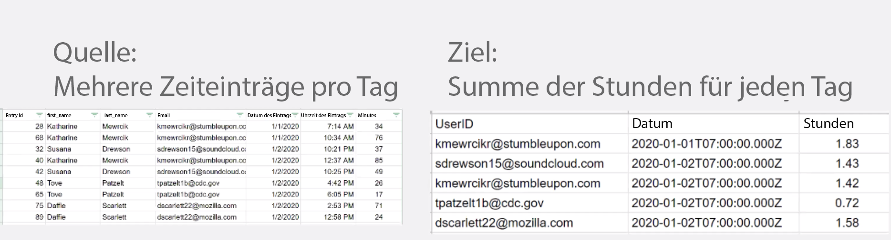

# Datenstrukturen

Wandeln Sie Daten aus einer Quelldatei in eine Zieldatei um.

## Übungsübersicht

Öffnen Sie eine CSV-Datei mit einer Liste von Zeiteinträgen. Diese Zeiteinträge beziehen sich auf Minuten, die an bestimmten Tagen von mehreren Benutzenden erfasst wurden. Ziel ist es, anhand dieser Informationen eine neue CSV-Datei mit der von jeder Person täglich protokollierten Gesamtzeit (in Stunden) zu erstellen.

In diesem Szenario öffnen Sie eine Datei mit einer Liste der Zeiteinträge für gearbeitete Minuten, einschließlich Datum und Uhrzeit, wie viele Minuten eingegeben wurden und der E-Mail-Adresse der Person, die den Eintrag vorgenommen hat. Es sind 100 Zeiteinträge vorhanden, von denen einige von denselben Personen wie andere Einträge und einige am selben Tag wie andere Einträge gemacht wurden.

Gehen Sie wie folgt vor, um eine Datei zu erstellen, die die Gesamtarbeitszeit (in Stunden) anzeigt, die jeden Tag für jede Person erfasst wird.

1. Rufen Sie im Trigger-Modul eine Datei aus dem Workfront-Ordner ab. Laden Sie die Datei herunter.
1. Analysieren Sie im ersten CSV-Modul die Zeiteingabedaten, um für jeden Zeiteintrag ein Bündel auszugeben. Dies ist ein Iterator.
1. Das erste Tools-Modul ist ein numerischer Aggregator. Dadurch werden alle Minuten SUMMIERT und die Zeilen nach E-Mail-Adresse und dann nach Datum gruppiert. Das Ergebnis ist die Gesamtzahl der täglich gerarbeiteten Minuten nach E-Mail-Adresse.
1. Das zweite Tools-Modul ist das Modul „Variable festlegen“. Auf diese Weise können Sie die Minuten so formatieren, dass sie durch 60 teilbar sind, und auf 2 Dezimalstellen runden.
1. Richten Sie im zweiten CSV-Modul die Ausgabedatei ein.
1. Laden Sie im endgültigen Modul die CSV-Datei in Workfront hoch.

## Zu befolgende Schritte

**Laden Sie die Datei von Workfront herunter.**

1. Wählen Sie im Ordner „Fusion-Übungsdateien“ von Workfront die Datei „_Fusion1.0JanTime.csv“ aus und klicken Sie auf „Dokumentdetails“.
1. Kopieren Sie die erste ID-Nummer aus der URL-Adresse.
1. Erstellen Sie ein neues Szenario. Nennen Sie es „Erstellen und Verwenden von Datenstrukturen“.
1. Beginnen Sie mit dem Modul „Dokument herunterladen“ in der Workfront-App.
1. Richten Sie Ihre Workfront-Verbindung ein und fügen Sie die Dokument-ID ein, die Sie aus der Workfront-URL kopiert haben.

   

   **Analysieren Sie die Zeiteingabedaten.**

1. Fügen Sie ein weiteres Modul hinzu und wählen Sie „CSV-Analyse“.
1. Richten Sie die CSV-Analyse für 7 Spalten ein. Markieren Sie das Kontrollkästchen „CSV enthält Kopfzeilen“. Wählen Sie den Trennzeichentyp Komma aus und geben Sie Daten in das CSV-Feld ein.

   

1. Klicken Sie auf „Einmal ausführen“, um die Ausgabe anzuzeigen.
1. Öffnen Sie den Ausführungsinspektor, um die Eingaben und Ausgaben des Moduls „CSV-Analyse“ anzuzeigen. Es gibt ein Bündel (eine CSV-Datei) als Eingabe und mehrere Bündel als Ausgabe (ein Bündel für jede Zeile in der CSV-Datei). Sie sollte in etwa so aussehen:

   

   **Wandeln Sie anschließend die Daten in das gewünschte Ausgabeformular um, wobei die aggregierten Zeitsummen in Stunden anstelle von Minuten ausgedrückt werden.**

1. Fügen Sie das Tool-Modul „Numerische Aggregatoren“ hinzu.
1. Wählen Sie das Quellmodul aus, welches das Modul „CSV-Analyse“ ist.
1. Wählen Sie SUMME als die Aggregierungsfunktion aus.
1. Das Wertfeld ist Spalte 7 aus der CSV-Datei. Dies sind die Minuten, die von jeder Benutzerin bzw. jedem Benutzer protokolliert werden.
1. Um die Felder nach Gruppe zu summieren, klicken Sie auf „Erweiterte Einstellungen“ und legen die Gruppierung nach E-Mail (Spalte 4) und Datum (Spalte 5) fest.

   + Dadurch wird für jede Kombination aus E-Mail und Datum summiert. Stellen Sie sicher, dass Sie ein Komma zwischen Spalte 4 und Spalte 5 setzen. Dies wird später als Trennzeichen verwendet.

   **Ihr Zuordnungsfenster sollte wie folgt aussehen:**

   

1. Klicken Sie auf „Einmal ausführen“, um die Aggregationsausgabe zu überprüfen.

   **Die Ausgabe-Bundles sollten wie folgt aussehen:**

   

   **Konvertieren Sie nun die aggregierten Minuten in Stunden.**

1. Fügen Sie ein weiteres Tool-Modul hinzu und wählen Sie „Variable festlegen“ aus.
1. Nennen Sie die Variable „Stunden“.
1. Setzen Sie den Variablenwert auf formatNumber(result/60;2;.;,)

   **Ihr Zuordnungsfenster sollte wie folgt aussehen:**

   

   **Richten Sie als Nächstes die Werte für die Ausgabedatei ein. Sie benötigen die Benutzer-ID und den Datumswert, die für die Gruppierungen verwendet werden. Sie benötigen außerdem die Stunden, die berechnet wurden.**

1. Fügen Sie mithilfe des Aggregators „CSV erstellen (erweitert)“ ein weiteres CSV-Modul hinzu.
1. Das Quellmodul ist „Tools – Numerischer Aggregator“.
1. Klicken Sie auf das Feld „Nach Datenstruktur hinzufügen“ und nennen Sie unsere Datenstruktur „Protokollierte Zeit – tägliche Summe“.
1. Klicken Sie auf „Element hinzufügen“, um das erste Element zu erstellen.
1. Nennen Sie das Element „Benutzer-ID“ und legen Sie den Typ auf „Text“ fest. Klicken Sie auf „Hinzufügen“.
1. Klicken Sie erneut auf „Element hinzufügen“, um das zweite Element zu erstellen.
1. Nennen Sie das Element „Datum“, legen Sie den Typ auf „Datum“ fest und klicken Sie auf „Hinzufügen“.
1. Klicken Sie ein weiteres Mal auf „Element hinzufügen“.
1. Nennen Sie das Element „Stunden“, legen Sie den Typ auf „Zahl“ fest und klicken Sie auf „Hinzufügen“.

   **Ihre Datenstruktur sollte wie folgt aussehen:**

   

1. Klicken Sie auf „Speichern“, um die Datenstruktur „Protokollierte Zeit – tägliche Summe“ abzuschließen.

   **Geben Sie nun die Werte für die drei soeben erstellten Felder an. Diese drei Felder sollten im Bedienfeld „CSV-Zuordnung“ angezeigt werden.**

1. Klicken Sie in das Feld „Benutzer-ID“ und wählen Sie auf der Registerkarte „Allgemeine Funktionen“ die Option „GET“ aus. Fügen Sie im ersten Parameter „SPLIT“ von der Registerkarte „Text- und Binärfunktionen“ ein. Der erste Parameter für die SPLIT-Funktion ist das Schlüsselfeld. Fügen Sie ein Komma als Trennzeichen und 1 als Index hinzu. Dies zeigt an, dass die GET-Funktion das erste Feld im Schlüssel-Array abrufen soll.
1. Kopieren Sie diesen Ausdruck in das Datumsfeld. Ändern Sie den Index von 1 zu 2, damit die GET-Funktion den zweiten Wert im Array bezieht.
1. Fügen Sie für das Feld „Stunden“ das gleichnamige Feld aus dem Tool „Variable festlegen“ hinzu.

   **Ihr Bedienfeld für die CSV-Zuordnung sollte wie folgt aussehen:**

   

   **Wenn Sie das Szenario jetzt ausführen, sollte diese Ausgabe angezeigt werden:**

   

   **Fügen Sie nun ein Modul hinzu, um diese Ausgabe zu nehmen und als Dokument in ein vorhandenes Projekt in Workfront hochzuladen.**

1. Öffnen Sie das Projekt in Workfront und kopieren Sie die Projekt-ID aus der URL.
1. Gehen Sie zurück zum Szenario in Fusion und fügen Sie ein weiteres Modul hinzu: das Modul „Dokument hochladen“ aus der Workfront-App.
1. Fügen Sie die Projekt-ID in das Feld „Zugehörige Eintrags-ID“ ein.
1. Wählen Sie „Projekt“ als den zugehörigen Eintragstyp aus.
1. Wählen Sie die Option „Zuordnung“ für die Quelldatei aus.
1. Verwenden Sie für den Dokumentnamen den Namen der Datei, die Sie heruntergeladen haben, und fügen Sie „Aktualisiert“ davor ein.
1. Verwenden Sie für den Dateiinhalt die Textausgabe aus dem Modul „CSV erstellen“.

   **Ihr Zuordnungsfenster sollte wie folgt aussehen:**

   

1. Klicken Sie auf „OK“ und speichern Sie das Szenario.
1. Klicken Sie auf „Einmal ausführen“, um das Szenario auszuführen.

   **Überprüfen Sie den Ausführungsinspektor im Modul „Dokument hochladen“, um zu bestätigen, dass das Dokument hochgeladen wurde.**

   
