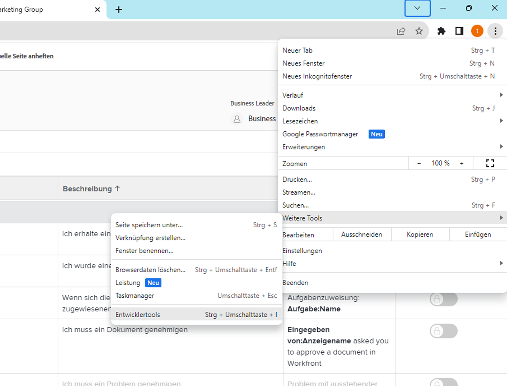

# Entwickler-Tool

Verbessern Sie Ihre Möglichkeiten, Fehler in einem Szenario zu beheben, und vereinfachen Sie komplexe Konfigurationen mit dem Entwickler-Tool.

## Übungsübersicht

Installieren und verwenden Sie die verschiedenen Bereiche im Entwickler-Tool in Workfront, um sich eingehender mit Anfragen/Antworten und fortgeschrittenen Tricks zum Szenario-Design auseinanderzusetzen.

>[!NOTE]
>
>Das Entwickler-Tool von Workfront Fusion ist nur im Chrome-Browser verfügbar, wenn Sie das [Chrome-Entwickler-Tool](https://developer.chrome.com/docs/devtools/) verwenden.

## Zu befolgende Schritte

**Installieren Sie das Entwickler-Tool.**

1. Laden Sie das Dokument „workfront-fusion-devtool.zip“ herunter, das Sie im Ordner „Fusion-Übungsdateien“ im Testlauf finden.
1. Extrahieren Sie die ZIP-Dateien in einen Ordner.
1. Öffnen Sie eine Registerkarte in Chrome und geben Sie **chrome://extensions** ein.
1. Schalten Sie mit dem Umschalter oben rechts den Entwicklermodus ein und klicken Sie dann auf die Schaltfläche „Entpackt laden“, die oben links angezeigt wird. Wählen Sie den Ordner aus, der das Entwickler-Tool enthält (d. h. den Ordner, in den Sie es entpackt haben).

   

1. Nach dem Entpacken wird das Entwickler-Tool neben Ihren anderen Erweiterungen angezeigt.

   

   **Verwenden Sie den Live-Stream.**

1. Öffnen Sie zunächst das Szenario „Verwenden von Datenspeichern zum Synchronisieren von Daten“.
1. Öffnen Sie das Entwickler-Tool, indem Sie auf F12 oder Funktionstaste+F12 drücken. Alternativ können Sie auf das Menü mit drei Punkten in der Chrome-Adressleiste klicken und zu „Entwickler-Tools“ navigieren.

   

1. Klicken Sie auf die Registerkarte „Workfront Fusion“ und wählen Sie dann links in der Liste den Eintrag „Live-Stream“ aus.
1. Klicken Sie auf „Einmal ausführen“, um Ereignisse zu sehen, während sie auftreten.
1. Klicken Sie auf ein Ereignis, um rechts die Registerkarten „Anfragekopfzeilen“, „Anfragetext“, „Antwortkopfzeile“ und „Antworttext“ anzuzeigen.

   

   **Verwenden des Szenario-Debuggers**

1. Wählen Sie „Szenario-Debugger“ aus und klicken Sie auf ein Modul, um Informationen zu den Vorgängen dieses Moduls anzuzeigen.

   

1. Navigieren Sie zur Registerkarte „Verlauf“. Klicken Sie bei einer Ausführung auf „Details“, um die Details des Modulbetriebs für eine bestimmte Ausführung zu überprüfen.

   

   **Verwenden der Tools**

1. Gehen Sie zurück zum Szenario-Designer und wählen Sie „Tools“ im Entwickler-Tool aus. Dadurch werden die verfügbaren Tools angezeigt.

   

+ Auf ein Modul fokussieren – Suchen und öffnen Sie ein Modul schnell mithilfe der Modul-ID.
+ Modul(e) nach Zuordnung suchen – Suchen Sie ein Szenario mit einem Suchbegriff, um zugeordnete Werte und/oder Schlüssel in Modulen zu finden.
+ App-Metadaten abrufen – Erhalten Sie die Metadaten für die ausgewählte App in einem Szenario.
+ Zuordnung kopieren – Kopiert die Zuordnung von einem Modul zum anderen. Sie können das Modul auch im Designer klonen.
+ Filter kopieren – Kopiert einen Filter. Der Filter wird immer dem Modul rechts von ihm zugewiesen.
+ Verbindung austauschen – Das Tool nimmt die Verbindung vom ausgewählten Modul und stellt dieselbe Verbindung zu allen Modulen derselben App im Szenario ein. Dies ist hilfreich, wenn Sie die Verbindung in einem abgeschlossenen Szenario ändern müssen. Vermeiden Sie mit diesem Tool den Verlust aller Zuordnungen und sparen Sie dadurch Zeit.
+ Variable austauschen – Findet alle Vorkommnisse der angegebenen Variablen im gesamten Szenario oder in einem Modul und ersetzt sie durch die neue. Platzhalter werden nicht unterstützt. Wenn Sie versehentlich einen Wert für das gesamte Szenario zugeordnet haben, können Sie hierdurch einfach den richtigen Wert einsetzen.
+ App austauschen – Tauscht die angegebene App gegen eine andere aus.
+ Base 64 – Kodiert die eingegebenen Daten in Base64 oder dekodiert Base64. Dies ist nützlich, wenn Sie in der kodierten Anfrage nach bestimmten Daten suchen möchten.
+ Modulname kopieren – Kopiert den Namen des ausgewählten Moduls in die Zwischenablage.
+ Quelle neu zuordnen – Ändern der Zuordnungsquelle von einem Modul in ein anderes. Sie müssen zunächst das Modul, das als Quellmodul verwendet werden soll, zur Route in einem Szenario hinzufügen.
+ Betriebssystem migrieren – Wurde speziell für die Aktualisierung von alten Google Sheets-Modulen auf die neueste Version von Google Sheets entwickelt. Eine neue Version des Moduls wird direkt nach der älteren Version des Moduls in der Szenarioroute hinzugefügt.
