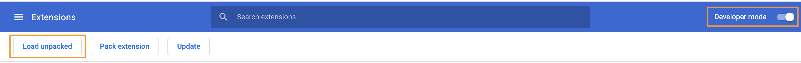

# Entwicklungstool

Verbessern Sie Ihre Fähigkeiten zur Fehlerbehebung in einem Szenario und erleichtern Sie komplexe Konfigurationen mit dem Entwickler-Tool.

## Übungsübersicht

Installieren und verwenden Sie die verschiedenen Bereiche im Workfront Dev-Tool, um einen tieferen Einblick in die Anforderungen/Antworten und die erweiterten Designtricks für Szenarien zu erhalten.

>[!NOTE]
>
>Das Workfront Fusion Dev-Tool ist nur im Chrome-Browser verfügbar, wenn Sie die [Chrome-Entwickler-Tool](https://developer.chrome.com/docs/devtools/).

## Schritte, die ausgeführt werden müssen

**Installieren Sie das Entwickler-Tool.**

1. Laden Sie das Dokument &quot;workfront-fusion-devtool.zip&quot;herunter, das Sie im Ordner Fusion Übungsdateien im Testlaufwerk finden.
1. Extrahieren Sie die ZIP-Dateien in einen Ordner.
1. Öffnen Sie eine Registerkarte in Chrome und geben Sie **chrome://extensions**.
1. Schalten Sie mit dem Schalter oben rechts den Entwicklermodus ein und klicken Sie dann auf die Schaltfläche &quot;Entpackt laden&quot;, die oben links angezeigt wird. Wählen Sie den Ordner aus, der das Entwickler-Tool enthält (hier haben Sie die Komprimierung aufgehoben).

   

1. Nach dem Entpacken wird das Entwickler-Tool unter Ihren anderen Erweiterungen angezeigt.

   

   **Verwenden Sie den Live-Stream.**

1. Öffnen Sie zunächst das Szenario &quot;Verwenden von Datenspeichern zum Synchronisieren von Daten&quot;.
1. Öffnen Sie das Entwickler-Tool, indem Sie F12 oder die Funktion F12 eingeben. Alternativ können Sie auf das Menü mit drei Punkten in der Chrome-Adressleiste klicken und zu &quot;Developer Tools&quot;navigieren.

   

1. Klicken Sie auf die Registerkarte Workfront Fusion und wählen Sie dann links in der Liste den Eintrag Live Stream aus.
1. Klicken Sie auf Einmal ausführen , um Ereignisse zu sehen, während sie auftreten.
1. Klicken Sie auf ein Ereignis, um rechts Registerkarten für Anforderungsheader, Anforderungstext, Antwortheader und Antworttext anzuzeigen.

   

   **Verwenden des Szenario-Debuggers**

1. Wählen Sie Scenario Debugger aus und klicken Sie auf ein Modul, um Informationen zu den Vorgängen dieses Moduls anzuzeigen.

   

1. Navigieren Sie zur Registerkarte Verlauf . Klicken Sie auf Details zu einer Ausführung, um die Details des Modulbetriebs für eine bestimmte Ausführung zu überprüfen.

   

   **Verwenden der Tools**

1. Gehen Sie zurück zum Szenario-Designer und wählen Sie im Entwickler-Tool &quot;Tools&quot;. Dadurch werden die verfügbaren Tools angezeigt.

   

+ Fokussieren eines Moduls - Suchen und öffnen Sie ein Modul schnell mithilfe der Modul-ID.
+ Suchmodul(e) nach Zuordnung - Suchen Sie ein Szenario mit einem Suchbegriff, um zugeordnete Werte und/oder Schlüssel in Modulen zu finden.
+ App-Metadaten abrufen - Anzeigen der Metadaten für die ausgewählte App in einem Szenario.
+ Zuordnung kopieren - Kopiert die Zuordnung von einem Modul zum anderen. Sie können das Modul auch im Designer klonen.
+ Filter kopieren - Kopiert einen Filter. Der Filter wird dem Modul auf der rechten Seite immer zugewiesen.
+ Verbindung austauschen - Das Tool nimmt die Verbindung vom ausgewählten Modul und stellt dieselbe Verbindung zu allen Modulen derselben App im Szenario ein. Dies ist hilfreich, wenn Sie die Verbindung in einem abgeschlossenen Szenario ändern müssen. Vermeiden Sie den Verlust aller Zuordnungen und sparen Sie Zeit mit diesem Tool.
+ Variable tauschen - Findet alle Vorkommnisse der angegebenen Variablen im gesamten Szenario oder in einem Modul und ersetzt sie durch das neue. Platzhalter werden nicht unterstützt. Wenn Sie versehentlich einen Wert für das gesamte Szenario zugeordnet haben, können Sie hierdurch einfach den richtigen Wert austauschen.
+ App tauschen - Tauscht die angegebene App gegen eine andere.
+ Base 64 - Kodieren Sie die eingegebenen Daten in Base64 oder dekodieren Sie Base64. Nützlich, wenn Sie in der kodierten Anforderung nach bestimmten Daten suchen möchten.
+ Modulname kopieren - Kopiert den Namen des ausgewählten Moduls in die Zwischenablage.
+ Remap Source - Ändern Sie die Zuordnungsquelle von einem Modul in ein anderes. Sie müssen zunächst das -Modul hinzufügen, das als Quellmodul verwendet werden soll, um die Route in einem Szenario zu erreichen.
+ Migrieren des Betriebssystems - Wurde speziell für die Aktualisierung von Google Tabellen-Modulen (alt) auf die neueste Google Tabellen-Version entwickelt. Es wird eine neue Version des Moduls direkt nach der älteren Version des Moduls in der Szenario-Route hinzugefügt.
