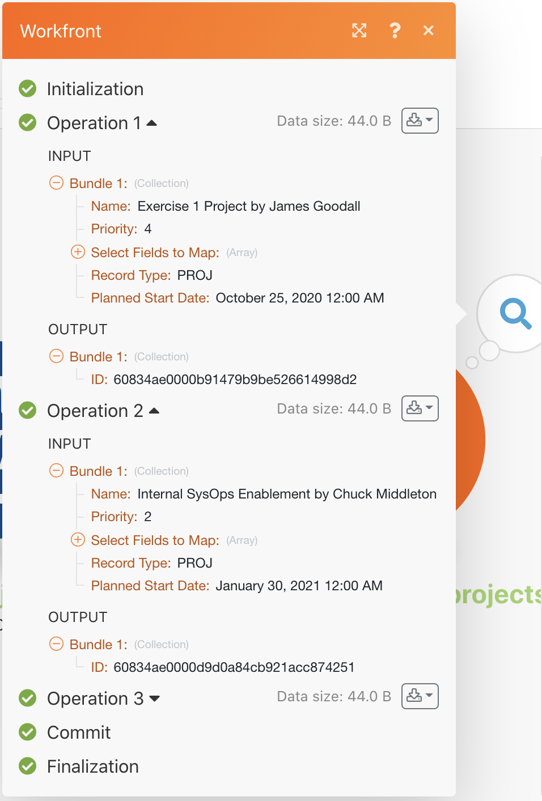
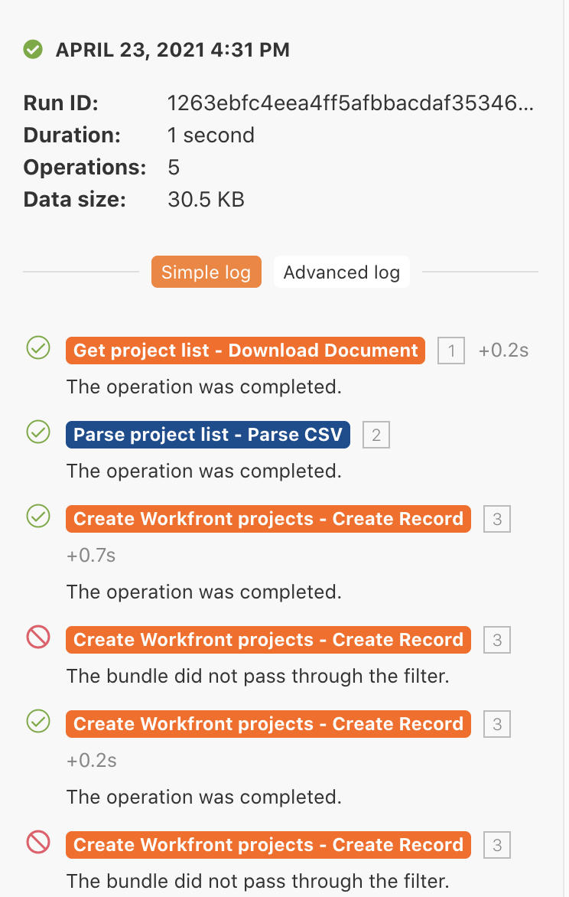
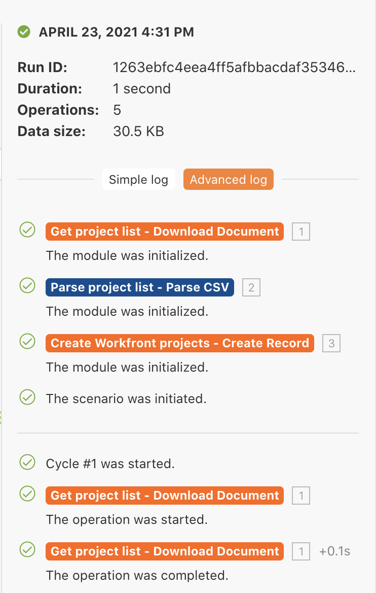

# Übung zum Ausführungsverlauf

Überprüfen Sie Details zu früheren Ausführungen und Szenario-Konfigurationen.

## Übungsübersicht

Überprüfen Sie den Ausführungsverlauf für das Szenario „Verwenden des mächtigen Filters“, um zu verstehen, was bei den Ausführungen passiert ist und wie sie strukturiert waren, als sie ausgeführt wurden.

## Zu befolgende Schritte

1. Öffnen Sie das Szenario „Verwenden des mächtigen Filters“.
1. Klicken Sie auf der Übersichtsseite auf die Registerkarte „Verlauf“ (oben unter dem Namen des Szenarios).

   

1. Suchen Sie eine Ausführung und klicken Sie auf die Schaltfläche „Details“, um eine Seite zu öffnen, auf der die spezifischen durchgeführten (oder nicht durchgeführten) Vorgänge im rechten Bedienfeld angezeigt werden. Im linken Bedienfeld können Sie das Szenario so untersuchen, wie es zum Zeitpunkt der Ausführung war.

   

1. Wenn Sie im Szenario-Bedienfeld auf ein Modul klicken, erscheint ein Modulinspektor-Bedienfeld, das Informationen über die Einstellungen des Moduls anzeigt. Klicken Sie auf den Ausführungsinspektor neben einem Modul oder Filter, um zu sehen, welche Informationsbündel darauf ausgeführt wurden.

   

   

1. Scrollen Sie im rechten Bereich durch das einfache Protokoll oder klicken Sie sich durch, um Details zur Wiedergabe der Ausführung anzuzeigen.

   + Sie können sehen, wann Vorgänge in Modulen abgeschlossen wurden und wann Bündel über Filter übergeben wurden (oder nicht).

   

   + Klicken Sie auf ein Protokollelement, um das Operations-Bedienfeld im Szenario-Bedienfeld zu öffnen. Die Protokolle werden in chronologischer Reihenfolge ihres Auftretens aufgelistet.

   

1. Das erweiterte Protokoll zeigt ähnliche Informationen. Es enthält jedoch zusätzlich Informationen darüber, wie viele Zyklen pro Ausführung ausgeführt wurden, und ermöglicht Ihnen, genauer zu untersuchen, welche Informationsbündel in den einzelnen Zyklen verarbeitet wurden.

