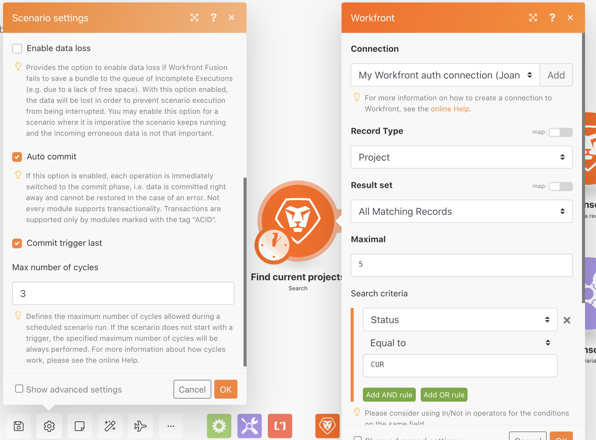

# Übung zum Kennenlernen von Durchläufen, Zyklen und Bündeln

Erfahren Sie, wie sich Durchläufe, Zyklen und Bündel verhalten und den Ausführungsverlauf eines Szenarios nutzen.

## Übungsübersicht

Üben Sie mit verschiedenen Szenariokonfigurationen, um die Verwendung von Durchläufen und Zyklen zu erkunden.

## Zu befolgende Schritte

1. Klonen Sie das Szenario mit dem Namen „Freigeben von Variablen zwischen Routing-Pfaden“. Nennen Sie das neue Szenario „Variablenfreigabe zwischen Routing-Pfaden – Zyklentest“.
1. Entfernen Sie das Modul „E-Mail senden“, da es für diesen Test nicht benötigt wird.

   **Richten Sie Ihr Szenario so ein, dass 3 Zyklen pro Durchlauf verarbeitet werden. Verarbeiten Sie 5 Projekte in jedem Zyklus.**

1. Klicken Sie auf das Trigger-Modul und ändern Sie das Feld „Maximal“ in 5, sodass in jedem Zyklus nur fünf Projekte verarbeitet werden.
1. Entfernen Sie in den Suchkriterien den zweiten Filter, der die Suche auf ein einzelnes Projekt beschränkt.
1. Klicken Sie auf „OK“.

1. Öffnen Sie in der Fusion-Symbolleiste die Szenario-Einstellungen und ändern Sie das Feld „Max. Anzahl von Zyklen“ von 1 in 3.
1. Klicken Sie auf „OK“.

   

   **Planen Sie das Szenario so, dass es jede Minute ausgeführt wird.**

1. Klicken Sie auf das Uhrensymbol neben dem Trigger-Modul und ändern Sie das Feld „Minuten“ in 1 Minute.

   

1. Stellen Sie dann den Schalter „Planung“ unter der Schaltfläche „Einmal ausführen“ auf „Ein“. Speichern Sie Ihr Szenario.

   

1. Rufen Sie den Ausführungsverlauf des Szenarios auf und schauen Sie, ob innerhalb der nächsten Minute ein neuer Verlaufseintrag erscheint. Möglicherweise müssen Sie die Seite aktualisieren.

   

1. Klicken Sie auf die Schaltfläche „Details“ eines Durchlaufs. Klicken Sie im rechten Bereich durch das einfache Protokoll, ähnlich wie im Abschnitt zum Ausführungsverlauf der Workfront Fusion-Schulung.
1. Die Einträge der verarbeiteten Vorgänge werden in Zyklen unterteilt.

   

1. In einem Dropdown-Menü oben rechts im Fenster können Sie einen der drei eingerichteten Zyklen auswählen, um ihn jedes Mal auszuführen.

   
