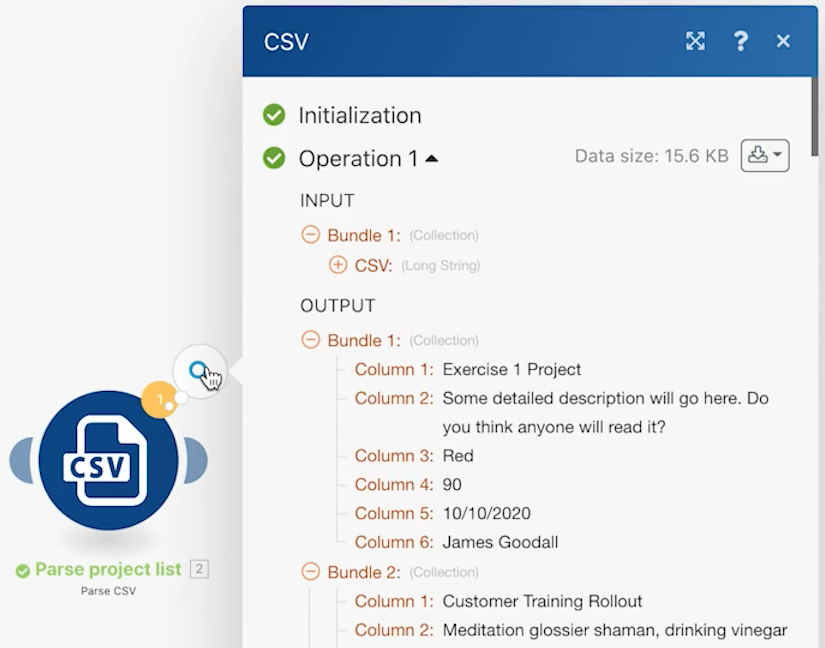
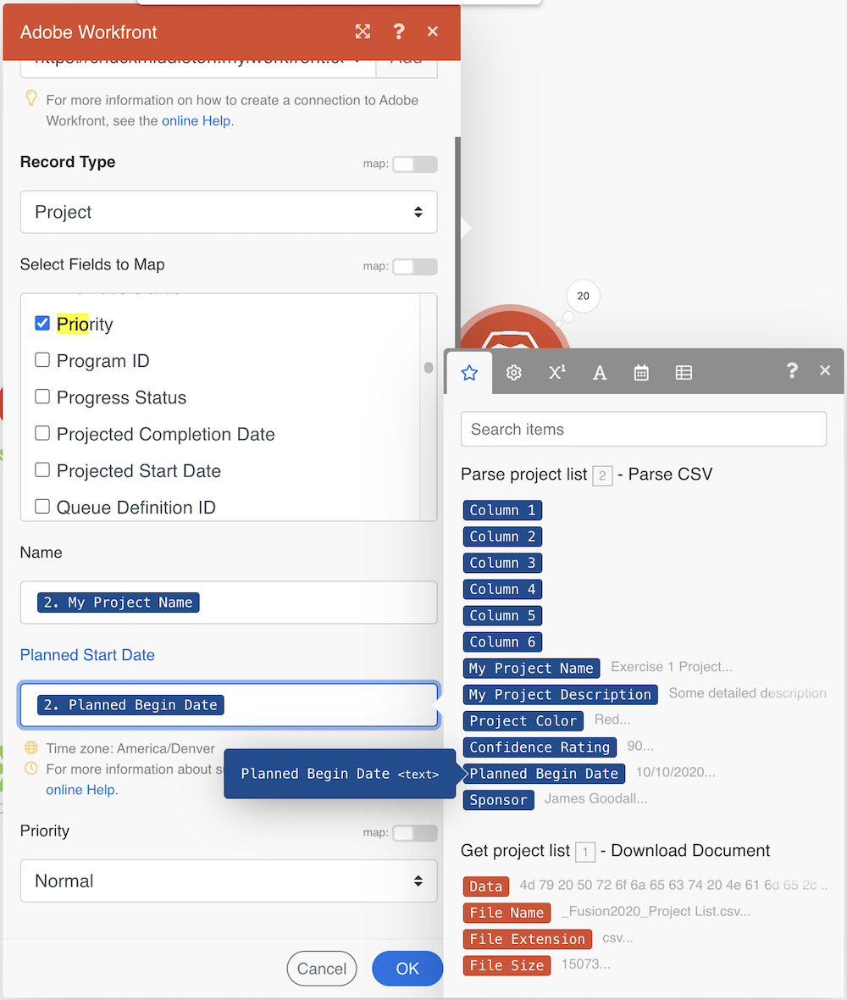

# Anfänglicher Entwurf des Szenarios

Hier erhalten Sie einige grundlegende Navigationstipps für die erste Anmeldung bei Workfront Fusion sowie die Erstellung Ihres ersten Szenarios.

## Voraussetzungen

1. Für diese Übung ist ein Workfront-Testlaufwerk erforderlich. Sie können eine anfordern, indem Sie [dieses Formulars](https://forms.office.com/r/f1J8HRGrNY). Wenn Sie nicht auf das Formular zugreifen können, senden Sie Ihren Namen, Ihre E-Mail-Adresse und Ihren Firmennamen an wfttstdr@adobe.com.
1. Bei Fusionsübungen wird davon ausgegangen, dass Sie das Video zur exemplarischen Vorgehensweise, das der Übung entspricht, angesehen haben. In diesem Fall ist [Anfängliche Designanleitung](https://experienceleague.adobe.com/docs/workfront-learn/tutorials-workfront/fusion/understand-the-basics/initial-scenario-design-walkthrough.html?lang=en).

## Übungsübersicht

Erstellen Sie in Workfront ein neues Projekt für jede Zeile in der CSV-Datei &quot;Projektliste&quot;.

## Schritte, die ausgeführt werden müssen

1. Erstellen Sie im Abschnitt Szenario einen Ordner mit dem Namen &quot;Aktivierungsübungen für Fusion&quot;.
1. Klicken Sie in den Ordner und dann auf Neues Szenario erstellen .

   

1. Suchen Sie auf der nächsten Seite nach Workfront und wählen Sie diese App aus. Klicken Sie dann auf Weiter .
1. Benennen Sie Ihr Szenario oben links im Szenario-Designerbildschirm in &quot;Ursprüngliches Szenario-Design&quot;um.
1. Klicken Sie in der Mitte des Bildschirms auf das leere Trigger-Modul, wählen Sie die Workfront-App und dann das Modul Dokument herunterladen aus.

   **Authentifizieren Sie die Verbindung des Moduls zu Ihrem Workfront-Konto.**

1. Um eine Verbindung zum ersten Mal zu erstellen, klicken Sie auf die Schaltfläche Hinzufügen .

   

1. Geben Sie der Verbindung einen Namen, z. B. &quot;My Workfront 2020&quot;

   

1. Geben Sie die URL von **Ihre Workfront-Instanz** und klicken Sie dann auf Weiter .

   

1. Geben Sie Ihr Kennwort ein und klicken Sie auf Anmelden.

   **Die Verbindung wird hergestellt. Geben Sie nun die Dokument-ID des Dokuments ein, das Sie von Workfront herunterladen möchten.**

   

1. Gehen Sie zurück zu Workfront. Wählen Sie im Ordner &quot;Fusion Übungsdateien&quot;die Option &quot;_Fusion2020_Project List.csv&quot;aus und klicken Sie im linken Bereich auf Dokumentdetails . Kopieren Sie die Dokument-ID-Nummer aus der URL-Adresse (dies ist die erste lange Nummer in der URL).

   

1. Gehen Sie zurück zu Fusion, fügen Sie die Nummer in das Feld Dokument-ID ein und klicken Sie auf OK.
1. Es empfiehlt sich, Module beim Erstellen umzubenennen. Klicken Sie mit der rechten Maustaste auf das Workfront-Modul und wählen Sie Umbenennen. Nennen Sie das Modul &quot;Projektliste abrufen&quot;.

   **Als Nächstes werden Sie die soeben heruntergeladene CSV-Datei analysieren, damit Sie auf jede Zeile in der Datei zugreifen können. Sie werden diese Informationen verwenden, wenn Sie ein Projekt aus jeder Zeile erstellen.**

1. Klicken Sie auf die rechte Seite des Workfront-Moduls, um ein weiteres Modul hinzuzufügen. Suchen Sie nach der CSV-App und wählen Sie das Modul CSV analysieren aus.
1. Richten Sie die CSV-Analyse für 6 Spalten ein, CSV enthält Kopfzeilen, Trennzeichen und legen Sie Daten im CSV-Feld ab. Klicken Sie dann auf OK.

   

1. Benennen Sie dieses Modul &quot;Projektliste analysieren&quot;um.
1. Klicken Sie unten im Szenario-Designer auf Speichern , um Ihr Szenario zu speichern.
1. Klicken Sie auf Einmal ausführen , um die Ausgabe anzuzeigen.

   >[!NOTE]
   >
   >Ignorieren Sie die Warnung, dass ein Transformator nicht das letzte Modul sein sollte (dies ist wahr, aber für diesen Test ist es nicht wichtig). Klicken Sie auf Jedwede Ausführung .

   

1. Öffnen Sie den Ausführungsinspektor im Parse CSV-Modul, um die Ein- und Ausgabe des Moduls anzuzeigen. Es gibt ein Bundle (eine CSV-Datei) als Eingabe und mehrere Bundles als Ausgabe (ein Bundle für jede Zeile in der CSV-Datei). Sie sollte ungefähr so aussehen:

   

   **Fügen Sie ein Modul hinzu, um ein Projekt für jede Zeile in der CSV-Datei zu erstellen.**

1. Fügen Sie ein weiteres Modul hinzu. Wählen Sie die Workfront-App und danach das Modul Datensatz erstellen aus.
1. Legen Sie den Typ Datensatz als Projekt fest.

   >[!TIP]
   >
   >Suchen Sie danach, indem Sie einige Buchstaben eingeben, z. B. *proj*, um direkt darauf zuzugreifen.

1. Verwenden Sie dann Befehl/Strg+G, um den Namen (Projektname) zu suchen. Aktivieren Sie das Kontrollkästchen neben Name. Das Feld wird unten angezeigt.
1. Aktivieren Sie nun die Kontrollkästchen neben &quot;Geplantes Startdatum&quot;und &quot;Priorität&quot;.
1. Klicken Sie in das Feld Name , damit das Zuordnungsfenster angezeigt wird. Klicken Sie im Modul CSV analysieren auf das Feld Spalte 1 , um es dem Feld Name hinzuzufügen. Dies ist der Projektname aus der CSV-Datei.
1. Klicken Sie für das geplante Startdatum im CSV-Modul &quot;Analysieren&quot;auf Spalte 5 .
1. Wählen Sie als Priorität im Dropdown-Menü die Option Normal aus.

   **Ihr Zuordnungsbereich sollte wie folgt aussehen:**

   

1. Klicken Sie auf OK.

   >[!NOTE]
   >
   >Wenn Sie nicht auf OK klicken und versehentlich wieder in den Designer klicken, wird Ihre Arbeit nicht gespeichert und Sie müssen sie erneut zuordnen.

1. Klicken Sie mit der rechten Maustaste auf das Workfront-Modul und benennen Sie es in &quot;Workfront-Projekte erstellen&quot;um.
1. Speichern Sie das Szenario und klicken Sie auf die Schaltfläche Einmal ausführen .
1. Klicken Sie auf den Ausführungsinspektor oben rechts im letzten Modul.

   + Sie werden sehen, dass 20 Vorgänge ausgeführt wurden. Für jeden Vorgang wurde ein Bundle (d. h. eine Zeile) aus der CSV-Datei als Eingabe- und Ausgabebundle verwendet, bei dem es sich um ein in Workfront erstelltes Projekt handelte. Die Projekt-ID des erstellten Projekts wird mit dem Ausgabebundle angezeigt.

   

   **Hinweise verwenden**

1. Hinweise helfen dabei, den Szenarioentwurf besser sichtbar zu machen. Um dem Modul Workfront-Projekte erstellen einen Hinweis hinzuzufügen, klicken Sie mit der rechten Maustaste darauf und wählen Sie Notiz hinzufügen aus. Rechts neben dem Designer-Fenster wird ein Fenster angezeigt, in dem Sie dem Modul eine Notiz hinzufügen können. Geben Sie unter &quot;Erstellen Sie ein Projekt mit dem Namen, dem geplanten Startdatum und der aus der CSV-Datei zugeordneten Priorität&quot;ein.
1. Fügen Sie einen weiteren Hinweis hinzu, um zu beschreiben, was das Trigger-Modul (das erste Workfront-Modul) tut.
1. Schließen Sie das Bedienfeld &quot;Notizen&quot;, indem Sie auf das X oben rechts klicken.

   + Greifen Sie erneut auf die Notizen zu, indem Sie in der unteren Symbolleiste auf die Schaltfläche &quot;Notizen&quot;klicken oder mit der rechten Maustaste auf ein beliebiges Modul klicken und eine neue Notiz hinzufügen.
   + Die Hinweise sind in chronologischer Reihenfolge sortiert.
   + Sobald Notizen hinzugefügt wurden, wird auf der Schaltfläche Notizen ein orangefarbener Punkt angezeigt.

   

1. Speichern Sie das Szenario, indem Sie in der Symbolleiste der Steuerelemente auf die Schaltfläche Speichern klicken.
1. Sie können die in Ihrer Workfront-Instanz erstellten Projekte anzeigen.
