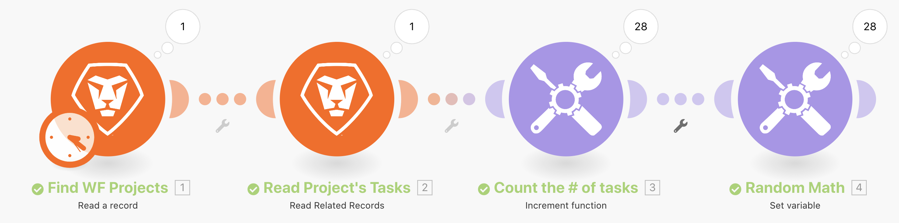
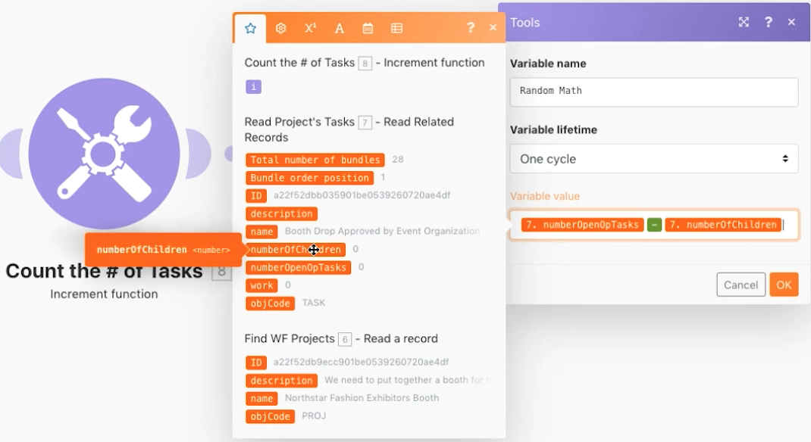

# Einführung in Iteratoren

Erfahren Sie, wie Sie Iterations-Apps verwenden und Aktionen für jedes Informationsbündel durchführen können.

## Übungsübersicht

Sehen Sie sich ein bestimmtes Projekt in Workfront an und dann alle Aufgaben innerhalb dieses Projekts. Mit dem Inkrement-Tool-Modul zählen Sie die Anzahl der Aufgaben im Projekt. Schließlich verwenden Sie das Modul „Variable festlegen“, um die Anzahl der untergeordneten Elemente von der Anzahl der offenen Probleme zu subtrahieren und für jedes der Aufgabenbündel einen numerischen Wert zu generieren.

## Zu befolgende Schritte

**Ein Projekt und zugehörige Aufgaben lesen.**

1. Starten Sie ein neues Szenario. Nennen Sie es „Einführung in die Iteration“.
1. Wählen Sie Workfront als Trigger-Modul und lesen Sie einen Eintrag.
1. Wählen Sie für „Eintragstyp“ die Option „Projekt“.
1. Wählen Sie für Ausgaben „ID“, „Name“ und „Beschreibung“ aus.
1. Geben Sie im Feld „ID“ die Projekt-ID des Messestandprojekts für Northstar Fashion aus Ihrer Workfront-Testlaufwerkinstanz ein.
1. Benennen Sie dieses Modul in „WF-Projekte suchen“ um.
1. Fügen Sie ein weiteres Workfront-Modul hinzu, um die mit diesem Projekt verbundenen Aufgaben zu lesen. Wählen Sie das Modul „Verwandte Datensätze lesen“ aus.
1. Wählen Sie für „Eintragstyp“ die Option „Projekt“.
1. Wählen Sie für die übergeordnete Eintrags-ID die ID aus dem Modul „Eintrag lesen“ aus.
1. Wählen Sie für „Sammlungen“ die Option „Aufgaben“.
1. Wählen Sie für „Ausgaben“ „ID“, „Name“, „Beschreibung“, „Anzahl der untergeordneten Elemente“, „Anzahl offener Probleme“ und „Arbeit“ aus.
1. Benennen Sie dieses Modul in „Projektaufgaben lesen“ um.
1. Speichern Sie das Szenario und klicken Sie dann auf „Einmal ausführen“, um die Ausgaben anzuzeigen.

   + Wenn Sie auf den Ausführungsinspektor klicken, sehen Sie ein Bündel als Eingabe (das Projekt) und 28 Bündel als Ausgabe (die Aufgaben).

   **Iterierte Bündel zählen und verarbeiten.**

1. Fügen Sie nach „Zugehörige Datensätze lesen“ ein weiteres Modul hinzu. Wählen Sie ein Inkrementierungsfunktions-Tool-Modul aus.

   + Belassen Sie das Feld „Wert zurücksetzen“ auf „Nie“ und klicken Sie auf „OK“.

1. Benennen Sie dieses Modul um in „Aufgaben zählen“.
1. Fügen Sie ein Modul „Variable festlegen“ hinzu. Setzen Sie den Variablennamen auf „Zufallsmathematik“.
1. Ziehen Sie im Feld „Variablenwert“ die Anzahl der offenen untergeordneten Elemente von der Anzahl der offenen Aufgaben ab.

   **Das sollte wie folgt aussehen:**

   

1. Benennen Sie dieses Modul in „Zufallsmathematik“ um.
1. Speichern Sie das Szenario und klicken Sie auf „Einmal ausführen“.

Für jede der vom Iterator-Modul „Zugehörige Datensätze lesen“ erzeugten Aufgaben führte Workfront Fusion 28 Ausführungen durch. Diese 28 Bündel werden während des gesamten Szenarios weiterhin verarbeitet, es sei denn, es wird ein Aggregator hinzugefügt, der den Kreislauf schließt.
