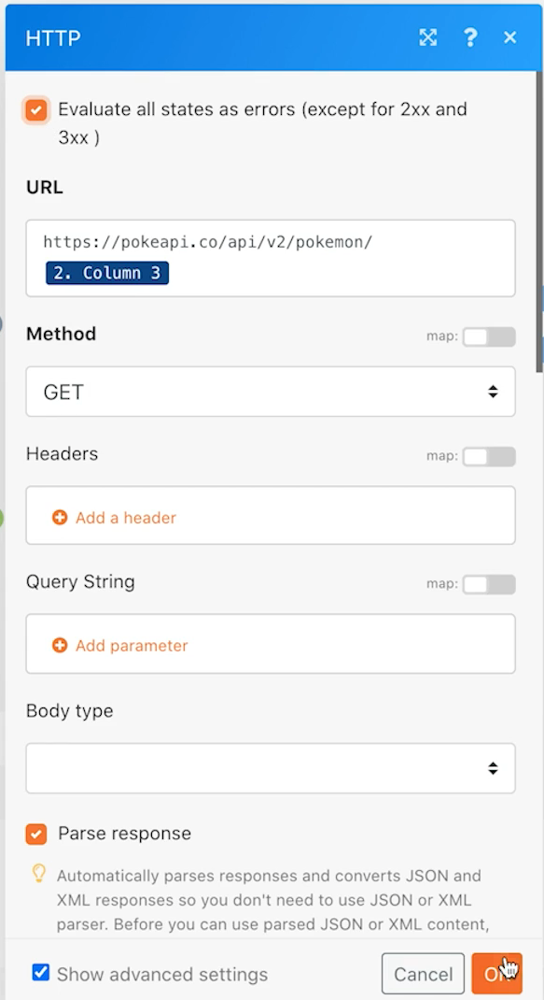

# Einführung in universelle Connectoren

Erweitern Sie Ihr Verständnis für die Arbeit mit universellen REST-Connectoren und die Arbeit mit den zurückgegebenen Daten.

## Übungsübersicht

Rufen Sie mithilfe eines Pokemon-Zeichens in einer Tabelle die Poke-API über einen HTTP-Connector auf, um weitere Informationen zu diesem Zeichen zu sammeln und zu posten.

## Schritte, die ausgeführt werden müssen

**Laden Sie die CSV-Datei von Workfront herunter.**

1. Wählen Sie im Ordner &quot;Fusion Exercise Files&quot;von Workfront die Option &quot;_Fusion20_Shipping Manifest.csv&quot;aus und klicken Sie auf &quot;Document Details&quot;.
1. Kopieren Sie die erste ID-Nummer aus der URL-Adresse.
1. Erstellen Sie ein neues Szenario in Workfront Fusion. Nennen Sie ihn &quot;Verwenden universeller Connectoren&quot;.
1. Beginnen Sie mit dem Modul Dokument von der Workfront-App herunterladen .
1. Richten Sie Ihre Workfront-Verbindung ein und fügen Sie die Dokument-ID ein, die Sie aus der Workfront-URL kopiert haben.
1. Benennen Sie dieses Modul &quot;Versandmanifest herunterladen&quot;um.

   

   **Analysieren Sie die Versandmanifestdaten.**

1. Fügen Sie ein weiteres Modul hinzu, indem Sie CSV analysieren auswählen.
1. Richten Sie die CSV-Analyse für elf Spalten ein. Aktivieren Sie das Kontrollkästchen CSV enthält Kopfzeilen . Wählen Sie den Trennzeichentyp Komma aus und fügen Sie Daten aus dem Modul Dokument herunterladen in das CSV-Feld ein.

   

1. Benennen Sie dieses Modul &quot;Versandmanifest analysieren&quot;um.
1. Speichern Sie das Szenario und klicken Sie einmal auf Ausführen , damit Sie in den nächsten Schritten Daten aus der CSV-Datei sehen können.

   **Rufen Sie die Pokemon-Daten über den universellen Connector ab.**

1. Fügen Sie ein HTTP-Anforderungsmodul hinzu.
1. Verwenden Sie im URL-Feld `https://pokeapi.co/api/v2/pokemon/[Character]`, wobei [Zeichen] ist Spalte 3 aus dem CSV-Modul Parse zugeordnet.
1. Aktivieren Sie das Kontrollkästchen Antwort analysieren .
1. Wählen Sie Erweiterte Einstellungen anzeigen und aktivieren Sie dann das Kontrollkästchen neben &quot;Alle Status als Fehler auswerten&quot;.
1. Klicken Sie auf OK und benennen Sie das Modul &quot;Pokemon-Informationen abrufen&quot;um.

   **Ihr Zuordnungsbereich sollte wie folgt aussehen:**

   

   **In diesem Teil der Übung möchten Sie nur Zeile 1 in der CSV-Datei verarbeiten.**

1. Fügen Sie vor Ihrem Get Pokemon Info-Modul einen Filter hinzu. Nennen Sie es &quot;Nur Zeile 1&quot;.
1. Setzen Sie die Bedingung so, dass nur ID Nummer 1 weitergegeben wird. ID Nummer 1 befindet sich in Zeile 1 und das ID-Feld befindet sich in Spalte 1 der CSV-Datei.

   

1. Speichern Sie das Szenario.
1. Klicken Sie auf &quot;Einmal ausführen&quot;und beobachten Sie die Fehlermeldung, die Sie im HTTP-Anforderungsmodul erhalten.

   >[!IMPORTANT]
   >
   >Beachten Sie, dass der Zeichenname im Feld für die Eingabe-Daten-URL großgeschrieben ist. Dies funktioniert nicht für diesen API-Aufruf, da Zeichennamen in Kleinbuchstaben geschrieben werden müssen.

   

1. Verwenden Sie das Zuordnungsbedienfeld im Feld &quot;HTTP URL anfordern&quot;, um die [Zeichen] Feld: Alle Kleinbuchstaben mit **lower** -Funktion.

   

   **Ordnen Sie Informationen mithilfe des Moduls Mehrere Variablen festlegen von der API zurück.**

1. Fügen Sie das Modul Mehrere Variablen festlegen nach Pokemon-Informationen abrufen hinzu. Name, Höhe, Gewichtung und Fähigkeiten der Karte.
1. Da das Feld &quot;Abilities&quot;ein Array ist, sollten Sie die Funktion &quot;map&quot;verwenden, um auf den Namen jeder Fähigkeit im Array zuzugreifen.

   

   **Führen Sie das Szenario ohne Filter aus, um einen weiteren Fehler zu erkennen.**

1. Um alle Zeilen in der CSV-Datei zu verarbeiten, löschen Sie den Filter Nur Zeile 1:

   + Klicken Sie auf das Filtersymbol, um es zu bearbeiten.
   + Löschen Sie die Filterbeschriftung.
   + Löschen Sie die Bedingung.
   + Klicken Sie auf OK.

1. Speichern Sie das Szenario und klicken Sie einmal auf Ausführen .
1. Im Informationsmodul &quot;Get Pokemon&quot;tritt ein Fehler auf. Sie sehen, dass ein Superheldenzeichen an die Pokemon-API übergeben wurde.

   >[!NOTE]
   >
   >In der Anleitung zu Routern erfahren Sie, wie Sie diesen Fehler beheben können, indem Sie einen separaten Pfad zum Verarbeiten von Superhelden erstellen.

   
