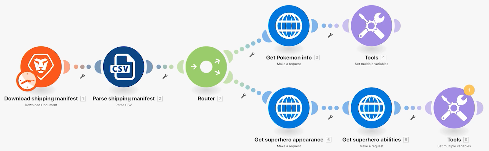

# Übung zu Routern

Machen Sie sich mit der Wichtigkeit von Routern vertraut und erfahren Sie, wie sie zur bedingten Verarbeitung verschiedener Module verwendet werden können.

## Übungsübersicht

Verwenden Sie einen Router, um die Bündel „Pokemon vs. Superhelden“ auf den richtigen Weg zu bringen, und erstellen Sie dann eine Aufgabe für jede Figur.

## Zu befolgende Schritte

1. Klonen Sie das Szenario „Verwendung universeller Connectoren“ aus der vorherigen Übung. Nennen Sie es „Erstellen verschiedener Pfade mithilfe von Routern“.

   **Erstellen Sie einen neuen Pfad für Superhelden, indem Sie Module klonen und einen Router hinzufügen.**

   

1. Klicken Sie mit der rechten Maustaste auf das Modul „Pokemon-Infos abrufen“ und wählen Sie „Klonen“. Nachdem es geklont wurde, ziehen Sie es und verbinden Sie es mit der Linie zwischen dem neuen HTTP-Modul und dem Parse-CSV-Modul.

   >[!NOTE]
   >
   > Beachten Sie, wie automatisch ein Router mit zwei Pfaden hinzugefügt wird.

1. Nennen Sie dieses Modul „Superhelden-Aussehen abrufen“.
1. Klonen Sie dieses Modul, bewegen Sie den Klon nach rechts und nennen Sie ihn „Superhelden-Fähigkeiten abrufen&quot;.
1. Klonen Sie das Werkzeugmodul und verschieben Sie es an das Ende des zweiten Pfads.
1. Klicken Sie in der Symbolleiste auf das Zauberstab-Symbol – die Schaltfläche „Automatisch ausrichten“.

   **Ihr Szenario sollte wie folgt aussehen:**

   

   **Als Nächstes ändern Sie die zugeordneten Werte in den neuen geklonten Modulen.**

1. Navigieren Sie zu <https://www.superheroapi.com/> und verwenden Sie Ihr Facebook-Konto, um ein Zugriffs-Token zu erhalten.

   >[!NOTE]
   >
   >Wenn Sie Probleme haben, auf Ihr eigenes Superhelden-Token zuzugreifen, können Sie dieses gemeinsame Token verwenden: 10110256647253588. Bitte achten Sie darauf, wie oft Sie die Superhelden-API aufrufen, damit dieses gemeinsame Token weiterhin für alle funktioniert.

1. Öffnen Sie die Einstellungen für „Superhelden-Aussehen abrufen“ und ändern Sie die URL zu `https://www.superheroapi.com/api/[access- token]/332/appearance`. Vergewissern Sie sich, dass Ihr Zugriffs-Token in der URL enthalten ist. Klicken Sie auf „OK“.
1. Öffnen Sie die Einstellungen für „Superhelden-Fähigkeiten abrufen“ und ändern Sie die URL zu `https://www.superheroapi.com/api/[access- token]/332/powerstats`. Vergewissern Sie sich, dass Ihr Zugriffs-Token in der URL enthalten ist. Klicken Sie auf „OK“.
1. Klicken Sie mit der rechten Maustaste auf jedes Superhelden-Modul und wählen Sie „Nur dieses Modul ausführen“. Dadurch wird die Datenstruktur generiert, die Sie für die Zuordnung sehen müssen.
1. Nachdem Sie beides ausgeführt haben, ändern Sie die Zahl „332“ in jedem URL-Feld in Spalte 4, die vom Modul „CSV-Analyse“ zugeordnet wird.

   

   **Jetzt können Sie in das Modul „Mehrere Variablen festlegen“ im Superhelden-Pfad klicken und den Namen, die Größe, das Gewicht und die Fähigkeiten aktualisieren.**

1. Aktualisieren Sie die Felder „Name“ und „Fähigkeiten“ im Modul „Superhelden-Fähigkeiten abrufen“ – Modul 8.

   

1. Aktualisieren Sie die Felder „Größe“ und „Gewicht“ im Modul „Superhelden-Aussehen abrufen“ – Modul 6.

   

   **Wenn Sie fertig sind, sollten Ihre Variablen wie folgt aussehen. Beachten Sie, dass die Modulnummern in den Feldwerten angezeigt werden.**

   

1. Klicken Sie auf „OK“ und speichern Sie das Szenario.

   **Erstellen Sie einen weiteren Pfad, um eine Aufgabe pro Charakter zu erstellen.**

1. Erstellen Sie in Workfront ein leeres Projekt. Nennen Sie es „Versandmanifest-Projekt“ und kopieren Sie die Projekt-ID aus der URL.
1. Kehren Sie zu Workfront Fusion zurück und klicken Sie in die Mitte des Routers, um einen weiteren Pfad zu erstellen.

   

1. Klicken Sie in die Mitte des angezeigten leeren Moduls und fügen Sie ein Modul „Eintrag erstellen“ aus der Workfront-App hinzu.
1. Setzen Sie den Eintragstyp auf „Aufgabe“ und wählen Sie „Projekt-ID“ aus dem Abschnitt „Zuzuordnende Felder“ aus.
1. Fügen Sie die Projekt-ID, die Sie aus Workfront kopiert haben, in das Feld „Projekt-ID“ ein.
1. Wählen Sie nun das Namensfeld aus dem Abschnitt „Zuzuordnende Felder“ aus.
1. Nennen Sie die Aufgabe „[Charakter] aus [Franchise]“, wobei Sie den Namen des Charakters und den Namen des Franchise aus der CSV-Datei übernehmen. Spalte 3 ist der Charaktername und Spalte 2 der Name des Franchise.

   

1. Klicken Sie auf „OK“ und benennen Sie dieses Modul in „Aufgabe für jeden Charakter erstellen“ um.

   **Fügen Sie Filter hinzu, damit das Szenario fehlerfrei ablaufen kann. Sie möchten, dass nur Pokemon-Charaktere den oberen Pfad, nur Superhelden-Charaktere den mittleren Pfad und alle Charaktere den unteren Pfad hinuntergehen.**

1. Klicken Sie auf die gepunktete Linie links neben dem Modul „Pokemon-Infos abrufen“, um den ersten Filter zu erstellen. Nennen Sie ihn „Pokemon-Charakter“.
1. Lassen Sie für die Bedingung nur Einträge zu, bei denen das Franchise (Spalte 2) gleich „Pokemon“ ist. Wählen Sie den Operator mit dem Text „Ist gleich“ aus.
1. Klicken Sie auf die gepunktete Linie auf der linken Seite des Moduls „Superhelden-Aussehen abrufen“, um den nächsten Filter zu erstellen. Nennen Sie ihn „Superhelden-Charakter“.
1. Da Superhelden aus verschiedenen Franchises stammen können, verwenden Sie das Feld „Superhelden-ID“ (Spalte 4), um zu bestimmen, ob ein Charakter ein Superheld ist oder nicht.

   **Ihre Filter sollten wie folgt aussehen:**

   

   

1. Speichern Sie das Szenario und klicken Sie auf „Einmal ausführen“. Überprüfen Sie mithilfe der Ausführungsinspektoren, ob alle Vorgänge erfolgreich waren, und überprüfen Sie die Aufgaben, die in Ihrem Workfront-Projekt erstellt wurden.

   
