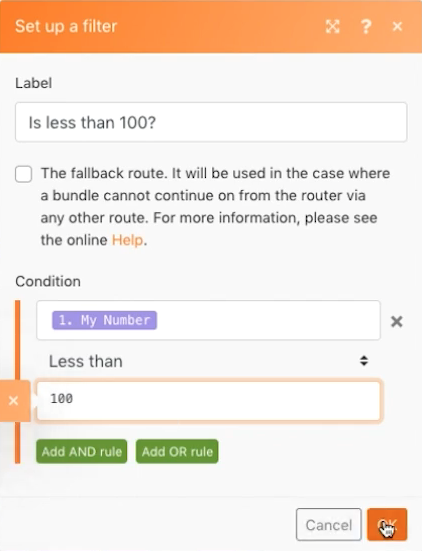

# Routing-Muster

Verbessern Sie Ihr Konzept des Routing und Fallback-Routen, ohne tatsächlich mit anderen APIs zu arbeiten.

## Übungsübersicht

Verwenden Sie das Modul Variable festlegen , um eine Zahl über mehrere Pfade zu senden, um zu sehen, wie sich Filter und Fallbacks beim Routing verhalten.

## Schritte, die ausgeführt werden müssen

1. Erstellen Sie ein neues Szenario und nennen Sie es &quot;Routing-Muster und Fallbacks&quot;.
1. Fügen Sie für den Trigger das Tool-Modul Variable festlegen hinzu. Setzen Sie &quot;Meine Nummer&quot;für den Variablennamen, belassen Sie die Lebensdauer der Variablen auf einen Zyklus und setzen Sie das Variablenfeld auf &quot;75&quot;.

   

1. Fügen Sie ein weiteres Modul hinzu und wählen Sie das Router-Modul aus. Wählen Sie für beide Pfade das Tool für die Inkrementierungsfunktion aus und klicken Sie auf &quot;OK&quot;, ohne für jeden Pfad Änderungen vorzunehmen.

   + Erstellen Sie für den ersten Pfad einen Filter, nennen Sie ihn &quot;Weniger als 100&quot;, und setzen Sie die Bedingung auf [Meine Nummer] Weniger als 100.

   + Erstellen Sie für den zweiten Pfad einen Filter, nennen Sie ihn &quot;Weniger als 1000&quot;, und setzen Sie die Bedingung auf [Meine Nummer] Weniger als 1000. Stellen Sie sicher, dass Sie den numerischen Operator für beide verwenden.

   

   

1. Klicken Sie einmal auf Ausführen und beobachten Sie, wie das Bundle den Pfad &quot;Weniger als 100&quot;durchläuft.
1. Ändern Sie dann das Feld Variablenmodul festlegen in 950 und führen Sie erneut aus. Sehen Sie, wie er den zweiten Pfad herunterfährt.
1. Klicken Sie auf den Router und fügen Sie einen weiteren Pfad hinzu. Fügen Sie das Tool-Modul für die Funktion Inkrement hinzu. Klicken Sie für den Filter auf das Kontrollkästchen &quot;Fallback-Route&quot;. Beachten Sie, wie sich der Pfeil, der auf diesen Pfad zeigt, zu einem Caret ändert, was angibt, dass es sich um die Ausweichroute handelt.

   

1. Ändern Sie die Anzahl der Variablen auf 9500 setzen und einmal ausführen. Da die Zahl nicht weniger als 100 oder weniger als 1000 beträgt, durchläuft das Bundle die Ausweichroute.

Wenn Sie einen weiteren Pfad mit einem Tool-Modul mit der Funktion Inkrement hinzufügen, aber keinen Filter festlegen, was passiert, wenn Sie erneut auf Ausführen klicken? Wird ein Bundle je die Fallback-Route entlang gehen, wobei die vierte Route hinzugefügt wird?

+ Nein, da ohne Filtersatz jedes Bundle immer diesen Pfad anstelle der Ausweichroute durchläuft.
