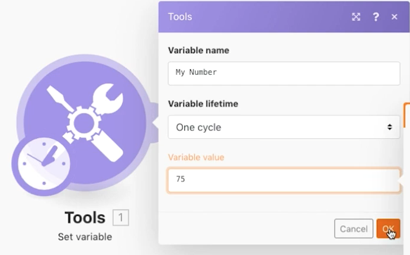

# Übung zu Routing-Mustern

Verbessern Sie Ihr Konzept des Routing und der Fallback-Routen, ohne dass Sie wirklich mit anderen APIs zu tun haben.

## Übungsübersicht

Verwenden Sie das Modul „Variable festlegen“, um eine Zahl über mehrere Pfade zu senden, um zu sehen, wie sich Filter und Fallbacks beim Routing verhalten.

## Zu befolgende Schritte

1. Erstellen Sie ein neues Szenario und nennen Sie es „Routing-Muster und Fallbacks“.
1. Für den Auslöser fügen Sie das Werkzeugmodul „Variable einrichten“ hinzu. Wählen Sie „Meine Nummer“ als Variablennamen, belassen Sie die Lebensdauer der Variablen bei einem Zyklus und setzen Sie das Variablenfeld auf „75“.

   

1. Fügen Sie ein weiteres Modul hinzu und wählen Sie das Router-Modul aus. Wählen Sie für beide Pfade das Tool für die Inkrementierungsfunktion aus und klicken Sie auf „OK“, ohne für die Pfade Änderungen vorzunehmen.

   + Erstellen Sie für den ersten Pfad einen Filter, benennen Sie ihn „Weniger als 100“ und setzen Sie die Bedingung für [Meine Nummer] auf „weniger als 100“.

   + Für den zweiten Pfad erstellen Sie einen Filter, benennen Sie ihn „Weniger als 1000“ und setzen Sie die Bedingung für [Meine Nummer] auf „Weniger als 1000“. Stellen Sie sicher, dass Sie den numerischen Operator für beide verwenden.

   

   

1. Klicken Sie einmal auf Ausführen und beobachten Sie, wie das Bündel den Pfad „Weniger als 100“ durchläuft.
1. Ändern Sie dann das Feld des Moduls „Variable einrichten“ auf 950 und führen Sie es noch einmal aus. Sehen Sie sich an, wie es den zweiten Pfad herunterfährt.
1. Klicken Sie auf den Router und fügen Sie einen weiteren Pfad hinzu. Fügen Sie das Werkzeugmodul für die Funktion „Inkrementieren“ hinzu. Klicken Sie für den Filter auf das Kontrollkästchen „Die Fallback-Route“. Beachten Sie, wie sich der Pfeil, der auf diesen Pfad zeigt, zu einem Caret ändert, was angibt, dass es sich um die Fallback-Route handelt.

   

1. Ändern Sie die Nummer „Variable einrichten“ auf 9500 und führen Sie einmal aus. Da die Zahl weder weniger als 100 noch weniger als 1000 beträgt, durchläuft das Bündel die Fallback-Route.

Wenn Sie einen weiteren Pfad mit einem Werkzeugmodul der Funktion „Inkrementieren“ hinzufügen, aber keinen Filter setzen, was passiert dann, wenn Sie erneut auf „Ausführen“ klicken? Wird ein Bündel jemals die Fallback-Route entlang gehen, wobei die vierte Route hinzugefügt wird?

+ Nein, da ohne Filtersatz jedes Bündel immer diesen Pfad anstelle der Fallback-Route durchläuft.
